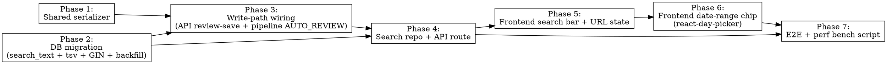

# Plan: Archive Keyword Search

> **Source:** `docs/plans/2026-05-07-archive-keyword-search-design.md`, `docs/spec/add-archive-keyword-search/spec.md`
> **Created:** 2026-05-07
> **Status:** planning

## Goal

Public users can keyword-search the entire content of every reviewed archive at `/`, and filter results by date range. The backend uses a Postgres-FTS-indexed denormalized `search_text` column populated from override-aware story content; the UI uses a search input + `react-day-picker` v9 range chip.

## Acceptance Criteria

- [ ] `GET /api/archives/search?q=…&from=…&to=…` is public, returns the same shape as `GET /api/archives`, applies FTS + range + reviewed filter, caps at 50, sorts by relevance when q is set, by date when not.
- [ ] `run_archives` has `search_text TEXT` + a generated `search_tsv tsvector` column GIN-indexed via an `immutable_unaccent` wrapper.
- [ ] A pure `serializeArchiveSearchText(...)` lives in `@newsletter/shared`, is unit-tested, and is called from both API write paths (review save) and pipeline AUTO_REVIEW.
- [ ] Migration backfills `search_text` for all existing reviewed archives via a pure-SQL UPDATE.
- [ ] `/` renders a search bar + date-range chip; UI state is URL-driven (`q`, `from`, `to`); inline `<mark>` highlights digest headline + summary; empty state matches mock Frame 3.
- [ ] All REQs and EDGEs in the spec have corresponding tests; baseline metrics held (typecheck pass, lint 0 errors, no test regressions).
- [ ] VS-1..VS-9 functional-verify scenarios pass; VS-10 perf-gate report shows P95 ≤ 200 ms at 1k archives.

## Codebase Context

### Existing Patterns to Follow

- **Drizzle migrations**: `packages/shared/src/db/migrations/NNNN_<adj>_<noun>.sql` — raw SQL files. Latest: `0013_curly_stellaris.sql`.
- **Repo factory**: `packages/api/src/repositories/run-archives.ts` returns `RunArchivesRepo` with `listReviewed` (lines 116–155) and `updateRankedItems` (line 185 — also writes `reviewed: true` atomically). NO separate `setReviewed` method.
- **Pipeline AUTO_REVIEW**: `packages/pipeline/src/workers/run-process.ts` lines 500–541. `archiveRepo.upsert({ rankedItems, reviewed: autoReviewed, … })` writes from pipeline directly via shared.
- **Hydration service**: `packages/api/src/services/rank-hydration.ts` (4 callsites — keep undisturbed).
- **Public route mount**: `packages/api/src/app.ts` line ~53 mounts `publicArchivesRouter` at `/api/archives` (no admin gate).
- **API route test**: `packages/api/tests/unit/runs-route.test.ts` — Hono app + mocked deps; no real DB. The repo's FTS query method gets a separate **integration** test (covered in Phase 2).
- **React component test**: `packages/web/tests/unit/ArchivePage.test.tsx` — `MemoryRouter` + `QueryClientProvider` wrapper.
- **Shared barrel**: `packages/shared/src/index.ts` — add new module exports here.

### Test Infrastructure

- Vitest 3 (unit + e2e projects per package).
- Unit: in-memory mocks. Run: `pnpm test:unit`.
- E2E (real Postgres + Redis): `pnpm infra:up` then `pnpm test:e2e`. Existing API e2e tests live under `packages/api/tests/e2e/`.
- Web component tests: jsdom + `@testing-library/react`.
- Playwright (Frontend e2e): existing under `packages/web/tests/e2e/`.

### Custom decisions (from Q&A)

- Serializer in `@newsletter/shared` — both api + pipeline import from root barrel.
- Backfill is pure SQL inside the migration (no Node post-migrate script). The serializer's logic is mirrored in SQL via jsonb extraction with COALESCE fallbacks for override→recap precedence.
- Server does NOT enforce min-char on `q`. Frontend gates at 2.
- Perf gate via a one-shot seed-and-benchmark script under `packages/api/scripts/`, exercised by functional-verify only.

## Phase Graph

Phases 1 and 2 are independent (no shared files) and can run in parallel as the first wave. Phase 3 depends on both. Phase 4 depends on 2 + 3. Phases 5 and 6 are sequential (6 builds on 5's URL-state plumbing). Phase 7 is the final integration check.

## Phase Summary

| # | Phase | Deliverable | Trace |
|---|-------|------------|-------|
| 1 | Shared serializer | `serializeArchiveSearchText` in `@newsletter/shared` + unit tests | REQ-008, REQ-010, EDGE-004, EDGE-005, EDGE-012 |
| 2 | DB migration | New columns + index + IMMUTABLE wrapper + pure-SQL backfill | REQ-009, REQ-012, REQ-029, EDGE-013 |
| 3 | Write-path wiring | API review-save + pipeline AUTO_REVIEW write `search_text` | REQ-008, REQ-011 |
| 4 | Search repo + API route | `searchReviewed` repo method + `GET /api/archives/search` (Hono + zod) | REQ-001..007, REQ-024..027, EDGE-001/003/006/008/009/010/011/014/016 |
| 5 | Frontend search bar | `SearchBar`, URL state, result-meta strip, hide month groups, empty state, inline `<mark>` | REQ-013..015, REQ-020..023, EDGE-002/017/018/019 |
| 6 | Date-range chip | Install `react-day-picker`, `DateRangeChip` with popover + presets + Apply/Clear | REQ-016..019, EDGE-014/015 |
| 7 | E2E + perf bench | Playwright e2e for VS-7/8/9 + `bin/seed-search-perf.ts` for VS-10 | REQ-028 + verification scenarios |

## Estimated Effort

Medium. ~7 phases, mostly straightforward. The two non-obvious bits — the SQL backfill that must mirror the JS serializer, and the IMMUTABLE wrapper — are codified in tests so they can't drift silently.
