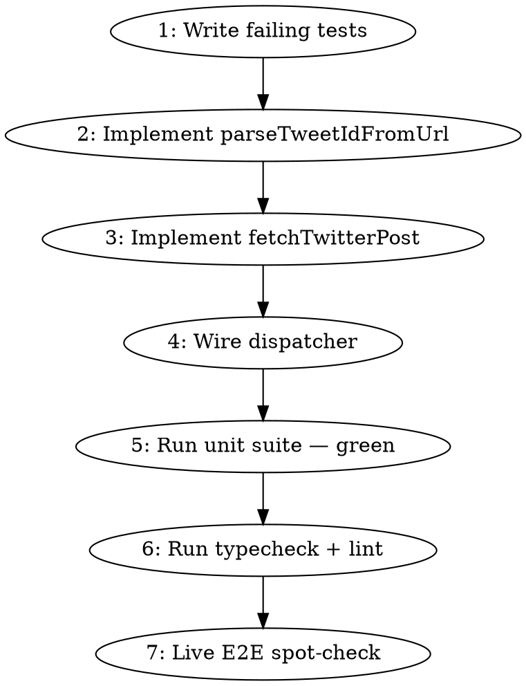

# Plan: Add Post — Twitter/X Collector Resolver

**Spec:** [spec.md](./spec.md)
**Design:** [design.md](./design.md)
**Library probe:** [library-probe.md](./library-probe.md)

## Approach

Single phase — the change is small (≈4 prod files, ≈3 test files) and tightly coupled. No benefit to splitting.

## Phase graph


## Phase 1: Add Twitter to Add Post

### Files to change

| File | Action |
|---|---|
| `packages/pipeline/src/collectors/twitter/index.ts` | Add `parseTweetIdFromUrl(url)`, `fetchTwitterPost(url, deps)`, export both. Lift `classifyError` to top-level export. Implement CSRF refresh+retry around `tweet.details` using the same pattern as the bulk collector (`withCsrfRefreshRetry` is already in `clients/rettiwt.ts` — reuse). |
| `packages/pipeline/src/services/add-post-helper.ts` | Add `"twitter"` to `AddPostSourceType`. Add `fetchTwitterPost?: ...` to `AddPostDeps`. Detect twitter URLs first in `detectAddPostSourceType`. Add `case "twitter"` to `dispatchFetch` (exhaustive `never` updated). |
| `packages/pipeline/src/add-post-entry.ts` | Re-export `parseTweetIdFromUrl` (the helper file already re-exports `detectAddPostSourceType` and types). |
| `packages/pipeline/tests/unit/services/add-post-helper.test.ts` | Add twitter cases to existing detection + dispatch tests. |
| `packages/pipeline/tests/unit/collectors/twitter-fetch-post.test.ts` | NEW. Unit tests for `parseTweetIdFromUrl` and `fetchTwitterPost` with an injected fake client + injected fake `resolveCookie`. |
| `packages/api/tests/unit/services/review.test.ts` | Add a test case: twitter URL → `hydrateAddedPost` called with `"twitter"`. |
| `packages/web/tests/e2e/review-add-post.spec.ts` | Extend to cover an x.com URL when `REVIEW_ADD_URL` is a twitter URL. |

### Steps



#### Step 1 — Write failing tests (RED phase, TDD)

1. **`packages/pipeline/tests/unit/services/add-post-helper.test.ts`**: add `detectAddPostSourceType` cases for each twitter URL in VS-0-5, including the `"web"` fallback for `https://x.com/jack` (no `/status/`).
2. **`packages/pipeline/tests/unit/collectors/twitter-fetch-post.test.ts`** (new file): write tests covering:
   - `parseTweetIdFromUrl` returns expected IDs for all VS-0-5 twitter URLs; returns `null` for non-twitter URLs.
   - `fetchTwitterPost` happy path: with `deps.client = { fetchTweetById: async () => fakeRaw }` and `deps.resolveCookie = async () => ({ apiKey, source: "env" })`, returns a `RawItemInsert` with `sourceType: "twitter"`, `externalId: "20"`, `author: "jack"`, `title` truncated to 80 chars.
   - `fetchTwitterPost` returns `null` → throws `"Tweet not found, deleted, or protected: 20"`.
   - `fetchTwitterPost` no cookie (`resolveCookie` returns `null`) → throws `"Twitter cookies not configured — set them at /admin/settings"`.
   - `fetchTwitterPost` auth error after retry → throws `"Twitter auth failed — rotate cookies at /admin/settings"`.
   - `fetchTwitterPost` propagates `AbortSignal` — pre-aborted signal causes the call to reject.
   - `fetchTwitterPost` non-twitter URL → throws `"not a twitter status URL: ..."`.

Run `pnpm --filter @newsletter/pipeline test:unit -- twitter-fetch-post` — expect RED.

#### Step 2 — `parseTweetIdFromUrl`

Add to `packages/pipeline/src/collectors/twitter/index.ts`:

```ts
const TWEET_URL_RE = /^https?:\/\/(?:[a-z0-9-]+\.)?(?:x|twitter)\.com\/(?:[^/]+)\/status\/(\d+)(?:[/?#].*)?$/i;
export function parseTweetIdFromUrl(url: string): string | null {
  const m = TWEET_URL_RE.exec(url);
  return m ? m[1] : null;
}
```

#### Step 3 — `fetchTwitterPost`

Add to the same file. Signature:

```ts
export interface FetchTwitterPostDeps {
  fetchFn?: typeof fetch;            // unused; reserved for symmetry with hn/reddit/web
  signal?: AbortSignal;
  // test seams:
  client?: { fetchTweetById(id: string, signal?: AbortSignal): Promise<RettiwtRawTweet | null | undefined> };
  resolveCookie?: () => Promise<{ apiKey: string; source: "db" | "env" } | null>;
  rettiwtFactory?: (apiKey: string) => { tweet: { details(id: string): Promise<RettiwtRawTweet | null | undefined> } };
  refreshCsrf?: (apiKey: string) => Promise<string | null>;  // returns rotated key, or null on failure
}

export async function fetchTwitterPost(url: string, deps: FetchTwitterPostDeps = {}): Promise<RawItemInsert>;
```

Behaviour (mirrors design.md §Chosen Approach):

1. `const id = parseTweetIdFromUrl(url)`. If `null` → `throw new Error("not a twitter status URL: " + url)`.
2. **If `deps.client` is provided** (test seam), call `deps.client.fetchTweetById(id, deps.signal)` and skip steps 3–6.
3. `resolveCookie = deps.resolveCookie ?? (() => resolveTwitterCollectorCookie({ repo: getSharedSocialCredentialsRepo(), env: process.env }))`.
4. `const cookie = await resolveCookie()`. If `null` → `throw new Error("Twitter cookies not configured — set them at /admin/settings")`.
5. Construct Rettiwt **inside** a try/catch (synchronous-throw path verified by probe): `let rettiwt; try { rettiwt = (deps.rettiwtFactory ?? defaultFactory)(cookie.apiKey); } catch (e) { throw new Error("Twitter auth failed — rotate cookies at /admin/settings"); }`.
6. Call `rettiwt.tweet.details(id)`. If error is CSRF-mismatch class **and** `cookie.source` is `env` or `db`, attempt one refresh via `deps.refreshCsrf ?? defaultRefresh` and retry once. Use `abortRace(..., signal)`.
7. If retry still throws auth-class → `throw new Error("Twitter auth failed — rotate cookies at /admin/settings")`.
8. If result is `null` / `undefined` → `throw new Error("Tweet not found, deleted, or protected: " + id)`.
9. Return `tweetToRawItem(denormalize(raw))`.

**Implementation notes:**
- Re-use `denormalize`, `tweetToRawItem`, `withCsrfRefreshRetry`, `abortRace`, `RettiwtRawTweet` — all already exported from `clients/rettiwt.ts`. Lift them to non-internal exports if currently package-private.
- `defaultFactory` is `(apiKey) => new Rettiwt({ apiKey })`.
- `defaultRefresh` calls `refreshRettiwtCsrfToken({ rettiwt: { apiKey }, repo: getSharedSocialCredentialsRepo(), credentialSource: cookie.source })` then returns the rotated key from the holder.
- The `client` seam in `deps.client` is the cleanest test boundary: tests inject `fetchTweetById` and never touch `Rettiwt` construction at all. This avoids vi.mocking the SDK.

#### Step 4 — Wire dispatcher

In `packages/pipeline/src/services/add-post-helper.ts`:

1. Update `AddPostSourceType`:
   ```ts
   export type AddPostSourceType = "hn" | "reddit" | "twitter" | "web";
   ```
2. Update `detectAddPostSourceType`:
   ```ts
   import { parseTweetIdFromUrl } from "@pipeline/collectors/twitter/index.js";
   ...
   export function detectAddPostSourceType(url: string): AddPostSourceType {
     if (parseTweetIdFromUrl(url) !== null) return "twitter";
     if (parseHnItemIdFromUrl(url) !== null) return "hn";
     if (parseRedditPostUrl(url) !== null) return "reddit";
     return "web";
   }
   ```
3. Extend `AddPostDeps`:
   ```ts
   fetchTwitterPost?: (url: string, deps?: FetchTwitterPostDeps) => Promise<RawItemInsert>;
   ```
4. Extend `dispatchFetch` switch with a `case "twitter"` that forwards `{ signal, fetchFn }`. The default fetcher is the new `fetchTwitterPost`. The exhaustive `never` check picks up the new value automatically because the union member is added.

In `packages/pipeline/src/add-post-entry.ts`:

```ts
export { parseTweetIdFromUrl } from "@pipeline/collectors/twitter/index.js";
export { fetchTwitterPost } from "@pipeline/collectors/twitter/index.js";
```

#### Step 5 — Run unit suite

```
pnpm --filter @newsletter/pipeline test:unit
pnpm --filter @newsletter/api test:unit
```

All new tests green; pre-existing 5 reddit RSS failures remain (baseline).

#### Step 6 — Typecheck + lint

```
pnpm typecheck
pnpm lint
```

Both PASS (warnings ≤ 10 baseline).

#### Step 7 — Live E2E spot-check (functional verify)

Manual against the actual review dashboard with a running infra:

```
pnpm infra:up
pnpm dev               # api + pipeline + web
# open http://localhost:5173/admin
# log in, navigate to /admin/review/<some-runId>
# paste https://x.com/jack/status/20 into Add Post → click Add
# expect: pending card → resolved card with @jack
# capture screenshot to docs/spec/add-post-collector-resolver/verification/screenshots/twitter-add-post.png
```

This is the UI claim covered by VS-0-1 and the only `type: "ui"` claim for the phase. Verify will re-run it via Playwright MCP.

### Test plan (per spec REQ → test mapping)

| REQ | Test |
|---|---|
| REQ-001, REQ-002, REQ-003, REQ-016 | `add-post-helper.test.ts` and `twitter-fetch-post.test.ts` (parser + detector tables) |
| REQ-004 | `add-post-helper.test.ts` — assert `fetchTwitterPost` is called when `sourceType === "twitter"` |
| REQ-005 | `twitter-fetch-post.test.ts` — happy path with injected client |
| REQ-006 | `twitter-fetch-post.test.ts` — null result branch |
| REQ-007 | `twitter-fetch-post.test.ts` — missing cookie branch |
| REQ-008 | `twitter-fetch-post.test.ts` — CSRF-mismatch first call, success on retry |
| REQ-009 | `twitter-fetch-post.test.ts` — auth error post-retry, constructor throw |
| REQ-010 | `twitter-fetch-post.test.ts` — two consecutive calls observe different resolved cookies (spy on `resolveCookie`) |
| REQ-011 | `add-post-helper.test.ts` — existing `hydrateAddedPost` test extended with twitter input |
| REQ-012 | `twitter-fetch-post.test.ts` — pre-aborted signal |
| REQ-013 | typecheck + `git diff packages/shared/src/db/schema.ts` empty |
| REQ-014 | `git diff packages/web/src/components/review/AddPostPanel.tsx` empty |
| REQ-015 | grep — `"web_search"` not present in add-post-helper.ts |
| REQ-016 | regression tests in `add-post-helper.test.ts` |

### Risks (per phase)

- **Cookie expiry mid-run:** ✅ Mitigated — CSRF refresh + retry path is required by REQ-008 and verified by probe.
- **Inconsistent invalid-id behaviour (undefined vs throw):** ✅ Mitigated — `null/undefined` → REQ-006 error; thrown errors propagate to the outer 502 handler with the underlying message.
- **Forgetting to update the exhaustive `never` switch:** typecheck catches it.
- **Forgetting per-call cookie resolution:** REQ-010 test catches it explicitly.

### Definition of done

All acceptance criteria from spec satisfied + the live E2E spot-check shown in Step 7 passes.
