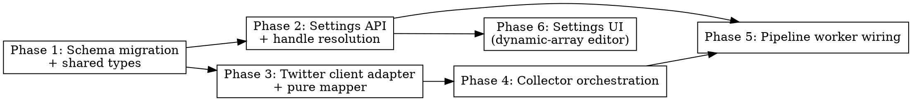

# Plan: Twitter/X Collector

> **Source:** `docs/plans/2026-05-04-twitter-collector-design.md`,
> `docs/spec/add-twitter-x-collector/spec.md`,
> `docs/spec/add-twitter-x-collector/library-probe.md`
> **Created:** 2026-05-04
> **Status:** planning

## Goal

Add a `collectTwitter` collector to the pipeline that pulls tweets from Twitter list IDs and `@handle` user timelines on each daily run, plus the schema, validation, settings UI, and handle-resolution path required to make it runnable end-to-end.

## Acceptance Criteria

- [ ] All REQ-* and EDGE-* in `spec.md` have at least one passing test in the verification matrix.
- [ ] `pnpm typecheck`, `pnpm lint`, `pnpm test:unit` are green at the end of each phase (no regressions vs `baseline.json`).
- [ ] VS-0a-userauth, VS-0a-pagination, and VS-0a-user-timeline still pass live at end-of-pipeline (functional-verify re-runs them in Stage 5).
- [ ] VS-1, VS-2, VS-2b, VS-2c, VS-3, VS-4, VS-5, VS-6 pass.
- [ ] No new ESLint violations from custom rules `newsletter/collector-return-shape` or `newsletter/enforce-repository-access`.
- [ ] No `any` types, no `@ts-ignore`, no `as unknown as X` casts.
- [ ] Drizzle migration generates cleanly, applies cleanly, and round-trips `twitterConfig` through the `userSettings` repo.

## Codebase Context

### Existing Patterns to Follow

- **Collector signature & body:** `packages/pipeline/src/collectors/hn.ts` (`collectHn(deps, config): Promise<CollectorResult>`, fan-out with `Promise.all`, `findExistingExternalIds` dedup, `upsertItems`). Reddit follows the same shape.
- **Per-source partial-failure handling:** `packages/pipeline/src/collectors/web.ts` "all-failed → throw, any-success → return with `failures[]`". Mirror exactly for Twitter.
- **Mapper pattern:** Each collector has a private mapper function — see `hn.ts` lines 157-170. Twitter follows the same shape: `tweetToRawItem(t: NormalizedTweet): RawItemInsert`. No intermediate `ParsedTweet` type per `.claude/rules/architecture.md` §"Collector pattern".
- **Repository access:** `packages/pipeline/src/repositories/raw-items.ts` is the only DB-write surface. Enforced by `newsletter/enforce-repository-access` ESLint rule.
- **Per-source jsonb config:** `packages/shared/src/db/schema.ts` lines 50-66 define `userSettings` with `hnConfig`, `redditConfig`, `webConfig`. Add `twitterConfig` in the same shape.
- **API zod schema for source config:** `packages/api/src/lib/validate.ts` lines 13-90: each source has its own `*ConfigSchema` and is composed into `userSettingsUpsertSchema` as `.nullable()`.
- **Run payload assembly:** `packages/shared/src/run-start.ts` lines 33-100 (`startRun()`) is where `UserSettings` → `RunProcessJobPayload.collectors.{hn,reddit,web}` happens. Twitter slots in here.
- **Run dispatch:** `packages/pipeline/src/workers/run-process.ts` — `RunCollectorsPayload` type, `CollectFns` interface, `Promise.all(tasks.map(runTask))`. Add `twitter?` field, `collectTwitter` fn, conditional Task.
- **Settings UI dynamic-array editor:** `packages/web/src/components/settings/SourcesSection.tsx` — `RedditEditPanel` (lines 405-503) shows the existing "managed list of strings" pattern via `Controller`. We diverge to add explicit Add / Remove buttons per the user's UI spec.
- **Logger boundary:** `createLogger("collector:twitter")` mirroring other collectors.

### Test Infrastructure

- Test runner: Vitest 3, project-per-package via Turborepo.
- Per-package test commands: `pnpm --filter @newsletter/<pkg> test:unit`.
- Test fixtures live next to the code (`__tests__` colocated). Reddit and HN show the pattern.
- Stub-driven tests for collectors (no live network): pass a `clientFactory` or a stubbed `client` via `deps`. Twitter follows this — `TwitterClient` interface lives in `types.ts`.
- React Testing Library + `@testing-library/user-event` for the SettingsPage tests.
- `pino` log capture: existing tests use a `MockLogger` factory. Reuse.
- API tests: `supertest`-style via the existing `tests/unit/routes/*.test.ts` pattern.

### Library deps

- **Already present:** `rettiwt-api@^7.0.3` at workspace root (added during library-probe).
- **Move it:** install in `packages/pipeline/package.json` (collector runtime) and `packages/api/package.json` (handle resolution at save-time). Remove from workspace root unless any non-package code uses it.
- **No new packages.**

### Known constraints

- TDD discipline required (`harness:tdd` skill).
- Custom ESLint rules: `newsletter/collector-return-shape`, `newsletter/enforce-repository-access`.
- `pipeline` package must NOT import `hono` or `@newsletter/api`.
- `web` package must NOT import `drizzle-orm`.
- TypeScript strict mode — no `any`, no `@ts-ignore`, no `as unknown as X` casts.
- Drizzle migrations live at `packages/shared/src/db/migrations/`. Use `pnpm --filter @newsletter/shared db:generate` then `db:migrate`. No raw `ALTER TABLE` SQL.
- **Architectural exception:** `rettiwt-api` is allowed in `@newsletter/api` for handle resolution at save-time (REQ-045..047). This is the single, narrow relaxation of the "API package: HTTP layer only" rule, justified in the design doc.

## Phase Graph

**Execution order (sequential per user preference):**
1. Phase 1 (foundational types/columns)
2. Phase 2 (settings API + handle resolution — needed for Phase 5 + Phase 6)
3. Phase 3 (mapper + client adapter)
4. Phase 4 (collector orchestration)
5. Phase 5 (worker wiring — needs Phases 2 and 4)
6. Phase 6 (settings UI — needs Phase 2)

Phases 2 and 3 are technically independent (no shared files) and could run in parallel; user chose sequential for cleaner diff review. Same for Phases 5 and 6.

## Phase summaries (full detail in phase-N.md)

| # | Phase | Files | REQs covered | Tests added |
|---|---|---|---|---|
| 1 | Schema migration + shared types | `schema.ts`, `migrations/*`, `types/run.ts`, pipeline `types.ts` | REQ-020, REQ-021, REQ-030, REQ-031 | Migration round-trip, type-only |
| 2 | Settings API + handle resolution | `validate.ts`, `routes/settings.ts`, new `services/twitter-handle-resolver.ts`, `repositories/settings.ts` (no change?) | REQ-022, REQ-023, REQ-045, REQ-045b, REQ-046, REQ-047 | API unit (zod), API unit (resolver), supertest round-trip |
| 3 | Twitter client adapter + mapper | new `collectors/twitter/{types.ts, map.ts, clients/rettiwt.ts, clients/index.ts}` | REQ-005..013, EDGE-001..005, EDGE-008, EDGE-012, EDGE-013 | Pure mapper unit tests, client-adapter shape test |
| 4 | Collector orchestration | new `collectors/twitter/index.ts` | REQ-001..017, REQ-002b, REQ-002c, REQ-003b, REQ-050..062, EDGE-006..011, EDGE-014, EDGE-015 | Collector unit tests with stubbed client |
| 5 | Pipeline worker wiring | `run-start.ts` (shared), `workers/run-process.ts` | REQ-024, REQ-032, REQ-033 | run-start unit, worker dispatch test |
| 6 | Settings UI | `components/settings/SourcesSection.tsx` (extend), possibly small dynamic-array helper component | REQ-040, REQ-040b, REQ-040c, REQ-041, REQ-042 | RTL render + interaction tests |

## Out of scope for this plan

The spec's section §6 "Out of Scope" applies. Notable plan-level non-goals:

- Refactoring existing collectors. We add Twitter alongside HN/Reddit/Web in the same patterns; we don't unify them.
- Changing the daily-run scheduler logic.
- Touching `docs/research/mvp-sources.md` (separate change).
- Promoting any of the failed candidates (rettiwt guest, convocation, syndication scraper, paid API) into a fallback at runtime. The library is committed.
