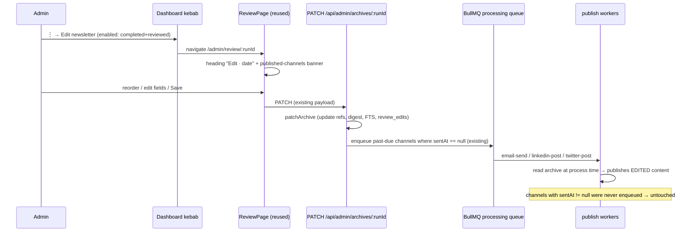

# Design — Edit a newsletter after review is done

## Problem Statement

Once an admin saves a review, the dashboard's primary action flips from "Review" to "View archive" and there is no UI path back into the curation flow. Typos or bad ordering discovered after review (but often before the scheduled email/social publish) cannot be fixed without manual DB surgery. The backend already tolerates re-saving a reviewed archive — the gap is purely the entry point and operator clarity about what an edit can still affect.

## Context

Verified against code in this worktree (code is authoritative):

- `PATCH /api/admin/archives/:runId` (`packages/api/src/routes/archives.ts:224`) → `patchArchive` (`packages/api/src/services/review.ts`) **does not reject already-reviewed archives**. It re-validates ids, rewrites `rankedItems` refs + digest fields, recomputes `search_text`, diffs against `preReviewSnapshot` into `review_edits`, and marks reviewed (idempotent).
- The PATCH route's immediate-publish block calls `selectImmediatePublishChannels` and **skips any channel whose `sentAt` timestamp is non-null** (`emailSentAt` / `linkedinPostedAt` / `twitterPostedAt`). Unsent past-due channels are enqueued `delay: 0`.
- The `email-send` / `linkedin-post` / `twitter-post` workers resolve the archive **at job-process time** (`resolvePublishTarget`) and are idempotent on the sent timestamps — so an edit saved before a channel fires is exactly what gets published on that channel.
- `ReviewPage` (`packages/web/src/pages/ReviewPage.tsx`) has **no reviewed-guard** — it renders any `status === "completed"` archive from the admin GET, including stored per-item overrides (hydration precedence `ref.title > recap.title > row.title`).
- The kebab menu is `SocialOverflowMenu` (`packages/web/src/components/dashboard/SocialOverflowMenu.tsx`), rendered on every run row by both `RunsTable` (≥640px) and `RunsCardList` (<640px).
- `deriveStatus(run)` (`run-status.tsx`) returns `"reviewed"` iff `status === "completed" && run.reviewed`.
- The admin archive GET does **not** currently expose `reviewed`, `emailSentAt`, `linkedinPostedAt`, `twitterPostedAt` — these exist on `RunArchiveRow` and are already selected by `findById` (the PATCH handler reads them off the same row type).

Conclusion: **no pipeline changes, no DB migration, no new env vars.** The feature is a web entry point + gating + a small admin-GET field exposure for the publish-status notice.

## Product Requirements (PRD)

No PRD — internal-facing change (admin-only operator tooling; personas are the two operators, Ritesh and Aman).

## Requirements

### Functional

- **F1** — When a run is `completed` and `reviewed`, the dashboard kebab (⋮) menu SHALL show an enabled "Edit newsletter" item that navigates to `/admin/review/:runId`. This applies to reviewed **dry-run** archives too (user-confirmed).
- **F2** — When a run is not reviewed (ready-to-review), or is `running` / `failed` / `cancelling` / `cancelled`, the kebab menu SHALL show the "Edit newsletter" item **disabled** (visible but inert, matching the existing disabled-item styling in the menu).
- **F3** — The edit flow SHALL reuse the existing review page and `PATCH /api/admin/archives/:runId` save path unchanged — no duplicate page, components, or route. Saving an edit re-runs the existing immediate-publish selection: unsent past-due channels get the edited content; already-sent channels are untouched; the archive (and public `/archive/:runId`, FTS) always updates.
- **F4** — `GET /api/admin/archives/:runId` SHALL additionally expose `reviewed: boolean`, `emailSentAt`, `linkedinPostedAt`, `twitterPostedAt` (ISO string or null). The **public** `GET /api/archives/:runId` shape is unchanged.
- **F5** — When the review page loads a reviewed archive, it SHALL render an edit-mode notice: the heading reads `Edit · <date>` (instead of `Review · <date>`) and, when any sent timestamp is non-null, a banner lists the already-published channels (e.g. "Already published: Email, LinkedIn — edits won't change those; the archive and any unsent channels will update.").
- **F6** — The kebab menu appears identically in `RunsTable` and `RunsCardList`; the Edit item SHALL appear in both via the single shared component.

### Non-functional

- **NF1** — No new HTTP endpoints, DB columns, migrations, or env vars.
- **NF2** — Public archive routes never gain the sent-timestamp fields (admin-only exposure).
- **NF3** — All new strings/derivations covered by unit tests; menu gating covered per state matrix in EC1–EC4.

### Edge cases

- **EC1** — Reviewed + all channels already sent → Edit enabled; save updates archive only; PATCH enqueues nothing (existing `sentAt != null` skip).
- **EC2** — Reviewed + email past-due but unsent → save enqueues `email-send` `delay: 0` (existing); worker sends the **edited** content.
- **EC3** — Reviewed dry-run → Edit enabled; publish workers never fire for dry runs (existing); archive updates.
- **EC4** — `running` / `failed` / `cancelled` / `cancelling` / ready-to-review → Edit item disabled.
- **EC5** — Archive with no sent timestamps (edited before any publish) → heading switches to Edit mode, no published-channels banner.
- **EC6** — Concurrent edit-save while a publish worker is mid-flight → worker may publish pre-edit content. Accepted: already-sent content is explicitly non-revertible per requirements; no locking added.
- **EC7** — Re-PATCH re-adds a BullMQ job with the same `jobIdFor(channel, runId)` → no-op when the job object still exists. Pre-existing behavior on main; unchanged.

## Architectural Challenges

- **Single component, two responsibilities**: the kebab is named `SocialOverflowMenu` and grows a non-social item. We extend it in place (no rename) to keep the diff minimal and avoid churning its tests/imports; the component stays the one overflow menu per run row.
- **Edit-mode detection on the review page**: the page must know `reviewed` + sent timestamps. These ride on the existing admin GET payload (F4) — no second request, no new hook.

## Approaches Considered

Only one viable approach — reuse the existing page + PATCH flow (the task explicitly mandates it, and the backend already supports it). Why not a separate `/admin/edit/:runId` route or an "unreview" flag: both duplicate the curation surface or add state the workers would have to re-interpret, for zero behavioral gain.

## Chosen Approach

1. **API (one file)**: `createAdminArchivesRouter` GET handler adds `reviewed`, `emailSentAt`, `linkedinPostedAt`, `twitterPostedAt` (serialized ISO/null) to the admin state object. Fields already exist on `RunArchiveRow`.
2. **Web — kebab**: `SocialOverflowMenu` gains an "Edit newsletter" menu item above the channel items. Enabled iff `run.status === "completed" && run.reviewed`; disabled otherwise with the existing disabled styling. Navigates to `/admin/review/:runId` (closing the menu). Renders in both table and card list automatically.
3. **Web — review page**: read the new fields off the admin GET; when `reviewed === true` switch the heading to `Edit · <date>` and the subtitle copy; when any sent timestamp is non-null render a notice banner listing published channels. Save flow untouched.
4. **Types**: extend the web-side admin archive response type (and the shared type if the admin GET shape lives in `@newsletter/shared/types`) with the four fields — subpath imports only in web (S-web rule).

## High-Level Design

## External Dependencies & Fallback Chain

None — pure-internal feature.

## Open Questions

None — both operator decisions resolved (notice banner: yes; dry-run edit: yes).

## Risks and Mitigations

- **Risk**: exposing sent timestamps on a route that later gets made public. Mitigation: fields added only to `createAdminArchivesRouter`'s GET; the public router has a separate handler (already split), and NF2 is asserted by a route test.
- **Risk**: an operator edits expecting an already-posted channel to update. Mitigation: F5 banner names the frozen channels explicitly.

## Assumptions

- `findById` selects `reviewed` and the three sent timestamps (verified: the PATCH handler reads them from the same repo row).
