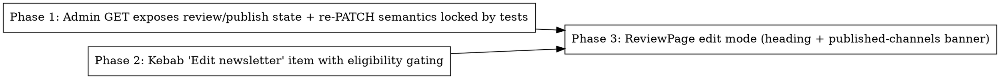

# Plan: Edit a newsletter after review is done

> **Source:** .harness/features/admin-edit-after-review/design.md + spec.md
> **Created:** 2026-06-05
> **Status:** planning

## Goal

An admin can re-enter the existing review page for any reviewed run from a kebab-menu "Edit newsletter" item, see which channels already published, and save edits that update the archive and any not-yet-sent publish channels — with zero new endpoints, migrations, or duplicated UI.

## Acceptance Criteria

- [ ] REQ-001..REQ-008 and EDGE-001..EDGE-006 from spec.md each pass their verification-matrix test
- [ ] `pnpm typecheck`, `pnpm lint`, `pnpm build`, affected package unit suites green
- [ ] Public archive route shape unchanged (REQ-004 asserted by test)

## Codebase Context

### Context Map (Step 2.0)
- **Context map read:** 4 PACKAGE.md (api/routes, web/components/dashboard, web/pages, shared/types), 3 standards files (api, web, global) + ARCHITECTURE.md + DECISIONS.md index
- **Decisions honored:** `D-017` (dual date columns — untouched; kebab item added without altering row columns); `D-018` (SocialOverflowMenu posted/permalink rendering — channel items unchanged, Edit item added above them)
- **Standards honored:** `S-web-01` — new web type imports use `@newsletter/shared/types` subpath only; `S-web-02` — no new fetch calls (reuses `getAdminArchive`); `S-web-03` — banner/heading derivation stays in small helpers, page composes; `S-api-03` — GET handler change is serialization-only, no logic added to the route; `S-api-04` — no repo interface changes (`findById` already selects the four fields); `S-global-01/03` — strict types, no new abstractions.
- **Gotchas carried forward:** SocialOverflowMenu portals its dropdown to `document.body` — the Edit item must live inside the portaled `role="menu"` div (Phase 2); `RunsCardList` shares the same component so both breakpoints get the item for free.

### Existing Patterns to Follow
- **Disabled menu item**: `SocialOverflowMenu.tsx` `renderChannelItem` disabled branch (`disabled` + `aria-disabled` + `opacity-50`)
- **Admin GET serialization**: `packages/api/src/routes/archives.ts:157-222` (`createAdminArchivesRouter` GET — extend the `state` object literal)
- **Sent-skip enqueue tests**: `packages/api/tests/unit/routes/archives-immediate-publish.test.ts` (lines ~314-400 already cover per-channel sent-skip — EXTEND, do not duplicate)
- **ReviewPage render-state derivation**: `formatHeading` helper at top of `ReviewPage.tsx`
- **Web e2e seeding**: `packages/web/tests/e2e/cost-dialog.spec.ts` (pg Client seed + admin login + Playwright assertions)

### Test Infrastructure
- Unit: `pnpm --filter @newsletter/<pkg> test:unit` (vitest; web uses jsdom). Single file: `pnpm --filter @newsletter/<pkg> exec vitest run <path>`
- Web e2e: `pnpm --filter @newsletter/web test:e2e` (Playwright vs :5173 + API :3000 + infra via `pnpm infra:up`)
- Existing specs to extend: `packages/web/tests/unit/components/dashboard/RunsTable-social.test.tsx`, `packages/web/tests/unit/pages/ReviewPage.test.tsx`, `packages/api/tests/unit/archives-route.test.ts`, `packages/api/tests/unit/routes/archives-immediate-publish.test.ts`

## Phase Graph

Phase 1 and Phase 2 are independent (api vs web) and can run in parallel. Phase 3 consumes Phase 1's new fields and extends the e2e spec created in Phase 2.

## Phase Summaries

- **Phase 1 (api):** Add `reviewed`, `emailSentAt`, `linkedinPostedAt`, `twitterPostedAt` to the admin archive GET; assert public GET omits them; lock re-PATCH behavior (200 + update on reviewed archive; sent channels never re-enqueued; all-sent enqueues nothing). Traces: REQ-003, REQ-004, REQ-007, REQ-008, EDGE-001, EDGE-002.
- **Phase 2 (web):** "Edit newsletter" item in `SocialOverflowMenu` — enabled iff `status === "completed" && reviewed` (dry-run allowed), disabled otherwise; navigates to `/admin/review/:runId`. New Playwright spec `edit-after-review.spec.ts` covering kebab gating. Traces: REQ-001, REQ-002, EDGE-003, EDGE-004.
- **Phase 3 (web):** Extend `RunStateResponse` + ReviewPage: `Edit · <date>` heading when reviewed, banner listing already-published channels when any sent timestamp non-null; extend the Phase 2 e2e spec with the full edit-save flow. Traces: REQ-005, REQ-006, EDGE-005, EDGE-006.
