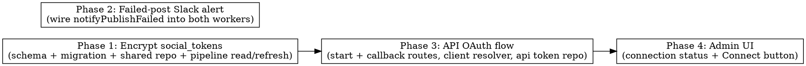

# Plan: Admin LinkedIn OAuth + Failed-Post Slack Alerting

> **Source:** docs/spec/admin-linkedin-oauth/design.md, docs/spec/admin-linkedin-oauth/spec.md
> **Created:** 2026-05-27
> **Status:** planning

## Goal

Let an admin connect/reconnect LinkedIn (with refresh tokens) entirely from `/admin/settings` via a
server-side OAuth flow, store the tokens encrypted at rest, surface connection status in the UI, and
alert Slack when a LinkedIn/X auto-post fails.

## Acceptance Criteria

- [ ] `POST /api/admin/social-credentials/linkedin/oauth/start` returns an authorize URL (REQ-001) or 409 when client creds absent (REQ-002).
- [ ] `GET /api/admin/social-credentials/linkedin/oauth/callback` exchanges code → encrypted `social_tokens` write → 302 (REQ-003), with state CSRF (REQ-004) and failure redirects (REQ-005).
- [ ] `social_tokens` tokens encrypted at rest via `getCredentialCipher()` (REQ-006), readable by both api + pipeline (REQ-007).
- [ ] `linkedin-post`/`twitter-post` workers call `notifyPublishFailed` on `failed` (REQ-008/009), not on `skipped`/`posted` (REQ-010).
- [ ] `/admin/settings` shows LinkedIn connection status + Connect/Reconnect button (REQ-011/012/013/014).
- [ ] Baseline tests stay green; new tests cover every REQ/EDGE.

## Codebase Context

### Existing Patterns to Follow
- **Per-package repos with cipher:** `packages/api/src/repositories/social-credentials.ts` + `packages/pipeline/src/repositories/social-credentials.ts` — each imports `getCredentialCipher` + shared schema. The new `social-tokens` api repo mirrors this.
- **Encrypted-field shape:** `LinkedInEncryptedFields { clientId: EncryptedBlob; clientSecret: EncryptedBlob }` in `packages/shared/src/db/schema.ts:111`. New `SocialTokenEncryptedFields { accessToken; refreshToken }`.
- **Cipher API:** `getCredentialCipher(env).encrypt(plaintext) → EncryptedBlob`, `.decrypt(blob) → string` (`packages/shared/src/services/credential-cipher.ts`). Requires `SESSION_SECRET ≥ 32 bytes`.
- **Client-cred resolver (DB-first/env):** `packages/pipeline/src/services/credential-resolver.ts::resolveLinkedInCredentials` — mirror an api-side version (api must NOT import pipeline; enforced by eslint `no-restricted-imports`).
- **Hono route group mounting:** `packages/api/src/app.ts:94` mounts `adminSocialCredentialsRouter` at `/api/admin/social-credentials` (behind `requireAdmin`). The OAuth `callback` must be exempt from the gate (state-gated) — see Phase 3 note.
- **Redis from API:** `createRedisConnection()` from `@newsletter/shared/redis` (used in `packages/api/src/index.ts:79`).
- **OAuth helpers (pure):** `packages/pipeline/src/social/cli-helpers.ts::buildLinkedInAuthorizeUrl` + `parseTokenResponse`; refresher in `packages/pipeline/src/social/linkedin/oauth.ts`. The API needs equivalents (can't import pipeline) — small pure helpers in api or shared.
- **Worker notify pattern:** `packages/pipeline/src/workers/linkedin-post.ts` + `twitter-post.ts` — `if (result.status === "posted" ...) notify…Posted`. Add `else if (result.status === "failed") notifyPublishFailed`.
- **Slack failure notifier (already built, unwired):** `packages/shared/src/slack/notifier.ts::notifyPublishFailed({ runId, channel })` with `linkedinFailure`/`twitterFailure` idempotency markers + `buildPublishFailedMessage`.
- **Admin UI panel:** `packages/web/src/components/SocialCredentialsPanel.tsx` (LinkedIn client id/secret form). Web imports shared via SUBPATHS only (`@newsletter/shared/types`, never root — see learnings/web-shared-subpath-imports.md).

### Test Infrastructure
- Vitest 3, unit + e2e projects per package. Run: `pnpm test:unit`, `pnpm --filter <pkg> test:unit`.
- API route tests: `packages/api/src/routes/__tests__/*.test.ts` (see `admin-social-credentials.test.ts`).
- Cipher round-trip + repo tests exist for social-credentials — mirror for social-tokens.
- Web component tests under `packages/web/tests/unit/`. Playwright MCP for e2e UI proof.
- **Pre-lint requirement:** `pnpm --filter @newsletter/eslint-plugin build` before `pnpm lint`.

### Migration Notes
- `social_tokens` migration: drop plaintext `access_token`/`refresh_token` columns, add `encrypted_fields jsonb`. The existing LinkedIn row holds a DEAD token — no preservation. Use `pnpm --filter @newsletter/shared db:generate` then `db:migrate`. Follow the no-raw-ALTER eslint rule (generate via Drizzle).

## Phase Graph

Phase 2 is independent of 1/3/4 (only touches workers + Slack) → can run in parallel with Phase 1.
Phase 3 depends on Phase 1 (encrypted token write). Phase 4 depends on Phase 3 (status endpoint + redirect contract).
