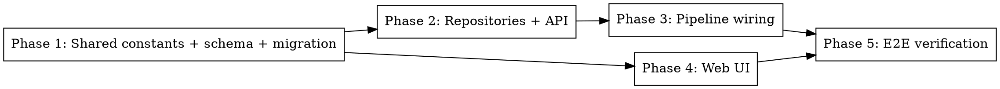

# Plan: Admin-editable ranking prompt

**Spec:** docs/spec/admin-ranking-prompt/spec.md
**Worktree:** /Users/amankumar/Documents/newsletter/.worktrees/feat-admin-ranking-prompt
**Branch:** feat/admin-ranking-prompt

---

## Phase graph

Phase 1 is the foundation (constants + schema + migration + drift test).
Phases 2 and 4 can run in parallel after Phase 1 completes (different surfaces).
Phase 3 depends on Phase 2 (repository changes).
Phase 5 (e2e) depends on Phases 3 and 4 (full stack ready).

For sub-agent dispatch simplicity, we'll serialise phases 1→2→3→4→5 in the coder stage.

---

## Phase 1 — Shared constants + schema + migration

**Covers:** REQ-001, REQ-002, REQ-010, REQ-011, EDGE-001, EDGE-008

### Files
- `packages/shared/src/constants/ranking-prompt.ts` (new) — exports `DEFAULT_RANKING_PROMPT` (verbatim copy of current `RANK_SYSTEM_PROMPT_NO_PROFILE` body).
- `packages/shared/src/constants/index.ts` (new or edit) — re-export.
- `packages/shared/package.json` — add `"./constants"` subpath export.
- `packages/shared/tsup.config.ts` — add `src/constants/index.ts` entry.
- `packages/shared/src/db/schema.ts` — add `rankingPrompt: text("ranking_prompt").notNull()` to `userSettings`.
- `packages/shared/src/db/migrations/0026_<auto>.sql` — generated via `pnpm --filter @newsletter/shared db:generate`, then hand-edited to: (1) ADD COLUMN nullable, (2) UPDATE seed, (3) SET NOT NULL.
- `packages/shared/src/db/migrations/__tests__/0026-seed-drift.test.ts` (new) — drift check.
- `packages/shared/src/types/user-settings.ts` (or wherever `UserSettings` is declared) — add `rankingPrompt: string`.

### Steps
1. Create the constants module.
2. Wire subpath exports.
3. Update schema; run `db:generate`.
4. Hand-edit the generated migration to the 3-step form, embedding the default text via `$prompt$ … $prompt$` dollar-quoting.
5. Write the drift-check unit test (reads SQL, extracts dollar-quoted block, asserts equality).
6. Build shared: `pnpm --filter @newsletter/shared build`.
7. `pnpm --filter @newsletter/shared typecheck` and unit test.

### Tests
- `0026-seed-drift.test.ts`: SQL contains `DEFAULT_RANKING_PROMPT` byte-for-byte.
- `0026-seed-drift.test.ts` (failing path): mutate the constant in-memory, assert the test fails.

### Acceptance
- `pnpm typecheck` green.
- Drift test passes.
- `pnpm --filter @newsletter/shared build` produces a `dist/constants.js`.

---

## Phase 2 — Repositories + API

**Covers:** REQ-003, REQ-004, REQ-005, EDGE-002, EDGE-003, EDGE-004, EDGE-005, EDGE-007

### Files
- `packages/api/src/lib/validate.ts` — add `rankingPrompt: z.string().trim().min(1, "Ranking prompt is required").max(20000, "Ranking prompt too long (max 20000 chars)")` to `userSettingsCommonShape`.
- `packages/api/src/repositories/user-settings.ts` — map `rankingPrompt` in `toDomain()`, INSERT, and `onConflictDoUpdate` SET clause; extend `UserSettingsUpsertInput`.
- `packages/api/src/routes/settings.ts` — include `rankingPrompt` in the `upsertInput` passed to `repo.upsert()`.
- `packages/pipeline/src/repositories/user-settings.ts` — mirror mapping changes (read-only at runtime, but type must include the field).

### Steps
1. Extend zod schema; add unit tests for accept / reject cases.
2. Extend `UserSettingsUpsertInput` and `toDomain`; add round-trip unit test (in-memory or with test DB).
3. Wire route handler.
4. Mirror to pipeline repo.

### Tests
- `validate.test.ts`: accepts valid prompt; rejects empty, whitespace, oversized, missing.
- `user-settings.repo.test.ts`: round-trip multi-line text with special chars (`\n`, backticks, `$`) using an in-memory test DB or a fixture-mocked Drizzle client.
- `settings.route.test.ts`: 400 path returns expected error shape; 200 path persists.

### Acceptance
- `pnpm --filter @newsletter/api test` green.
- `pnpm typecheck` green.

---

## Phase 3 — Pipeline wiring

**Covers:** REQ-006, REQ-007, EDGE-006

### Files
- `packages/pipeline/src/processors/rank.ts` — add `systemPrompt: string` to `RankOptions` (required); replace line 208 hardcoded constant with `options.systemPrompt`.
- `packages/pipeline/src/workers/run-process.ts` — at the rerank call site (~line 655), pass `systemPrompt: settings.rankingPrompt`. Ensure settings are loaded fresh per job (they already are at line ~727; just confirm and pass through).
- `packages/pipeline/src/processors/rank-prompts.ts` — delete `RANK_SYSTEM_PROMPT_NO_PROFILE` (or leave as `export const RANK_SYSTEM_PROMPT_NO_PROFILE = DEFAULT_RANKING_PROMPT` from shared if needed for back-compat with any other consumers; prefer deletion if no other importers).

### Steps
1. Grep for any other importers of `RANK_SYSTEM_PROMPT_NO_PROFILE`; record findings.
2. Update `RankOptions` and `rankCandidates`.
3. Update call site in `run-process.ts`.
4. Remove or re-export the old constant.
5. Add a test asserting `rankCandidates` passes `options.systemPrompt` into the AI SDK call.
6. Add a freshness test: mock the settings repo to return two different prompts on consecutive calls; run two job iterations in the same process; assert each rank invocation observed the respective prompt.

### Tests
- `rank.test.ts`: AI SDK call receives the `systemPrompt` from options, not a hardcoded value.
- `run-process.test.ts` (or new file): freshness — consecutive jobs see consecutive saves.

### Acceptance
- All unit tests pass.
- `pnpm --filter @newsletter/pipeline build` green.

---

## Phase 4 — Web UI

**Covers:** REQ-008, REQ-009, REQ-010

### Files
- `packages/web/src/pages/settingsSchema.ts` (or wherever the form zod schema lives) — add `rankingPrompt: z.string().trim().min(1, "Required").max(20000)`.
- `packages/web/src/pages/SettingsPage.tsx` — extend `getDefaults()` to include `rankingPrompt: ""` initially (server hydrates).
- `packages/web/src/pages/sections/RankingPromptSection.tsx` (new) — monospace textarea + char count + Reset to default button.
- `packages/web/src/pages/SettingsPage.tsx` — mount `<RankingPromptSection />`.

### Steps
1. Add to form schema.
2. Build the section component with `useFormContext()` and `setValue` for reset.
3. Mount in the page.
4. Verify build: `pnpm --filter @newsletter/web build` succeeds with no Node-built-in warnings.

### Tests
- Component unit test (Vitest + RTL): renders, shows char count, Reset button calls `setValue` with `DEFAULT_RANKING_PROMPT`.

### Acceptance
- `pnpm --filter @newsletter/web build` green.
- Component test green.

---

## Phase 5 — E2E verification

**Covers:** VS-1 through VS-5

### Steps
1. Start infra: `pnpm infra:up`.
2. Apply migrations: `pnpm --filter @newsletter/shared db:migrate`.
3. Start API + web dev servers.
4. Use Playwright MCP to drive `/admin/login` → `/admin/settings`, performing VS-1 through VS-4.
5. For VS-5, trigger a run via `/admin` "Run Now" (or via direct API) with a mocked AI SDK boundary (or inspect the structured log line that the rerank stage already emits) to confirm freshness.
6. Capture screenshots into `docs/spec/admin-ranking-prompt/verification/screenshots/`.

### Acceptance
- All 5 VS scenarios produce evidence (screenshots + observed values).
- `docs/spec/admin-ranking-prompt/verification/proof-report.md` written.
- `docs/spec/admin-ranking-prompt/verification/adversarial-findings.md` written.

---

## Risks (cross-cutting)

- **Migration ordering on prod-like DB:** Phase 1 must test the migration against a DB that already has a singleton row (not just a fresh one). The integration test in Phase 1 will spin up a postgres container, apply migrations 0001..0025, then apply 0026, and assert the row has the default text.
- **Freshness regression:** Phase 3 test must explicitly exercise consecutive saves+runs in the same process. This is a previously-bitten failure mode (see `cache-vs-spec-promise-review.md`).
- **Drift between SQL seed and TS constant:** Phase 1 drift test catches at CI time. Without it, a developer editing the constant silently breaks the Reset button.
