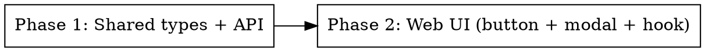
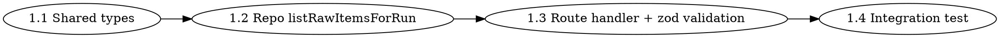
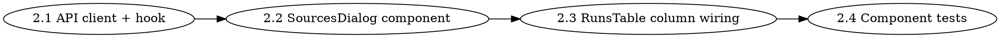

# Implementation Plan: Admin "Sources" Button

**Spec:** docs/spec/admin-source-button/spec.md
**Design:** docs/spec/admin-source-button/design.md

## Phase graph

Phase 2 imports the response type from Phase 1, so it depends on Phase 1.

## Phase 1: Shared types + API endpoint + repository

**Covers REQ:** REQ-005..REQ-012, REQ-021, REQ-022 ; EDGE-008..EDGE-010, EDGE-015

**Files to create:**
- `packages/shared/src/types/run.ts` — append `RawItemSummary` and `RunSourcesResponse` interfaces
- `packages/api/src/repositories/raw-items.ts` (or existing rawItems repo) — add `listRawItemsForRun(runId)`
- `packages/api/src/routes/runs.ts` — add `GET /api/admin/runs/:runId/sources` handler
- `packages/api/test/routes/runs-sources.test.ts` — integration tests
- `packages/api/test/repositories/raw-items-listForRun.test.ts` — repo unit tests

**Acceptance:**
- `pnpm --filter @newsletter/api test` includes new tests, all passing
- Endpoint responds 200/401/404/400 per spec
- Repo returns items sorted `(sourceType ASC, COALESCE(publishedAt, collectedAt) DESC)`
- `content` is never included in response

### Steps

1. **Shared types** — append `RawItemSummary` + `RunSourcesResponse` to `packages/shared/src/types/run.ts`. Export from package barrel if applicable.
2. **Repo `listRawItemsForRun`** — implement in the raw-items repository (locate by `grep -l 'rawItems' packages/api/src/repositories`). Resolution order: `run_archives` lookup → Redis `run:{runId}` fallback → throw `NotFoundError`. Returns `RawItemSummary[]` sorted by source then recency. Excludes `content` column from SELECT.
3. **Route handler** — add to `packages/api/src/routes/runs.ts`, mounted under existing admin middleware. Validate `:runId` with `z.string().uuid()`; on `NotFoundError` return 404 with `{ error: "Run not found" }`.
4. **Integration tests** — covering 200, 400 (bad UUID), 401 (no cookie), 404 (unknown UUID), 200-with-empty-array, sort order, content-omitted invariant.

## Phase 2: Web UI — column, button, modal, hook

**Covers REQ:** REQ-001..REQ-004, REQ-013..REQ-020 ; EDGE-001..EDGE-007, EDGE-011..EDGE-014

**Files to create / modify:**
- `packages/web/src/api/runs.ts` — append `getRunSources(runId)` client
- `packages/web/src/hooks/useRunSources.ts` — new react-query hook
- `packages/web/src/components/dashboard/SourcesDialog.tsx` — new modal
- `packages/web/src/components/dashboard/RunsTable.tsx` — add "Sources" column + wire dialog state
- `packages/web/test/components/SourcesDialog.test.tsx`
- `packages/web/test/components/RunsTable-sources.test.tsx`

**Acceptance:**
- `pnpm --filter @newsletter/web test` includes new tests, all passing
- Table renders new column between Items and Action; column header `Sources`
- Sources button disabled iff status is failed/cancelled AND itemCount === 0
- Modal opens on click, fetches once, renders grouped items, supports loading / error / empty / dismiss states

### Steps

1. **API client + hook** — `getRunSources(runId)` in `packages/web/src/api/runs.ts` returning `RunSourcesResponse`. `useRunSources({ runId, enabled })` with queryKey `['run-sources', runId]`, `staleTime: 30_000`, no auto refetch.
2. **SourcesDialog** — controlled component (`open`, `onOpenChange`, `runId`, `runStartedAt`). Renders Radix Dialog. Header shows formatted date + count subtitle. Body branches on hook state: loading (skeletons) / error (message + Retry) / empty (empty-state copy) / success (grouped renderer). Group order: HN → Reddit → Twitter → Blog → RSS → GitHub → Newsletter (only groups with items). Each item row: thumb 40×40 (placeholder fallback via `onError`), title anchor (`target="_blank"` `rel="noopener noreferrer"`), author, ⭐ points, 💬 comments, relative time using `Intl.RelativeTimeFormat` or existing date util.
3. **RunsTable column wiring** — add `<TableHead>Sources</TableHead>` between `Items` and `Action`. Add `<TableCell>` with `SourcesButton`. Local state `sourcesRunId: string | null` to drive `<SourcesDialog open={sourcesRunId === run.runId} onOpenChange={…} />` rendered once at the table level (avoids one dialog per row).
4. **Component tests** — cover: renders new column, button disabled state, opens dialog with runId, renders grouped items from mocked hook, skeleton on pending, error+Retry, empty state, dismiss.

## Out-of-band

- No DB migration needed.
- No new env vars.
- No new dependencies.

## Verification

- Functional verification scenarios VS-1..VS-5 (see spec.md). Evidence captured under `docs/spec/admin-source-button/verification/`.
- Quality gate: typecheck, lint, all package test suites green.
