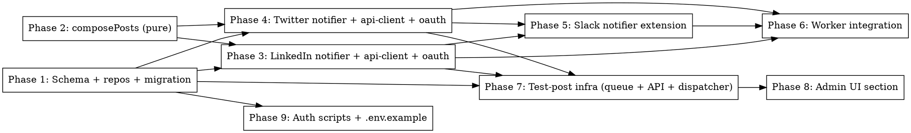

# Plan: Auto-post to LinkedIn and X after newsletter send

> **Source:** `docs/plans/2026-05-11-auto-social-post-on-review-design.md`
> **Spec:** `docs/spec/auto-social-post-on-review/spec.md`
> **Library probe:** `docs/spec/auto-social-post-on-review/library-probe.md` (PASS)
> **Created:** 2026-05-11
> **Status:** planning

## Goal

When the `newsletter-send` worker finishes sending emails for a reviewed run, automatically publish a short post to LinkedIn (personal profile) and X (personal account) using the digest headline + summary + archive URL. Provide an admin "Send test post" button to verify auth without waiting for a real run.

## Acceptance Criteria

- [ ] Migration `0015_auto_social_post.sql` adds `linkedin_posted_at`, `twitter_posted_at`, `social_metadata` columns to `run_archives` and creates the `social_tokens` table.
- [ ] `composePosts(...)` produces the documented templates and obeys the X 280-char ceiling with the documented truncation order.
- [ ] LinkedIn notifier posts to `/rest/posts` and writes `linkedin_posted_at` + permalink in `social_metadata`. Treats 422 DUPLICATE_POST as success-equivalent.
- [ ] Twitter notifier posts via `twitter-api-v2` and writes `twitter_posted_at` + permalink.
- [ ] Either notifier silently no-ops if its env vars are unset.
- [ ] Both notifiers no-op (with log) if `digest_headline` is null.
- [ ] Both notifiers no-op (with log) if their `*_posted_at` is already set.
- [ ] Newsletter-send worker calls both notifiers in parallel, never blocks email send.
- [ ] Slack notification renders a "Social posts" block when `socialResults` is provided.
- [ ] `/admin/settings` shows a "Social posting" section with a configured-state indicator and one test button per platform.
- [ ] Auth scripts at `scripts/auth-linkedin.ts` and `scripts/auth-twitter.ts` upsert tokens into `social_tokens`.
- [ ] All unit + integration tests pass; `pnpm typecheck`, `pnpm lint`, `pnpm test:unit` are green.

## Codebase Context

### Architecture rules (must follow)
- **Schema lives in `@newsletter/shared`** only. Both API and pipeline import from there.
- **DB access only through repositories** (enforced by `newsletter/enforce-repository-access` lint rule). New repos go in `packages/{api,pipeline}/src/repositories/`.
- **Pipeline has no HTTP framework** — never import `hono` or `@newsletter/api`.
- **API routes never import `@newsletter/shared/db` directly** — only via repositories.
- **Migrations are Drizzle-Kit-generated**, never hand-written ALTERs (enforced by `newsletter/no-raw-alter-table`).

### Existing patterns to follow
- **Slack notifier** (idempotency, factory, env-var disabling): `packages/shared/src/slack/notifier.ts:19-130`.
- **Slack message builder** (Slack block format, "delivery" section pattern): `packages/shared/src/slack/message-builder.ts:56-141`.
- **Webhook client** (HTTP boundary, injected `fetchFn`): `packages/shared/src/slack/webhook-client.ts:1-30`.
- **Run-archives repo factory + `markSlackNotified`** (write the same pattern for LinkedIn/Twitter): `packages/api/src/repositories/run-archives.ts:87-143`.
- **Worker post-send invocation** (where to add new notifier calls): `packages/pipeline/src/workers/newsletter-send.ts:352-373`.
- **Deps wiring + dispatcher switch** (env-var construction + `job.name` routing): `packages/pipeline/src/workers/processing.ts:96-132, 182-214`.
- **API route factory + Zod parse** (mirror this for `POST /api/settings/test-social-post`): `packages/api/src/routes/settings.ts:88-196`.
- **Queue construction in API** (mirror this for `socialTestPostQueue`): `packages/api/src/index.ts:67-100`.
- **SettingsPage section/form** (use react-hook-form + react-query, not raw fetch): `packages/web/src/pages/SettingsPage.tsx:1-59`.

### Test infrastructure
- **Vitest 3.** Pipeline tests are split into projects: `unit` (`tests/unit/**`), `seam` (e2e against real services, `tests/e2e/seam/**`), `network` (gated by `RUN_NETWORK_TESTS=1`).
- **Commands:** `pnpm test:unit`, `pnpm test:e2e`. Use `pnpm --filter @newsletter/pipeline test:unit -t "<name>"` to run a single test.
- **Real Postgres + Redis for seam tests** via `tests/e2e/setup/global-setup.ts` (testcontainers/podman). Concurrent-refresh test (REQ-032) goes here.
- **Web e2e** via Playwright; `pnpm --filter @newsletter/web test:e2e`.

### Important deviations from design
- **The design doc says `twitter-api-v2` but the project currently uses `rettiwt-api` (read-only scraper).** These do different things — `rettiwt-api` is a Twitter *scraper* used by collectors; it cannot post. We need to add `twitter-api-v2@1.29.0` as a new pipeline dependency. Library-probe verified this is the right choice. **Add to `packages/pipeline/package.json`, not shared.**
- **The design doc says LinkedIn delete needs the URN format `urn:li:share:<id>`, not just the numeric ID.** This is captured as REQ-023 and REQ-025; the api-client code must construct the full URN from the `x-restli-id` header before storing it.

### Custom lint rules to be aware of
- `newsletter/dotenv-bootstrap`: every entry-point file must import `dotenv` at top.
- `newsletter/enforce-repository-access`: see above.
- `newsletter/no-raw-alter-table`: migration is auto-generated.
- `no-restricted-imports`: pipeline → no `hono` or `@newsletter/api`; web → no `drizzle-orm`.

## Phase Graph

**Wave plan (orchestrate uses this):**
- **Wave 1:** Phase 1 + Phase 2 (independent foundations).
- **Wave 2:** Phase 3 + Phase 4 (LinkedIn + Twitter, fully parallel — different files).
- **Wave 3:** Phase 5 (depends on 3 + 4 to know the SocialResult type) + Phase 7 (depends on 1 + 3 + 4) + Phase 9 (depends on 1).
- **Wave 4:** Phase 6 (depends on 3, 4, 5) + Phase 8 (depends on 7).

## Risks & Mitigations

- **Drizzle-Kit migration may regenerate unrelated columns**: Run `pnpm migrate:generate` and inspect the diff before commit. If extraneous changes appear, hand-edit the migration to keep only the social-post additions.
- **Concurrent-refresh test flakiness**: REQ-032 requires real Postgres `SELECT FOR UPDATE`. Use the `seam` project, not unit, to avoid mocking what is the entire point of the test.
- **`twitter-api-v2` adds ~280KB to the pipeline bundle**: Acceptable for a worker process; documented in the phase notes.
- **Auth scripts cannot be unit-tested end-to-end**: We test pure helpers (URL builders, token-response parsers) and rely on manual one-shot OAuth for full verification. The probe-auth script at `scripts/probe/auth-linkedin.ts` already proved the LinkedIn flow.

## Per-Phase Summary

| Phase | Delivers | Files (approx) | Parallelism |
|---|---|---|---|
| 1 | Schema columns, social_tokens table, migration, two repos | 6 | sequential (single migration) |
| 2 | composePosts pure function + tests | 2 | n/a (single unit) |
| 3 | LinkedIn api-client, oauth, notifier, types | 6 | step-parallel after types |
| 4 | Twitter api-client, oauth, notifier, types (+ new dep) | 6 | step-parallel after types |
| 5 | Slack notifier accepts socialResults, message-builder renders block | 2 | sequential |
| 6 | Worker calls notifiers in parallel; deps wired from env | 2 | sequential |
| 7 | BullMQ queue, API route, dispatcher handler, social-test entry | 5 | step-parallel |
| 8 | SettingsPage "Social posting" section + Playwright | 3 | sequential |
| 9 | scripts/auth-{linkedin,twitter}.ts + .env.example | 3 | step-parallel |
