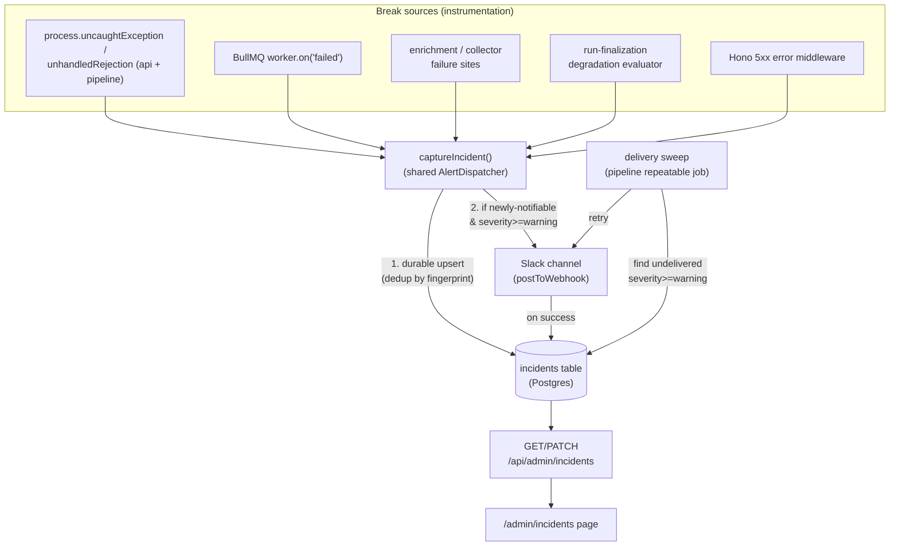
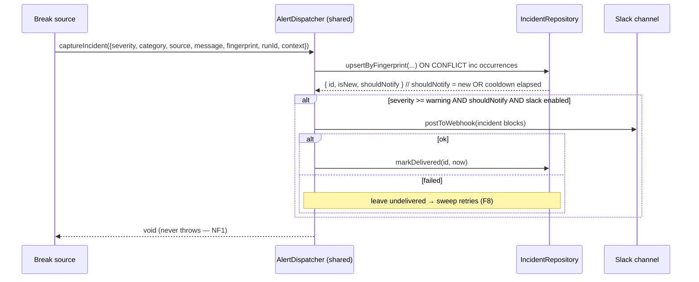
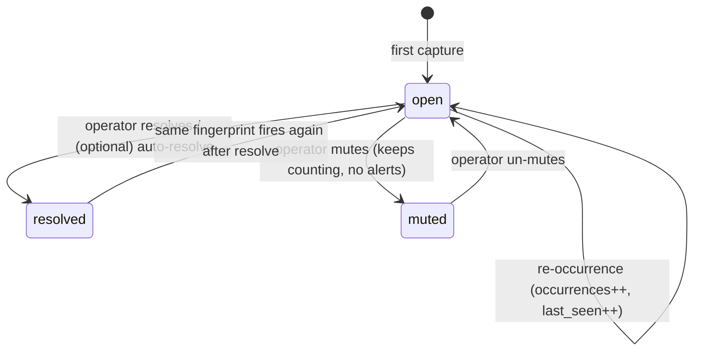

# Centralized Observability & Reliable Alerting — Design

## Problem Statement

When the pipeline breaks, the operator is not reliably notified. The only push
signal today is a small set of Slack notifications fired on **domain milestones**
(newsletter sent, review pending, publish failed). There is **no alert path for
errors**: handled failures (link enrichment, collector errors), worker crashes,
BullMQ job failures, and degraded-but-completed runs are written to logs and
counters and then silently forgotten.

Concretely: in the last run, link enrichment failed across many sources
(`link enrichment failed: arxiv.org — page.goto: net::ERR_TUNNEL_CONNECTION_FAILED`)
and **no Slack notification was ever sent** — not because Slack was flaky, but
because no code path sends an alert on enrichment failure. The run "succeeded"
with a high failure rate and nobody knew until the digest looked thin.

We need (a) a **centralized place to track** what is breaking across the whole
application (api + pipeline workers + web), and (b) **reliable push alerts** the
moment something breaks — covering both hard errors and degradation, delivered
durably so an alert is never silently lost.

## Context

What exists today (verified in code):

- **Structured logging** — Pino (`packages/shared/src/logger.ts`), dual-emitted
  to a `run_logs` table via `createRunLogger` (`packages/pipeline/src/services/run-logger.ts`).
- **Slack notifier** — `packages/shared/src/slack/notifier.ts`. Twelve
  milestone notifications, each idempotent via `archive.notificationState[key]`.
  No-op when `SLACK_WEBHOOK_URL` is unset. The reusable primitive `postToWebhook`
  (`packages/shared/src/slack/webhook-client.ts`) already returns a structured
  `{ ok }` / `{ ok:false, status, error }` result distinguishing network failures.
- **Run observability** — per-run funnel (`run_archives.run_funnel`), per-source
  telemetry, enrichment counters (`EnrichmentTelemetry`), and an admin
  observability **page** (`RunObservabilityPage`) backed by
  `GET /api/admin/runs/:runId/observability`. This is per-run, read-only, and
  in-app — it shows a run's health *if you go look at it*.
- **`/health`** — returns `{ status: "ok" }`, nothing more.

The gaps that caused the incident:

1. Handled errors (enrichment, collectors) are logged + counted but **never alerted**.
2. No `process.on('uncaughtException' | 'unhandledRejection')` in any worker — a
   crash exits the process with no notice.
3. No BullMQ `worker.on('failed')` listeners — a job that exhausts retries is silent.
4. No degradation evaluation — a run that *completes* with 60% enrichment failures
   is indistinguishable from a healthy one to the alerting layer.
5. No cross-run, centralized "what's broken" view — observability is per-run only.

The operator chose (see Open Questions → resolved): **build an internal alerting
layer** (no new vendor), deliver via **Slack**, covering **errors + degradation**.

## Product Requirements (PRD)

### Personas
- **Operator (Aman / Ritesh)** — runs the newsletter daily. Knows the pipeline
  well. Wants a single Slack ping when something breaks and one admin screen to
  see every open incident across runs, without drilling into individual run pages.

### Goals & Non-Goals
- **Goals:**
  - Be notified in Slack within one run cycle of any break (hard error or degradation).
  - Never silently lose an alert — if Slack is momentarily unreachable, the alert
    is durably stored and retried.
  - One centralized admin view of all incidents (open / resolved), across runs.
  - No alert fatigue — repeated occurrences of the same break collapse into one
    incident with an occurrence count, not N pings.
- **Non-Goals:**
  - No new external vendor / SaaS (no Sentry, Datadog, Grafana). Internal layer only.
  - No PagerDuty / phone paging.
  - No distributed tracing or metrics-scraping (Prometheus `/metrics`) — out of scope.
  - Not replacing the existing per-run observability page — this complements it.
  - No public/end-user surface — operator-only, behind the admin gate.

### User Stories
| Story | Persona | Fulfilled by |
|-------|---------|--------------|
| Get a Slack alert the moment enrichment / a collector / a worker breaks | Operator | F1, F2, F3, F6 |
| Get alerted when a run completes but is degraded (high failure rate) | Operator | F4a, F4b, F4c |
| Stop getting 30 pings for the same recurring failure | Operator | F7 |
| Never miss an alert just because Slack was briefly down | Operator | F8 |
| See every open incident in one admin screen and resolve/mute them | Operator | F9, F10, F11 |

### User Flows

**Flow: Operator is alerted to a degraded run**
1. A run finishes with enrichment failure rate above threshold → operator sees a
   Slack message: *"⚠️ Degraded run `<id>`: enrichment failing for arxiv.org,
   ssrn.com (28/40 links, 70%)"* with a link to the run observability page.
2. The same domain keeps failing on the next run → no new ping; the existing
   incident's occurrence count increments.

**Flow: Operator reviews and clears incidents**
1. Operator opens `/admin/incidents` → sees a table of incidents: severity,
   title, source, occurrences, first/last seen, status, link to the run.
2. Operator filters to **Open / critical**.
3. Operator clicks **Resolve** on a fixed incident → it moves to Resolved and
   stops counting.
4. Operator clicks **Mute** on a known-noisy incident → it stops alerting but
   keeps counting (visible, de-emphasized).

**Flow: A worker crashes**
1. An uncaught exception fires in the pipeline worker → a critical incident is
   recorded and a Slack alert is sent **before** the process exits.
2. The incident appears at the top of `/admin/incidents` as critical / Open.

## Requirements

### Functional Requirements
- **F1:** When an uncaught exception or unhandled rejection occurs in any
  long-running process (api server, pipeline workers), the system SHALL record a
  `critical` incident and attempt a Slack alert before the process exits.
- **F2:** When a BullMQ job exhausts its retries (`worker.on('failed')` with no
  attempts left), the system SHALL record an `error` incident carrying the queue,
  job name, and failure reason.
- **F3:** When link enrichment or a collector fails for a given source, the system
  SHALL route that failure through the centralized capture facility (not only the
  existing log line).
- **F4a:** At run finalization (the `completed` branch), the system SHALL record a
  `warning` incident when the run's enrichment failure-rate exceeds
  `ENRICHMENT_FAILURE_RATE_THRESHOLD`.
- **F4b:** At run finalization, the system SHALL record a `warning` incident when a
  source that normally yields items returns zero items for this run.
- **F4c:** When publishing partially fails (some channels succeed, some fail), the
  system SHALL record an `error` incident.
  *(Boundary: F4a/F4b run only on the `completed` branch; a run that fails outright
  never reaches finalization and is instead covered by F2's job-failed incident.)*
- **F5:** When the API returns a 5xx from an unhandled route error, the system
  SHALL record an `error` incident with the route and request context.
- **F6:** Every recorded incident with severity ≥ `warning` SHALL be eligible for
  Slack delivery; `info`-level events SHALL be recorded but never alerted.
- **F7:** The system SHALL deduplicate incidents by a stable fingerprint
  (category + source + normalized signature). Re-occurrence within a cooldown
  window SHALL increment an occurrence count and update `last_seen_at` WITHOUT
  sending a new Slack message. The cooldown decision SHALL compare the **pre-update**
  `notified_at` against `now − INCIDENT_ALERT_COOLDOWN_MS` (evaluated inside the
  upsert, reading the conflicting row's prior value — never the just-bumped
  `last_seen_at`); `notified_at` SHALL be advanced only when a Slack send is actually
  attempted.
- **F8:** Incident recording SHALL be durable-first: the incident is persisted
  before Slack is attempted. If Slack delivery fails, the incident SHALL remain
  marked undelivered, and a periodic delivery sweep SHALL retry it until it
  succeeds or `delivery_attempts` reaches a max cap. Delivery is **at-least-once**:
  if a Slack POST succeeds but the subsequent `markDelivered` write is lost (or the
  process dies between the two), the sweep MAY re-send — duplicate pings are an
  accepted trade-off for an internal tool; we do not add cross-process Slack
  idempotency.
- **F9:** The system SHALL expose `GET /api/admin/incidents` returning incidents
  with filtering by status and severity, newest-first.
- **F10:** The system SHALL expose `PATCH /api/admin/incidents/:id` to set an
  incident's status to `resolved` or `muted` (and back to `open`).
- **F11:** The web admin SHALL provide an `/admin/incidents` page listing
  incidents with severity, title, source, occurrence count, first/last seen,
  status, a link to the originating run (when applicable), and Resolve / Mute actions.

### Non-Functional Requirements
- **NF1 (reliability):** The capture facility MUST NOT throw into its caller. A
  failure to record or deliver an alert must never break a pipeline run or an API
  request — capture is best-effort for the caller, durable for the operator.
- **NF2 (no fatigue):** Default per-fingerprint alert cooldown ≥ 1 hour
  (constant, tune empirically). Degradation thresholds are constants in
  `@newsletter/shared`, not env knobs.
- **NF3 (backwards compatible):** Additive only — a new `incidents` table and a
  new Slack message builder. No changes to existing notification behavior; legacy
  runs with null telemetry degrade gracefully (no degradation incident, not a crash).
- **NF4 (graceful disable):** When `SLACK_WEBHOOK_URL` is unset, incidents are
  still recorded in the DB and visible in the admin page; only Slack delivery is
  skipped (marked as such, not retried forever).
- **NF5 (architecture):** All `incidents` DB access goes through repository
  factories in `api` and `pipeline` (`src/repositories/**`) — the shared facility
  takes a repository interface by injection; it never imports `drizzle-orm`.
- **NF6 (bounded work):** The delivery sweep MUST process a bounded batch
  (`ALERT_SWEEP_BATCH_SIZE`) per tick and MUST stop retrying an incident once
  `delivery_attempts` reaches `ALERT_MAX_DELIVERY_ATTEMPTS`, so an unreachable Slack
  cannot cause unbounded work.

### Edge Cases and Boundary Conditions
- **EC1: Slack webhook down at capture time** — incident persisted, delivery
  marked failed, retried by the sweep. Never lost (F8).
- **EC2: Crash storm** — the same uncaught exception fires repeatedly; dedup
  collapses to one incident + count; cooldown prevents a Slack flood.
- **EC3: DB itself is the failure** — if the incident insert fails (e.g. DB down),
  the facility falls back to a Pino `fatal` log and does not throw (NF1). This is
  the one class we cannot durably store; it is at least logged loudly.
- **EC4: Legacy archive with null funnel/telemetry** — degradation evaluator skips
  rules it has no data for; no false incident.
- **EC5: Dry-run archive** — degradation/publish incidents suppressed for
  `isDryRun` runs, matching the existing Slack-notifier dry-run guard.
- **EC6: Sweep races a live capture** — delivery uses a guarded update
  (`mark delivered WHERE not delivered`) so an incident is sent at most once per
  cooldown even if the sweep and a fresh capture overlap.
- **EC7: Fingerprint with unbounded cardinality** (e.g. per-URL) — fingerprints
  are built from *source/domain + category*, never the full URL, to keep incident
  count bounded.

## Key Insights

1. **Slack wasn't unreliable — it was never called.** The fix is mostly
   *instrumentation* (wiring errors to a capture path), not a better transport.
   A new transport alone would still have stayed silent on the arxiv incident.
2. **"Reliable" = durable-first + retry, not fire-and-forget.** The reason an
   alert can be "never sent" is that delivery is best-effort and in-band. Storing
   the incident first and sweeping for undelivered ones is what makes it reliable.
3. **The dangerous failures are the ones that don't crash.** The arxiv run
   *completed*. Crash-only alerting is a trap; degradation evaluation at
   finalization is the part that actually closes this incident class.
4. **We already have the data, just no judgment layer.** Funnel, per-source
   telemetry, and enrichment counters all exist — degradation detection is a thin
   evaluator over data we already persist, not new collection.

## Architectural Challenges

- **Repository boundary vs. a shared facility.** The capture logic (dedup,
  fingerprinting, severity rules, Slack formatting) is cross-package and belongs
  in `@newsletter/shared`, but DB access may not live there. Resolved by:
  shared exports a pure `createAlertDispatcher({ repo, channels, logger, clock })`
  that depends on an `IncidentRepository` **interface**; api and pipeline each
  implement that interface in their own `src/repositories/**` and inject it.
- **Dedup correctness under concurrency.** Two workers can capture the same
  fingerprint simultaneously. Resolved with an upsert keyed on fingerprint
  (`INSERT … ON CONFLICT (fingerprint) DO UPDATE SET occurrences = occurrences+1,
  last_seen_at = now()`) returning whether this call crossed the notify threshold.
- **Where the delivery sweep runs.** Following this repo's split, the **API
  bootstrap** owns `Queue` instances and registers repeatable schedulers
  (`upsertJobScheduler`), while the **pipeline** runs the consuming Workers. So the
  API registers a repeatable `alert-delivery` job and the pipeline adds a Worker that
  runs the dispatcher sweep over `listUndelivered` — no new long-running process.
  The sweep processes a bounded batch per tick (see Load & Retention).
- **Capturing a crash before exit.** `uncaughtException`/`unhandledRejection`
  handlers must do durable work then exit, in an already-corrupt process. Resolved by
  `Promise.race([recordThenBestEffortSlack(), timeout(ms)])` followed
  unconditionally by `process.exit(1)` — the timeout guarantees a wedged DB/HTTP call
  can't hang the exit. The API crash handler must not double-record a 5xx already
  captured by the Hono error middleware (F5): the middleware capture is the
  authoritative one for handled request errors; the crash handler fires only for
  truly unhandled top-level throws.
- **Not double-alerting milestones.** Existing milestone notifications stay as-is;
  incidents are a parallel channel for *breakage*, keyed off errors/degradation,
  never off normal completion (F6 excludes `info`).

## Approaches Considered

### Approach A: Centralized internal alerting layer (chosen)
A new `incidents` table + a shared `AlertDispatcher` (dedup, severity, durable-first
delivery, retry sweep) + instrumentation hooks (process handlers, BullMQ `failed`,
enrichment/collector capture, run-finalization degradation evaluator) + Slack channel
reusing `postToWebhook` + admin API & page. Trade-off: we own grouping/dedup/retry
and a small UI; in exchange, no vendor, data stays in our Postgres, and it reuses
every primitive already present (Pino, Slack webhook, repository pattern, admin gate).

### Approach B: Managed error tracking (Sentry)
Rejected by the operator. Would give grouping/alerting "for free" via the SDK, but
adds an external vendor + DSN secret, and handled errors (the arxiv case) still need
explicit `captureException` calls — so the instrumentation work is the same, plus a
SaaS dependency.

### Approach C: OpenTelemetry + Prometheus/Grafana/Loki + Alertmanager
Rejected as YAGNI for a two-person internal tool — a multi-container observability
stack to run and maintain, far beyond "notify me when something breaks."

## Chosen Approach

**Approach A.** It directly fixes the reported incident (enrichment failures now
captured + degradation now evaluated), satisfies "centralized" (one table, one admin
page across all runs) and "reliable" (durable-first + retry sweep), adds no vendor,
and is built almost entirely from primitives the codebase already has. Accepted
trade-offs: we maintain a small amount of grouping/UI code, and "reliable delivery"
is on us — mitigated by the durable-first + sweep design and the fact that the store
of record is our own Postgres (high availability for an internal tool).

## High-Level Design

**Capture sequence (durable-first delivery):**

**Incident lifecycle:**

**Components & contracts:**

- **`@newsletter/shared`**
  - `incidents` Drizzle table: `id`, `fingerprint` (unique), `severity`
    (`critical|error|warning|info`), `category` (e.g. `enrichment_failed`,
    `worker_crash`, `job_failed`, `run_degraded`, `api_5xx`), `title`, `message`,
    `source` (domain/queue/null), `run_id` (nullable FK-ish), `context` jsonb,
    `status` (`open|resolved|muted`), `occurrences` int, `first_seen_at`,
    `last_seen_at`, `notified_at` (nullable), `delivery_attempts` int.
  - Types: `Incident`, `IncidentSeverity`, `IncidentCategory`, `IncidentStatus`,
    `CaptureIncidentInput`.
  - `IncidentRepository` interface: `upsertByFingerprint`, `markDelivered`,
    `listUndelivered`, `list(filter)`, `setStatus`.
  - `createAlertDispatcher({ repo, channels, logger, clock })` → `{ capture(input) }`.
  - `buildIncidentMessage(incident)` → Slack blocks; `createSlackAlertChannel({ webhookUrl })`.
  - Constants: `INCIDENT_ALERT_COOLDOWN_MS`, `ENRICHMENT_FAILURE_RATE_THRESHOLD`,
    degradation rule constants.
- **`@newsletter/pipeline`**
  - `IncidentRepository` impl in `src/repositories/`.
  - Bootstrap: install process handlers + per-worker `.on('failed')` → capture.
  - Enrichment/collector failure sites call `capture(...)` alongside existing logs.
  - `evaluateRunHealth(archive, telemetry)` at finalization → degradation incidents.
  - `alert-delivery` **Worker** → `dispatcher` sweep over a bounded batch of
    `listUndelivered`.
- **`@newsletter/api`**
  - `IncidentRepository` impl in `src/repositories/`.
  - Hono error middleware → capture on 5xx; process handlers.
  - Registers the repeatable `alert-delivery` scheduler (owns the `Queue`).
  - Routes: `GET /api/admin/incidents` (filter by status/severity), `PATCH
    /api/admin/incidents/:id` (status), behind `requireAdmin`.
- **`@newsletter/web`**
  - `/admin/incidents` page: react-query list + filters + Resolve/Mute mutations,
    matching existing admin page patterns.

### Load & Retention

- **Table growth is bounded by dedup**, not by occurrence volume — N recurrences of
  the same break are one row with `occurrences++`, so cardinality is roughly
  (categories × distinct sources), small and stable. EC7 keeps fingerprints
  domain-scoped so a per-URL storm can't explode the row count.
- **Sweep is bounded:** each tick processes at most `ALERT_SWEEP_BATCH_SIZE`
  undelivered rows (constant, default 50) ordered by `first_seen_at`; cadence is the
  repeatable-job interval (default a few minutes). `delivery_attempts` is capped at
  `ALERT_MAX_DELIVERY_ATTEMPTS` (default 10) — beyond the cap the incident stays
  visible in the admin page but is no longer retried, preventing an unreachable
  Slack from spinning forever.
- **Retention:** resolved incidents are kept (audit trail) but are out of the
  default `open`-filtered admin view; a retention/archival sweep is deferred (Open
  Questions) — at internal-tool scale the table stays small enough that v1 needs no
  pruning.

## External Dependencies & Fallback Chain

None — pure-internal feature. Reuses the already-integrated Slack incoming webhook
(`SLACK_WEBHOOK_URL`) via the existing `postToWebhook` primitive; no new external
library or third-party API is introduced.

## Open Questions

- **Auto-resolve?** Should an `open` incident auto-resolve after N runs without
  recurrence, or only on manual resolve? Leaning manual-only for v1 (simpler,
  operator stays in control); auto-resolve can be added later as a sweep rule.
  (Parked — does not block planning; v1 = manual resolve.)
- **Degradation thresholds' exact values** — `ENRICHMENT_FAILURE_RATE_THRESHOLD`
  (default 0.3, tune empirically) and "source normally yields items" baseline.
  Starting values are constants, revisited after a few live runs.

## Risks and Mitigations

- **Risk: alert fatigue defeats the purpose.** → Dedup + per-fingerprint cooldown
  + severity gating (`info` never alerts); thresholds tuned to avoid crying wolf.
- **Risk: the alerting layer itself fails silently** (the original sin, recursively).
  → Durable-first store means the incident survives even when Slack/the dispatcher
  misbehaves; dispatcher failures fall back to a loud Pino `fatal` (EC3) and never
  throw into callers (NF1).
- **Risk: crash handler hangs a wedged process.** → record-then-best-effort with a
  short timeout, then `process.exit(1)` regardless.
- **Risk: scope creep into a full observability platform.** → Non-Goals fence it:
  no metrics scraping, no tracing, no vendor; complements (not replaces) the
  existing per-run page.
- **Risk: fingerprint cardinality blowup.** → Fingerprints keyed on
  category + source/domain, never full URLs (EC7).

## Assumptions

- An incoming Slack webhook is configured (`SLACK_WEBHOOK_URL`) for delivery;
  without it, incidents are still tracked in the admin page (NF4).
- Postgres availability is acceptable as the store of record for an internal tool
  (it is already the system of record for runs, archives, and logs).
