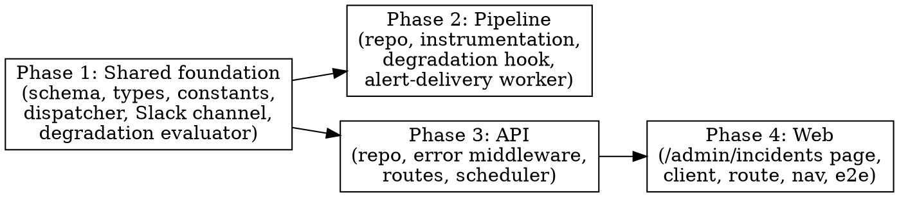

# Plan: Centralized Observability & Reliable Alerting

> **Source:** .harness/features/centralized-observability/design.md + spec.md
> **Created:** 2026-06-08
> **Status:** planning

## Goal

Capture every break across api + pipeline (handled errors, crashes, job failures,
degraded runs) into a deduplicated `incidents` store, deliver Slack alerts durably
(durable-first + retry sweep), and give the operator one `/admin/incidents` screen to
see and clear them.

## Acceptance Criteria

- [ ] Enrichment/collector failures, BullMQ job failures, uncaught exceptions, API 5xx, and degraded runs all create incidents (REQ-001–008).
- [ ] Incidents dedupe by fingerprint with a per-fingerprint cooldown; no alert flood (REQ-009–011).
- [ ] Severity ≥ warning alerts to Slack; `info` never alerts; capture never throws into callers (REQ-012, REQ-017–018).
- [ ] Durable-first persistence + bounded retry sweep; at-least-once delivery (REQ-013–016, EDGE-001/008).
- [ ] `GET`/`PATCH /api/admin/incidents` behind `requireAdmin`; `/admin/incidents` page lists + Resolve/Mute (REQ-020–025).
- [ ] All `incidents` DB access via `src/repositories/**`; shared dispatcher imports no `drizzle-orm` (REQ-026).
- [ ] Typecheck + lint clean; baseline unit suites still green.

## Codebase Context

### Context Map (Step 2.0)
- **Context map read:** 21 PACKAGE.md, 4 standards files (shared, pipeline, api, web + sub-packages).
- **Decisions honored:**
  - `D-110` — new `alert-delivery` work uses a **dedicated queue + worker**: API owns the `Queue` and registers the repeatable scheduler (`reconcile…Schedule`), pipeline runs a separate `Worker` with its own `createRedisConnection()` + listeners + SIGTERM/SIGINT close. Mirrors collector-health exactly; never folds onto `processing` concurrency.
  - `D-111` — incidents use their **own fingerprint+cooldown dedup**, not `run_archives.notification_state`; like collector-health, incident alerts are not run-archive-bound, so the D-107 marker mechanism does not apply.
  - `D-107` — existing run-bearing milestone notifications are untouched; the new channel is additive.
  - `D-070` — capture is **best-effort, never fails the run** (NF1); same posture as the run-logger.
  - `D-102` — the `incidents` table is defined **only in `@newsletter/shared`**.
  - `D-103` — the `context` jsonb column carries an explicit `.$type<IncidentContext>()`.
  - `D-105` — generated migration inspected so the new table/columns are not a bare `ADD COLUMN … NOT NULL` on a populated table (new table → safe; defaults provided).
  - `D-100` — web imports incident **types** via a shared subpath (added to `tsup.config.ts` + `package.json#exports`), never the root barrel.
  - `D-112` — the alert-delivery scheduler key may carry `:` (`alert-delivery:default`); any custom job id passed to `Queue.add` uses a dash, not a colon.
- **Standards honored:** `S-global-01` (strict TS, no `any`); `S-global-04` (log at service boundaries — capture sites are boundaries); `S-pipeline-*` (worker lifecycle, best-effort telemetry); `S-api-*` (zod-validated routes, `requireAdmin`); `S-web-*` (react-query + admin page patterns); `newsletter/enforce-repository-access` (drizzle only under `src/repositories/**`).
- **Gotchas carried forward:** BullMQ ≥5 rejects `:` in custom job ids (D-112); web bundle breaks on root-barrel shared import (D-100); migrations must be inspected for NOT-NULL adds (D-105); `failed` listeners must not throw.

### Existing Patterns to Follow
- **Schema table + jsonb $type:** `packages/shared/src/db/schema.ts` (runArchives).
- **Repository factory (both pkgs):** `packages/{pipeline,api}/src/repositories/run-logs.ts` — `createXxxRepo(db)`; this is the model for the IncidentRepository existing in BOTH packages.
- **Admin route GET+PATCH+zod+requireAdmin:** `packages/api/src/routes/admin-must-read.ts`; registration via `buildApp` deps in `app.ts` + `index.ts`.
- **Dedicated queue+scheduler:** `packages/api/src/services/scheduler.ts` (`reconcileCollectorHealthSchedule`) + `packages/shared/src/scheduling/job-ids.ts` keys.
- **Dedicated worker lifecycle:** `packages/pipeline/src/workers/collector-health.ts` + `packages/pipeline/src/index.ts` (createRedisConnection, on('failed'/'completed'), SIGTERM/SIGINT).
- **Run finalization hook point:** `packages/pipeline/src/services/finalize-run.ts` (sourceTelemetry, enrichmentTelemetry, funnel, dryRun all in scope).
- **Enrichment failure site:** `packages/pipeline/src/services/link-enrichment/index.ts:108-123` (`logEnrichmentFailure`).
- **Slack builder + post:** `packages/shared/src/slack/builders/collector-health.ts` + `webhook-client.ts` (`postToWebhook`).
- **Admin page + client + route + nav + e2e:** `packages/web/src/pages/admin/AdminMustRead*`, `src/api/must-read.ts`, `src/App.tsx`, `src/layouts/AdminLayout.tsx`, `packages/web/tests/e2e/cost-dialog.spec.ts`.

### Test Infrastructure
- **Runner:** Vitest 3 per package (`pnpm --filter <pkg> exec vitest run {FILE}`); full unit: `pnpm test:unit`.
- **E2E:** Playwright under `packages/web/tests/e2e/*.spec.ts`, seeds via `pg.Client`, `adminLogin` via `/api/admin/login`. Infra: hermetic ephemeral PG/Redis (see recent `bc34961` hermetic harness).
- **Build gate:** custom eslint-plugin must be built before lint (`pnpm build`).

## Phase Graph

Phase 1 unblocks Phases 2 and 3, which are **independent** (each implements its own
repository in its own package; they communicate only via Redis/DB) and run in parallel.
Phase 4 depends on Phase 3's API endpoints.
