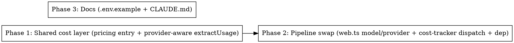

# Plan: Cheaper Provider/Model for Web Discovery + Extraction

> **Source:** docs/spec/cheaper-discovery-extraction/spec.md
> **Created:** 2026-05-27
> **Status:** planning

## Goal

Move the web collector's `discoverPostUrls` + `extractPostFields` LLM calls from Anthropic Claude Haiku 4.5 to Gemini 3.1 Flash-Lite (`@ai-sdk/google`), and price the new stages correctly via a provider-aware usage extractor + a new pricing-table entry — leaving the Anthropic path (rank/shortlist/recap) untouched.

## Acceptance Criteria

- [ ] `discoverPostUrls` + `extractPostFields` run on `gemini-3.1-flash-lite` via `@ai-sdk/google`, keyed by `GEMINI_API_KEY` (REQ-001..003)
- [ ] Cost for `web-discovery`/`web-extraction` records `modelId: "gemini-3.1-flash-lite"` and prices correctly (REQ-004,005,008)
- [ ] `extractUsage` dispatches Gemini → standard-fields-only extractor, Anthropic → unchanged extractor (REQ-006,007; EDGE-001,007)
- [ ] `@ai-sdk/google@2.0.74` pinned in pipeline only; full `pnpm build`+`typecheck` green across the monorepo (REQ-009)
- [ ] Anthropic stages + their tests unchanged and green (REQ-010)
- [ ] `GEMINI_API_KEY` documented in `.env.example` + CLAUDE.md (REQ-011)
- [ ] Live VS-0 probe re-runs green at verification

## Codebase Context

### Files to touch
- **`packages/shared/src/pricing.ts`** — add `gemini-3.1-flash-lite` entry (REQ-005). 5-field shape; cache-write tiers = 0.
- **`packages/shared/src/cost.ts`** — add `extractGeminiUsage(usage)` + `extractUsage(modelId, usage, providerMetadata)` dispatcher; both exported via root barrel (`index.ts:14-15` already `export *`). Keep `extractAnthropicUsage` exported + unchanged. (REQ-006,007)
- **`packages/pipeline/src/services/cost-tracker.ts`** — line 168: swap `extractAnthropicUsage(input.usage, input.providerMetadata)` → `extractUsage(input.modelId, input.usage, input.providerMetadata)`; update the import on line 9-13. (REQ-004,006,007)
- **`packages/pipeline/src/collectors/web.ts`** — line 27 `WEB_COLLECTOR_MODEL_ID = "gemini-3.1-flash-lite"`; lines 195-200 `resolveDefaultModel` → Google provider via `createGoogleGenerativeAI({ apiKey: process.env.GEMINI_API_KEY })("gemini-3.1-flash-lite")` (note line 198 ALSO hardcodes the old id — use the constant). The `record` calls (lines 214,224) already use `WEB_COLLECTOR_MODEL_ID` — no change needed there. (REQ-001,002,003)
- **`packages/pipeline/package.json`** — add `"@ai-sdk/google": "2.0.74"` (already installed during probe). (REQ-009)
- **`.env.example`** + **`CLAUDE.md`** — document `GEMINI_API_KEY`. (REQ-011)

### Existing patterns to follow
- **Pricing entry shape:** existing Anthropic entries in `pricing.ts` (5 fields). Per shared/CLAUDE.md: thinking tokens bill at output rate; no separate reasoning rate.
- **Usage extractor:** mirror `extractAnthropicUsage` structure (`shared/src/cost.ts:47-62`) for the Gemini variant — read standard fields, default the rest to 0.
- **Provider lazy-load:** `resolveDefaultModel` already lazy-imports the provider (`web.ts:195-200`) and caches it — keep that shape, swap the import + factory.
- **Tracker record:** `cost-tracker.ts:167-178` — single line change at the extractor call.

### Test infrastructure
- Runner: Vitest 3, `pnpm test:unit` (turbo). Per-package: `pnpm --filter @newsletter/shared test:unit`, `pnpm --filter @newsletter/pipeline test:unit`.
- Shared cost/pricing tests: `packages/shared/tests/unit/cost.test.ts`, `pricing.test.ts`.
- Pipeline: `packages/pipeline/tests/unit/services/cost-tracker.test.ts`, `tests/unit/collectors/web.test.ts`.
- Pipeline cost e2e: `packages/pipeline/tests/e2e/seam/workers/cost-tracking.e2e.test.ts`.
- **Probe fixture for REQ-006:** `.harness/cheaper-discovery-extraction/probes/ai-sdk-google/payload.sample.json` (real Gemini usage shape: `{inputTokens,outputTokens,totalTokens}`).

### Note
- `cost-tracker.ts` imports from the root `@newsletter/shared` barrel (allowed — the subpath rule is web-package-only). Adding `extractUsage` to the barrel is automatic via `export * from "./cost.js"`.

## Phase Graph

Phase 1 is pure-shared and independently testable. Phase 2 depends on Phase 1 (`cost-tracker` calls `extractUsage`). Phase 3 (docs) is independent of both — can run any time. Recommended order: 1 → 2, with 3 in parallel.
