# Plan: Chrome Extension — Add URL to Next-Day Newsletter

> **Source:** .harness/features/chrome-extension-url-collector/design.md + spec.md
> **Created:** 2026-06-18
> **Status:** planning

## Goal

A separate `@newsletter/extension` MV3 package: log in with the shared password (bearer
token), then one-click submit the current tab's URL so it enters the next run's candidate
pool via a new `manual`-sourced `raw_items` row. Backend exposes bearer-auth extension
routes (isolated from the admin cookie gate). Fully e2e-tested with Playwright loading the
unpacked extension.

## Acceptance Criteria

- [ ] `POST /api/extension/login` issues/validates a bearer token (REQ-001/002)
- [ ] `requireExtensionAuth` gates `POST /api/extension/submissions` (REQ-003/004)
- [ ] Submissions insert a `manual` raw_item (enriched, deduped) eligible for the next run (REQ-005/006/008/009)
- [ ] CORS scoped to `chrome-extension://` on extension routes only; admin gate untouched (REQ-010)
- [ ] Extension popup: login view ↔ add-current-tab view, success + 401 handling (REQ-011/012/013)
- [ ] `@newsletter/extension` builds a loadable MV3 dist with deterministic id (REQ-014/015)
- [ ] E2E suite loads the unpacked extension and drives both flows; unit suite covers auth/validation/ingestion

## Codebase Context

### Existing Patterns to Follow
- **Token HMAC**: `packages/api/src/auth/session.ts` — `issueToken`/`verifyToken` use `createHmac('sha256', secret).update('admin|'+issuedAt)`; `verifyPassword` is constant-time. Extension token mirrors this with an `ext|` payload prefix + its own `EXT_MAX_AGE_MS`.
- **Hono router factory + Deps**: `packages/api/src/routes/runs.ts` — `createXRouter(deps)` + `createDefaultXRouter()`; zod `safeParse` → 400; repository factories injected.
- **Admin gate**: `packages/api/src/auth/middleware.ts` (`requireAdmin`) + mount in `packages/api/src/app.ts`. Extension routes mount as a sibling group, NOT under requireAdmin.
- **Enrichment**: `hydrateAddedPost` from `@newsletter/pipeline/add-post` (already used by `archives.ts` add-post). Reuse for title/author/content.
- **Canonicalize/dedup**: `canonicalizeUrl` (`packages/pipeline/src/processors/dedup.ts`); `externalId = hash(canonicalizeUrl(url))`.
- **raw_items repo**: `packages/api/src/repositories/raw-items.ts` — `upsertItems` with `onConflictDoUpdate` on `(sourceType, externalId)`.
- **SourceType**: `packages/shared/src/db/schema.ts` union + `packages/shared/src/constants/sources.ts` labels — add `"manual"`.
- **Web Vite app + e2e**: `packages/web/` for Vite/React conventions; `packages/web/tests/e2e/run-e2e.mjs` + `playwright.config.ts` for hermetic infra (ephemeral PG+Redis, migrate, boot API) — extension e2e reuses this pattern.

### Test Infrastructure
- Unit: vitest (`pnpm --filter <pkg> exec vitest run <file>`); full `pnpm test:unit`.
- E2E: Playwright `@playwright/test@1.59.1`, Chrome for Testing installed; hermetic infra via `run-e2e.mjs`. Probe confirmed `launchPersistentContext`+`--load-extension` works (`channel:"chromium"`, `--headless=new --no-sandbox --disable-dev-shm-usage`).
- Baseline: typecheck PASS, unit 1167 PASS, lint has 1 pre-existing web error (unrelated).

## Phase Graph

```dot
digraph phases {
  rankdir=LR
  node [shape=box]

  phase_1 [label="Phase 1: shared 'manual' SourceType + candidate eligibility"]
  phase_2 [label="Phase 2: API bearer auth + submissions route + CORS"]
  phase_3 [label="Phase 3: @newsletter/extension MV3 package (build + popup UI)"]
  phase_4 [label="Phase 4: E2E suite (load unpacked ext, both flows)"]

  phase_1 -> phase_2
  phase_2 -> phase_3
  phase_2 -> phase_4
  phase_3 -> phase_4
}
```

Phase 1 → 2 are sequential (2 depends on the `manual` type). Phase 3 (extension UI) depends on Phase 2's contract. Phase 4 (e2e) depends on both 2 and 3 (needs the built extension + live API).
