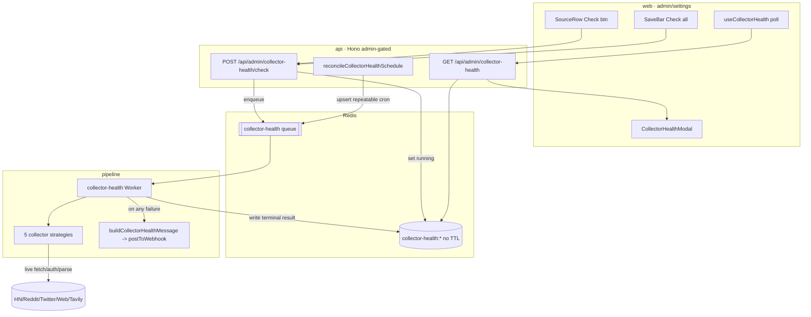
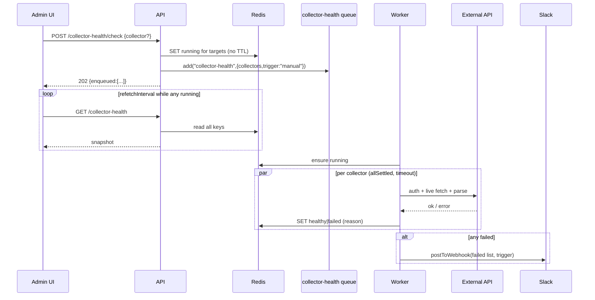
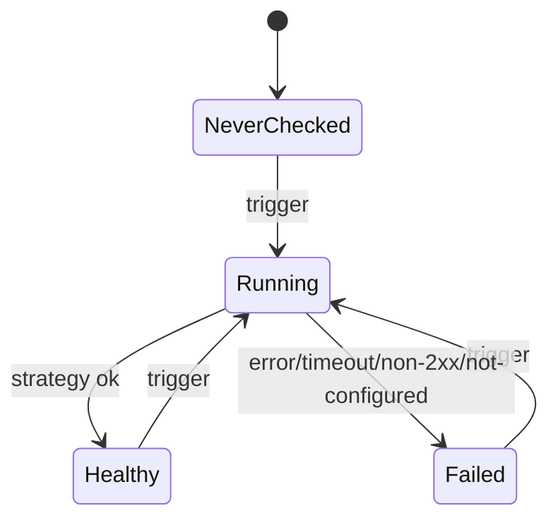

# Design — Collector Health Checks

**Status:** Approved-pending-plan
**Spec name:** `collector-health-checks`
**Author:** orchestrate / brainstorm
**Date:** 2026-06-03

## Problem

The pipeline collects from five live external sources (Hacker News, Reddit, Twitter/X,
Blog/Web, Web Search). Each depends on credentials, network egress, or a third-party API that
can silently break (expired Twitter cookies, a blocked VPS IP, a missing API key, a changed
response shape). Today the operator only discovers a broken collector *after* a daily run
produces a thin or empty digest. We need a way to proactively verify each collector — on demand
and automatically before each scheduled run — and to alert the operator the moment something is
wrong, with a concise reason.

## Context

- Monorepo: `shared` (DB/types/Redis/Slack), `api` (Hono routes + scheduler), `pipeline` (BullMQ
  workers + collectors), `web` (React admin UI).
- Five implemented collectors (`SourceType`): `hn`, `reddit`, `twitter`, `blog` (the "Web" row),
  `web_search`. Each has a real entry point in `packages/pipeline/src/collectors/**` and reusable
  low-level fetch/auth primitives.
- **Template precedent:** an existing `social-health` BullMQ job (`packages/pipeline/src/workers/social-health.ts`)
  is scheduled `SOCIAL_HEALTH_LEAD_MINUTES` (15) before the run via `toCronMinusMinutes` inside
  `reconcilePipelineSchedule` (`packages/api/src/services/scheduler.ts`), re-derived on every
  settings save, and posts a Slack alert on failure with no archive coupling. This feature mirrors
  that pattern at the collector granularity.
- Redis conventions: `run:<id>` run-state (1h TTL), `run:cancel:<id>` pub/sub. Client via
  `createRedisConnection()` from `@newsletter/shared/redis`.
- Slack: `postToWebhook()` + Block Kit builders in `packages/shared/src/slack/`, no-op when
  `SLACK_WEBHOOK_URL` is unset. `social-health` posts directly (no archive marker) — the right
  pattern here since a health check has no `run_archives` row.
- Settings: singleton `user_settings`; `GET/PUT /api/settings`; `reconcilePipelineSchedule` runs on
  the `processing` queue at API bootstrap and on every settings save.
- UI: per-collector `SourceRow` in `packages/web/src/components/settings/SourcesSection.tsx`;
  `SaveBar`; Radix `Dialog` primitive (`components/ui/dialog.tsx`); react-query polling template in
  `hooks/useRunObservability.ts` (`refetchInterval` returns `false` on terminal status).

## Key Insight

A health check is only worth anything if **passing implies the real collector will work**. So each
strategy exercises the *same* auth-resolve → live-fetch → parse path the real collector uses, with
the operator's *saved* config — not a mock and not a synthetic endpoint. The one scoped exception
(by explicit decision) is the Blog/Web check, which runs the real crawl/egress path but stops short
of the LLM discovery step (see AD-5 and "What This Does NOT Do").

## Requirements

### Functional

- **F1** — The system SHALL expose an admin-gated endpoint to trigger a health check for a single
  collector or for all enabled collectors.
- **F2** — When a health check is triggered, the system SHALL run each targeted collector's strategy
  against its live dependency using the operator's saved configuration, and classify the outcome as
  `healthy` or `failed`.
- **F3** — Each collector's latest health result SHALL be persisted in Redis indefinitely (no TTL)
  under a per-collector key, and SHALL survive worker/process restarts.
- **F4** — The system SHALL expose an admin-gated endpoint returning the latest health snapshot. The
  endpoint SHALL enumerate **all five** checkable collectors, returning one entry each; a collector
  with no Redis key is returned with `status: "never"` and null `trigger`/`durationMs`/`reason`/`detail`
  (not omitted). In-flight checks return `status: "running"`.
- **F5** — A health check SHALL run on a dedicated queue/worker so it neither blocks nor is blocked
  by the `processing` pipeline (`run-process`, publishing, etc.).
- **F6** — The system SHALL schedule an automatic health check of all enabled collectors
  `COLLECTOR_HEALTH_LEAD_MINUTES` before the scheduled pipeline run, re-derived whenever the
  pipeline schedule time/timezone changes or scheduling is disabled.
- **F7** — When any targeted collector fails, the system SHALL post a single, formatted Slack
  message listing each failed collector with a concise filtered reason, tagged with the trigger
  source (`scheduled` | `manual`). No-op when `SLACK_WEBHOOK_URL` is unset.
- **F8** — The admin settings page SHALL render a "Check" control beside each collector row and a
  "Check all" control, each opening/feeding a per-collector result modal.
- **F9** — While any watched collector is `running`, the UI SHALL poll the snapshot endpoint until
  all watched collectors reach a terminal status (`healthy`/`failed`).

### Non-functional

- **NF1** — A health check SHALL set targeted collectors to `running` *before* the work begins so a
  polling UI never stops early on a stale terminal result (no start-race).
- **NF2** — A strategy failure (thrown error, timeout, non-2xx) SHALL be caught, classified, and
  persisted as `failed` — a single collector's failure SHALL NOT abort checks of other collectors
  (per-collector `Promise.allSettled` isolation).
- **NF3** — Each strategy SHALL be bounded by a per-collector timeout so a hung dependency cannot
  stall the job indefinitely. Defaults: `blog` 35s, `twitter`/`web_search` 15s, `hn`/`reddit` 10s
  (tune empirically). Strategies run concurrently, so worst-case job runtime ≈ 35s — comfortably
  under the 30-min auto-check lead (F6), guaranteeing the auto-check finishes before the run starts.
- **NF4** — Slack webhook failure SHALL be logged (`slack.collector_health.failed`) but SHALL NOT
  fail the job.
- **NF5** — Credential/config resolution SHALL be DB-first/env-fallback and read per job (no
  worker-startup caching) so admin saves take effect on the next check without a restart — matching
  the existing collector freshness contract.

### Edge cases

- **E1** — Targeted collector has no/empty saved config (e.g. Reddit with no subreddits, Twitter
  with no users/lists, Blog with no sources) → `failed`, reason `"not configured — add sources at /admin/settings"`.
- **E2** — Required credential missing (Twitter cookies, `TAVILY_API_KEY`) → `failed`, reason names
  the exact missing secret and where to set it.
- **E3** — "Check all" with zero enabled collectors → 202 with an empty target list; snapshot
  unchanged; no Slack.
- **E4** — A collector never checked → snapshot entry returned with `status: "never"` (per F4);
  rendered as "Never checked"; not counted as `running`, so polling does not start spuriously.
- **E8** — The UI captures its watch set at trigger time; polling stops when every collector in that
  watch set is non-`running` (F9). A separate re-trigger of a collector restarts its lifecycle
  (`* → running → terminal`); a UI not watching that collector ignores the transition. E7's
  last-writer-wins applies per collector key.
- **E5** — Schedule disabled (`scheduleEnabled=false`) → the auto-check repeatable scheduler is
  removed (symmetry with `social-health`).
- **E6** — `pipelineTime − lead` crosses midnight → handled by `toCronMinusMinutes`'s modulo
  arithmetic (already proven for `social-health`).
- **E7** — Two checks of the same collector enqueued back-to-back → both run (dedicated worker
  concurrency 1 serializes them); the later terminal write wins (last-writer-wins is acceptable —
  it reflects the most recent probe).

## Architectural Decisions

- **AD-1 — Dedicated `collector-health` BullMQ queue + Worker.** Health checks run on their own
  queue/worker, isolated from `processing`. Rationale: the Blog crawl can take ~20–30s and a
  `run-process` job runs for minutes; sharing the single-concurrency `processing` worker would make
  them block each other (F5, NF2). *Tradeoff:* one extra `Queue` (api) + `Worker` (pipeline) to wire
  and start. Justified by the explicit non-blocking requirement. (Note: do NOT set the processing
  worker to `concurrency: 1` for this — that anti-pattern is recorded in
  `.claude/rules/learnings/queue-concurrency-vs-in-process-pacer.md`.)
- **AD-2 — Per-collector Redis key, no TTL.** `collector-health:<collector>` → JSON
  `CollectorHealthResult`. `redis.set(key, json)` with **no `EX`**. The snapshot endpoint reads all
  five keys. Mirrors run-state shape but persists forever (F3).
- **AD-3 — Status lifecycle `never → running → healthy | failed`.** Authoritative `running`-write
  ownership: for **manual** triggers the API writes `running` synchronously before enqueue (NF1) and
  the worker does NOT rewrite it; for the **scheduled** trigger (no API involvement) the worker writes
  `running` at job start. Every `running` write sets the full result shape — `status:"running"`,
  `trigger` (`manual`/`scheduled`), `checkedAt: now`, `durationMs: null`, `reason: null`,
  `detail: null`. The worker overwrites with the terminal result per collector as each strategy
  settles. (The sequence diagram's "ensure running" denotes the scheduled-only write.)
- **AD-4 — Auto-check via a sibling reconcile on the dedicated queue.** A new
  `reconcileCollectorHealthSchedule(collectorHealthQueue, settings)` upserts/removes a repeatable
  scheduler keyed `collector-health:default`, cron =
  `toCronMinusMinutes(pipelineTime, COLLECTOR_HEALTH_LEAD_MINUTES)`, tz = `scheduleTimezone`. Called
  everywhere `reconcilePipelineSchedule` is (bootstrap + settings save). Kept a sibling rather than
  folded into `reconcilePipelineSchedule` because it targets a *different queue* (F6, E5).
  `COLLECTOR_HEALTH_LEAD_MINUTES = 30`.
- **AD-5 — Strategies exercise real collection primitives with saved config.** Per collector:
  - `hn` → live Algolia search (config keyword or default) + validate response shape.
  - `reddit` → fetch first configured subreddit RSS with the bot UA + XML-parse + validate entries.
  - `twitter` → resolve cookie (DB-first/env) → construct rettiwt client → minimal authenticated
    read of the first configured user/list (count 1) → validate shape; classify via existing
    `classifyError`.
  - `blog` → resolve proxy → Crawlee crawl of the first configured listing URL, **crawl-only**
    (validate `requestsFailed===0` + non-empty content); **LLM discovery is intentionally skipped**
    (decision). DeepSeek key is therefore NOT exercised by this check.
  - `web_search` → resolve `TAVILY_API_KEY` → live minimal Tavily query (maxItems 1) → validate
    result shape.
  Each returns `{ status, durationMs, reason?, detail? }`, runs under a per-collector timeout (NF3),
  and is read fresh from settings/credentials per job (NF5).
- **AD-6 — Slack on failure mirrors `social-health` (no archive marker).** One consolidated Block
  Kit message per job listing every failed collector + filtered reason, tagged with trigger source;
  built by a new `buildCollectorHealthMessage` in `shared/slack/builders`, posted via `postToWebhook`.
  Fires for **both** manual and scheduled failures (decision 1). No `notification_state` marker
  (health checks have no run). No-op when webhook unset (F7, NF4).
- **AD-7 — Per-collector failure classifier.** A new `classifyCollectorHealthError(collector, err)`
  produces a concise human-readable reason (auth/missing-secret/rate-limit/network-timeout/blocked/
  schema/not-configured), reusing the Twitter `classifyError` codes where applicable and following
  the `classifyDeliveryFailure` style. The full raw error stays in the structured log; the modal +
  Slack get the short reason.
- **AD-8 — UI: control per `SourceRow` + "Check all" in SaveBar; one polling hook; one modal.** A
  `useCollectorHealth()` react-query hook polls `GET /api/admin/collector-health` with
  `refetchInterval` returning `false` when no collector is `running` (F9, mirrors
  `useRunObservability`). A `CollectorHealthModal` (Radix `Dialog`) shows the latest per-collector
  result (status pill, reason, checkedAt, duration, detail). Web→`blog` mapping is handled in the UI
  layer.

## Approaches Considered

- **Reuse the `processing` queue + raise its concurrency** so health checks run alongside runs.
  Rejected: raising concurrency changes scheduling semantics for *all* job types (two `run-process`
  jobs could overlap) and risks the documented `concurrency` anti-pattern; a dedicated queue is the
  surgical fit.
- **Fold the auto-check scheduler into `reconcilePipelineSchedule`.** Rejected: that function only
  has the `processing` queue; the auto-check belongs on the dedicated queue. A sibling reconcile
  keeps queue ownership clean.
- **One Redis key holding the whole snapshot** vs per-collector keys. Chose per-collector keys:
  independent last-writer-wins per collector, no read-modify-write race when two collectors finish
  concurrently.

## Data Shapes (shared)

```ts
// health-checkable subset of SourceType ("blog" == the Web/blog collector row)
type HealthCheckCollector = "hn" | "reddit" | "twitter" | "blog" | "web_search";
type CollectorHealthStatus = "never" | "running" | "healthy" | "failed";
type CollectorHealthTrigger = "manual" | "scheduled";

interface CollectorHealthResult {
  collector: HealthCheckCollector;
  status: CollectorHealthStatus;
  trigger: CollectorHealthTrigger | null;  // null only for "never"
  checkedAt: string | null;     // ISO 8601; null only for "never"
  durationMs: number | null;    // null while running / never
  reason: string | null;        // concise filtered failure reason; null otherwise
  detail: string | null;        // display-only context (endpoint, sample count); never parsed
}

// snapshot endpoint payload — always one entry per checkable collector (synthesize "never" when no key)
type CollectorHealthSnapshot = { collectors: CollectorHealthResult[] };

const collectorHealthKey = (c: HealthCheckCollector): string => `collector-health:${c}`;
// Redis: SET key json with NO EX (persist forever). "never" entries are synthesized at read time,
// never written.
```

## Architecture







## External Dependencies & Fallback Chain

**None — pure-internal feature.** Every dependency it touches (Algolia/HN, Reddit RSS, `rettiwt-api`,
Crawlee, Tavily `@tavily/core`, `ioredis`, BullMQ, Radix Dialog, `@tanstack/react-query`) is already
integrated and in production use. No new package is added. The health check *exercises* these live
services but introduces no new library surface, so `library-probe` is **NOT_APPLICABLE**.

## Risks & Mitigations

- **R1 — Manual-check Slack noise.** Manual failures Slack too (decision). *Mitigation:* one
  consolidated message per job (not per collector) and a clear `manual` tag; revisit if noisy.
- **R2 — Health check ≠ guarantee of a future run.** A pass means "dependencies + config work now,"
  not forever. *Mitigation:* documented in "What This Does NOT Do"; the auto-check runs close (30m)
  to the run to stay representative.
- **R3 — Blog check excludes the LLM discovery path** (decision). A blog collector can pass the
  health check yet fail discovery at run time. *Mitigation:* explicitly documented; the crawl/egress
  step (the most common blocker — VPS IP blocks) is still covered.
- **R4 — Live external calls cost a little + can rate-limit.** *Mitigation:* minimal single-item
  probes, per-collector timeouts (NF3), DB-first credential reads (no extra auth churn).

## Assumptions

- Per-collector saved config is sufficient to drive a representative probe (a configured subreddit /
  user / listing URL exists for enabled collectors). Where it is absent, E1 governs (`failed —
  not configured`) rather than a silent pass.

## What This Does NOT Do

- Does **not** run the Blog collector's LLM discovery/extraction step or validate `DEEPSEEK_API_KEY`
  (decision: crawl-only). Covers crawl egress + listing reachability only.
- Does **not** store health history/time-series — only the **latest** result per collector (F3).
- Does **not** add a public (non-admin) surface; all routes are admin-gated.
- Does **not** gate or block the pipeline run on health results (it alerts; it does not abort the run).
- Does **not** retry failed strategies with backoff (a single probe per check; the operator can
  re-trigger).
- Does **not** introduce any new external library or model.
```
