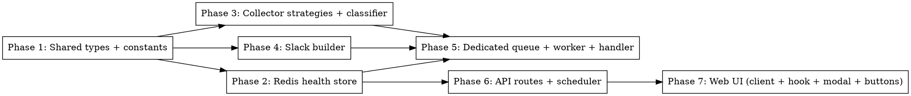

# Plan: Collector Health Checks

> **Source:** docs/spec/collector-health-checks/design.md + spec.md
> **Created:** 2026-06-03
> **Status:** planning

## Goal

Add proactive per-collector health checks (manual + auto pre-run) that exercise each collector's
real auth/fetch/parse path, persist the latest result per collector in Redis forever, alert Slack on
failure, and surface results in the admin settings UI with live polling — all on a dedicated
non-blocking queue.

## Acceptance Criteria

- [ ] Admin can trigger a per-collector or all-collectors health check (REQ-001, REQ-002).
- [ ] Checks run on a dedicated `collector-health` queue/worker, isolated from `processing`
      (REQ-009); processing worker concurrency is not set to 1.
- [ ] Each collector's latest result persists in Redis with no TTL (REQ-007).
- [ ] Snapshot endpoint returns exactly one entry per checkable collector, synthesizing `never`
      (REQ-008).
- [ ] An auto-check is scheduled 30 min before the run and re-derived on every settings save / removed
      when scheduling is disabled (REQ-011, REQ-012).
- [ ] Any failure posts one consolidated Slack message tagged with trigger source; no-op when webhook
      unset (REQ-014, REQ-015, REQ-016).
- [ ] Settings UI shows per-row "Check" + "Check all" controls and a per-collector modal; UI polls
      while running until terminal (REQ-017, REQ-018, REQ-019).

## Codebase Context

### Context Map (Step 2.0)
- **Context map read:** 2 PACKAGE.md (pipeline/workers, shared/slack) + ARCHITECTURE.md + DECISIONS.md
  + 4 standards files (global, api, pipeline, web). Collectors/scheduler/settings/redis subsystems
  were additionally mapped directly from code by four exploration agents during brainstorm.
- **Decisions honored:**
  - `D-051` — collector-health worker resolves credentials (Twitter cookie, `TAVILY_API_KEY`,
    `WEB_HTTP_PROXY`, settings) **per job**, not at worker construction.
  - `D-107` — the existing Slack idempotency marker (`notification_state`) is **deliberately not
    used**: a health check has no `run_archives` row, so we post directly via `postToWebhook` (the
    `social-health` pattern), not via the archive-coupled `notifyWithMarker`.
  - `D-100` — web imports the new health types via the `@newsletter/shared/types` subpath only.
  - `D-014` — no Redis pub/sub needed here; the BullMQ job model suffices (noted, not used).
- **Standards honored:**
  - `S-global-01` strict TS; `S-global-03` strategies reuse existing collector primitives rather than
    new abstractions; `S-global-04` logs only at job/strategy boundaries.
  - `S-pipeline-01` no HTTP in pipeline; `S-pipeline-03` per-job credential resolution.
  - `S-api-01` Redis access via a store module (not drizzle); `S-api-02` API enqueues by queue **name**
    + constructs its own `Queue` (no static pipeline import); `S-api-03` thin handlers.
  - `S-web-01` subpath imports; `S-web-02` calls via `apiFetchAdmin`; `S-web-03` thin pages (logic in
    hook).
- **Gotchas carried forward:**
  - workers `D-051` gotcha → health worker deps built per-job (shapes Phase 5).
  - slack archive-coupling gotcha → direct `postToWebhook`, no notifier method (shapes Phase 4/5).
  - learning `queue-concurrency-vs-in-process-pacer` → dedicated queue; never set processing
    concurrency to 1 (shapes Phase 5 + a guard test in REQ-009).
  - learning `drizzle-not-null-add-column` → **N/A: no DB migration** (Redis-only persistence).
  - learning `web-shared-subpath-imports` → Phase 7 uses subpaths; add subpath exports in Phase 1 if
    missing.

### Existing Patterns to Follow
- **Scheduled pre-run job:** `packages/pipeline/src/workers/social-health.ts` + `SOCIAL_HEALTH_*` in
  `packages/api/src/services/scheduler.ts` (`toCronMinusMinutes`) — the direct template.
- **Dispatching worker + queue:** `packages/pipeline/src/workers/processing.ts`,
  `packages/pipeline/src/queues/processing.ts`, started in `packages/pipeline/src/index.ts`.
- **API queue construction (no pipeline import):** `new Queue("processing", { connection })` in
  `packages/api/src/index.ts` / `routes/runs.ts`.
- **Scheduler reconcile:** `reconcilePipelineSchedule` in `packages/api/src/services/scheduler.ts`,
  called at `api/src/index.ts` bootstrap + `routes/settings.ts` PUT.
- **Redis client:** `createRedisConnection()` from `@newsletter/shared/redis`; key helpers in
  `packages/shared/src/constants/index.ts` (`runKey`).
- **Slack builders:** `packages/shared/src/slack/builders/*` + `_helpers.ts` (`headerBlock`,
  `sectionMarkdown`, `truncate`); `postToWebhook` in `webhook-client.ts`.
- **Collector primitives:** hn (`collectors/hn.ts`), reddit (`collectors/reddit.ts`), twitter
  (`collectors/twitter/index.ts` + `resolveTwitterCollectorCookie` in `services/credential-resolver.ts`),
  web/blog (`collectors/web.ts` + `services/web-crawler.ts` `runWebCrawl`/`resolveWebProxyUrl`/`isCrawlableUrl`),
  web_search (`collectors/web-search/providers/tavily.ts`). Reuse the existing fetch/auth/parse helpers
  (export them from the collector module if currently private rather than duplicating the request shape).
- **react-query polling:** `packages/web/src/hooks/useRunObservability.ts` (`refetchInterval` returns
  `false` on terminal).
- **Modal:** `packages/web/src/components/ui/dialog.tsx` (Radix); example `CostDialog.tsx`.
- **Settings UI rows:** `packages/web/src/components/settings/SourcesSection.tsx` (`SourceRow`),
  `SaveBar.tsx`.

### Test Infrastructure
- Vitest 3 per package (`pnpm test:unit`, `pnpm test:e2e`). Pipeline/api tests inject deps (fake
  fetch, fake queue, fake redis). Web uses Vitest + RTL. E2E via Playwright MCP in the verify stage.
- Run: `pnpm typecheck`, `pnpm lint` (needs `pnpm build` first for the eslint-plugin in a fresh
  worktree), `pnpm test:unit`.

## Phase Graph

Ready after P1: **P2, P3, P4 in parallel.** After P2: **P6** (parallel with P3/P4/P5). P5 needs
P2+P3+P4. P7 needs P6. Waves: [P1] → [P2,P3,P4] → [P5,P6] → [P7].

## Requirement → Phase Map

| Phase | REQ / EDGE covered |
|-------|--------------------|
| P1 | data shapes (all), REQ-007 key helper |
| P2 | REQ-003, REQ-005, REQ-006, REQ-007, REQ-008, EDGE-006 |
| P3 | REQ-004, REQ-006, REQ-020, REQ-021, REQ-022, EDGE-002/003/004/005/009/011/012/013 |
| P4 | REQ-014 (message shape) |
| P5 | REQ-004(wiring), REQ-009, REQ-010, REQ-013, REQ-014, REQ-015, REQ-016, EDGE-008/010 |
| P6 | REQ-001, REQ-002, REQ-003, REQ-008, REQ-011, REQ-012, REQ-023, EDGE-001/007 |
| P7 | REQ-017, REQ-018, REQ-019, EDGE-006 |
