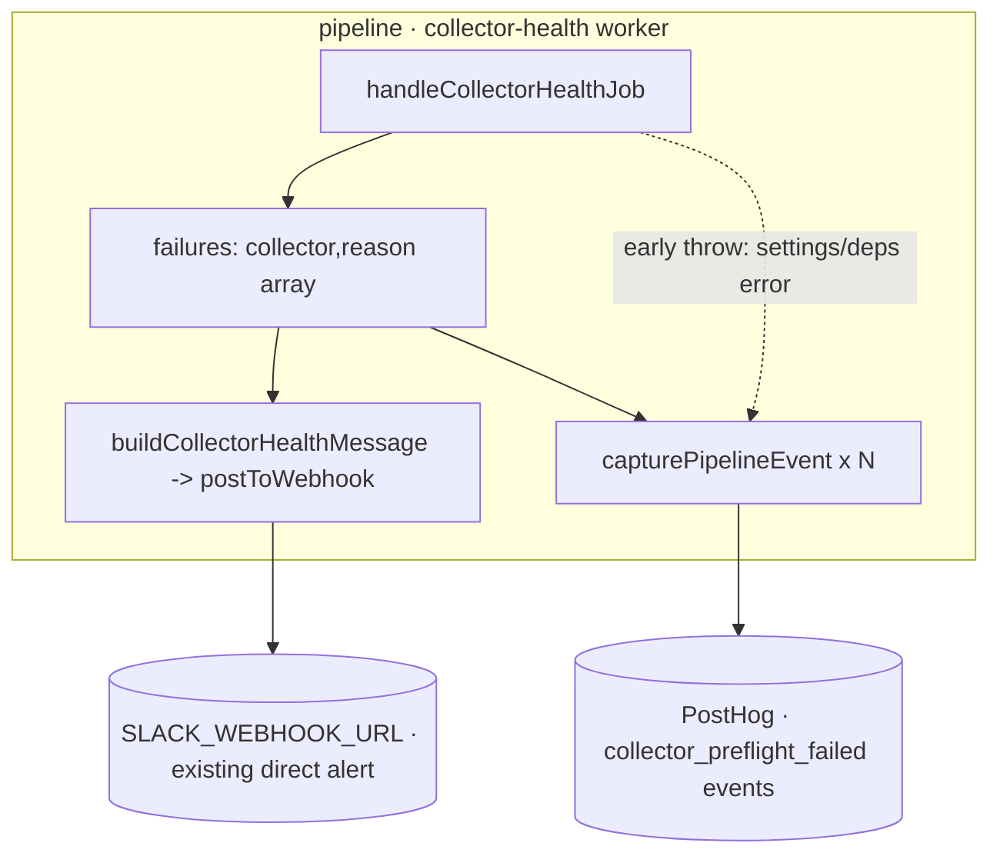

# Design — Collector Health Check → PostHog Emit

**Status:** Draft (pending user approval)
**Spec name:** `collector-health-posthog-emit`
**Date:** 2026-06-09
**Build target:** `feature/posthog-error-tracking` branch (depends on its `capturePipelineEvent` infra + the already-merged-on-branch `collector-health-checks` feature)

## Problem

The pipeline already has a **pre-flight collector health-check** (feature `collector-health-checks`,
on this branch): a dedicated `collector-health` BullMQ job runs `COLLECTOR_HEALTH_LEAD_MINUTES` (30)
before the daily run, probes each enabled collector against its live dependency with the operator's
saved config, persists per-collector results to Redis, and posts a consolidated Slack message on
failure via the project's own `SLACK_WEBHOOK_URL`.

What it does **not** do: emit anything to PostHog. So broken collectors are not searchable in the
PostHog dashboard, there is no per-collector failure history there, and the alert cannot be routed
through a PostHog Slack destination (the same mechanism used for `pipeline_run_degraded` /
error-tracking). The operator wants the pre-flight failures to show up in PostHog — with enough
per-source detail to track down the cause in the dashboard rather than reproduce locally —
alongside the existing direct-webhook Slack alert.

## Context

- **Worker:** `packages/pipeline/src/workers/collector-health.ts` →
  `handleCollectorHealthJob(deps, job)`. It builds a `failures: { collector, reason }[]` array and a
  `successCount`/`failureCount`, logs `collector_health.job_complete`, then posts Slack on failure.
  This is the single natural emit point.
- **PostHog capture infra (this branch):** `packages/pipeline/src/lib/posthog.ts` exports
  `capturePipelineEvent(event: string, properties?: Record<string, unknown>): void` — a **silent
  no-op when PostHog is unconfigured** (parity with the `SLACK_WEBHOOK_URL`-unset pattern), wrapped
  in try/catch, no await/flush. This is exactly the function `finalize-run.ts` uses to emit
  `pipeline_run_degraded`.
- **Reference emit:** `packages/pipeline/src/services/finalize-run.ts` emits one
  `pipeline_run_degraded` PostHog event per health finding — the precedent this design mirrors
  (one event per failing collector, flat string/number properties).
- **Outcome shape available at the emit point:** each settled check yields
  `{ collector: HealthCheckCollector, status, durationMs, reason, detail }` and the job knows its
  `trigger` (`"manual" | "scheduled"`). `severity` is NOT currently on the collector-health outcome
  (the run-health `evaluateRunHealth` has severity; the collector probe does not) — see Decisions.

## Requirements

### Functional

- **F1** — When a `collector-health` job completes with ≥1 failed collector, the system SHALL emit
  one PostHog event per failed collector via `capturePipelineEvent`.
- **F2** — The event name SHALL be `collector_preflight_failed`.
- **F3** — Each event SHALL carry flat, queryable properties: `collector` (string), `reason`
  (string, the already-classified concise reason), `trigger` (`"manual" | "scheduled"`),
  `durationMs` (number | null). (See Decisions for `severity`.)
- **F4** — Emission SHALL be a silent no-op when PostHog is unconfigured (inherited from
  `capturePipelineEvent`); it SHALL NOT fail or delay the job, and SHALL NOT alter the existing
  Slack-on-failure or Redis-persist behavior.

### Non-functional

- **NF1** — Emission SHALL NOT throw into the job (capture is already try/catch-wrapped; the call
  site adds no new failure path).
- **NF2** — Healthy/`successCount`-only completions SHALL emit nothing (no per-success event) — the
  feature is an alerting/observability signal for failures, mirroring `pipeline_run_degraded` which
  only fires on a finding. (Tunable later if a "still-healthy" heartbeat is wanted; not now — YAGNI.)
- **NF3** — No new env vars. Reuses the existing `POSTHOG_*` config resolved inside
  `capturePipelineEvent`.

### Edge cases

- **E1** — PostHog unconfigured → `capturePipelineEvent` returns immediately; job behaves exactly as
  today. (Most common case in local/dev.)
- **E2** — Settings-load or deps-build failure path (the worker writes `failed` for explicit targets
  then `throw`s): emit `collector_preflight_failed` for those forced-failed collectors **before**
  rethrowing, so a settings/infra outage that breaks every collector is still visible in PostHog.
  Reason = the caught error message (same string already written to Redis).
- **E3** — `reason` is null on an outcome classified `failed` (shouldn't happen — the classifier
  always yields a string — but defensively) → emit with `reason: "unknown"` (same fallback the Slack
  path already uses).
- **E4** — A check that *threw* (caught in the per-collector try/catch, persisted `failed` with the
  raw message) → already folded into the `failures[]` array, so it emits like any other failure. No
  special handling.

## Architectural Decisions

- **AD-1 — Emit at the single existing failure-aggregation point in `handleCollectorHealthJob`,
  right after `failures[]` is built and before/around the Slack post.** One event per entry in
  `failures[]`. Rationale: that array is already the canonical "what failed + why" list the Slack
  message is built from; emitting from the same place guarantees PostHog and Slack never diverge.
  *Not* emitted inside the per-collector `Promise.allSettled` map, to keep one clear emit site and
  avoid interleaving with the Redis writes.
- **AD-2 — Reuse `capturePipelineEvent`, do not add a new capture helper.** It already encapsulates
  the no-op-when-unconfigured + try/catch contract. One-line call per failure.
- **AD-3 — `severity` handling.** The collector-health outcome has no severity field today. Rather
  than thread a new field through the probe strategies (scope creep), derive a constant
  `severity: "error"` at the emit site — a failed pre-flight collector is unambiguously an error for
  the operator (it will produce a thin/empty digest). If finer grades are wanted later, add severity
  to `CollectorHealthOutcome` then. (YAGNI: hardcode now.)
- **AD-4 — Forced-failure paths (E2) also emit.** The two early-`throw` branches (settings_error,
  deps_error) currently write `failed` to Redis for explicit targets but never reach the Slack/emit
  block. Add the emit there too so total-outage cases aren't silent in PostHog. Mirror the same
  property shape.

## Implementation Note

Implemented on `feature/posthog-error-tracking`: a `capturePipelineEvent` dependency added to
`CollectorHealthJobDeps` (default-wired from `@pipeline/lib/posthog.js`), and a local
`emitPreflightFailed` helper called from three sites in `handleCollectorHealthJob` — the
failure-aggregation loop (with the real `outcome.durationMs`) and the two early-throw paths
(settings-load error, deps-build error). 5 new tests in
`packages/pipeline/tests/unit/workers/collector-health.test.ts`; the suite mocks
`@pipeline/lib/posthog.js` to keep `posthog-node` out of the unit run.

## What This Does NOT Do

- Does **not** create the PostHog insight / alert / Slack-destination for `collector_preflight_failed`
  — that is PostHog UI/API config done after the event exists in the project (separate, via the
  PostHog MCP, analogous to the `pipeline_run_degraded` Alert 3 already created). The design's job is
  to make the event *exist*.
- Does **not** emit per-success or a healthy heartbeat (NF2).
- Does **not** add `severity` to the probe strategies (AD-3) or change any probe logic, Redis shape,
  Slack message, or schedule.
- Does **not** touch `evaluateRunHealth` / `pipeline_run_degraded` (a distinct in-run signal).

## Architecture

## Risks & Mitigations

- **R1 — Double-alerting** (existing direct webhook Slack + a future PostHog Slack destination both
  fire). Mitigation: this design only adds the *event*; whether to also wire a PostHog Slack
  destination is the operator's later choice. If both are on, that is two messages by design —
  documented, not a defect.
- **R2 — Property-name drift from `pipeline_run_degraded`** (which uses `kind`/`source`/`severity`/
  `rate`). Mitigation: deliberately use `collector`/`reason`/`trigger`/`severity` — the natural
  vocabulary for a pre-flight check; they are different events with different shapes. Documented in
  F3.

## External Dependencies & Fallback Chain

None — pure-internal feature. Reuses `posthog-node` already on the branch via `capturePipelineEvent`.

## Open Questions

- None blocking. (The downstream PostHog insight/alert/Slack-destination config is explicitly
  out of scope and handled separately once the event lands.)
