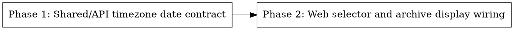

# Plan: Admin Settings Timezone for Date Selectors

> **Source:** docs/spec/date-selectors-admin-timezone/spec.md
> **Created:** 2026-05-23
> **Status:** in-progress

## Goal

Make admin-facing date selectors, calendar-run lookup, and archive issue dates use the timezone configured in admin settings.

## Acceptance Criteria

- [ ] A run completed near UTC midnight is grouped under the admin-settings local date.
- [ ] Eval calendar and manual fixture import date selectors default to the admin-settings local day.
- [ ] Archive list/detail dates match the admin-settings local day, independent of browser timezone.
- [ ] Analytics date defaults use the admin-settings local day.
- [ ] Missing or invalid timezone settings fall back to UTC.

## Codebase Context

### Existing Patterns to Follow

- **Settings source:** `packages/web/src/hooks/useSettings.ts` and `packages/api/src/repositories/user-settings.ts` already expose `scheduleTimezone`.
- **Calendar run lookup:** `packages/api/src/routes/admin-eval.ts` delegates to `packages/pipeline/src/repositories/eval-exports.ts`.
- **Archive list/detail:** `packages/api/src/routes/archives.ts` and `packages/api/src/repositories/run-archives.ts` shape public archive dates.
- **UI selectors:** `packages/web/src/pages/EvalIndexPage.tsx`, `packages/web/src/pages/EvalManualFixturePage.tsx`, and `packages/web/src/pages/AnalyticsPage.tsx` contain native date inputs.
- **Date display:** `packages/web/src/components/ArchivePageHeader.tsx` and eval page helpers currently rely on browser-local `Intl` defaults.

### Test Infrastructure

- Web unit tests use Vitest and Testing Library.
- API unit tests use Vitest with mocked repositories/routes.
- Existing eval tests cover calendar date selection and fixture import.
- Browser verification uses Playwright MCP against Vite with mocked API responses.

## Phase Graph

## Phases

1. **Phase 1: Shared/API timezone date contract**
   - Add shared timezone date helpers.
   - Make calendar-run lookup interpret selected dates in settings timezone.
   - Make archive list/detail payloads expose dates computed in settings timezone.
   - Add unit/API coverage for near-midnight Asia/Kolkata behavior and UTC fallback.

2. **Phase 2: Web selector and archive display wiring**
   - Use settings timezone for eval calendar, manual fixture import, and analytics date defaults.
   - Use settings timezone for run timestamp labels.
   - Render archive detail issue date from configured timezone data instead of browser timezone.
   - Add unit and browser verification coverage.
