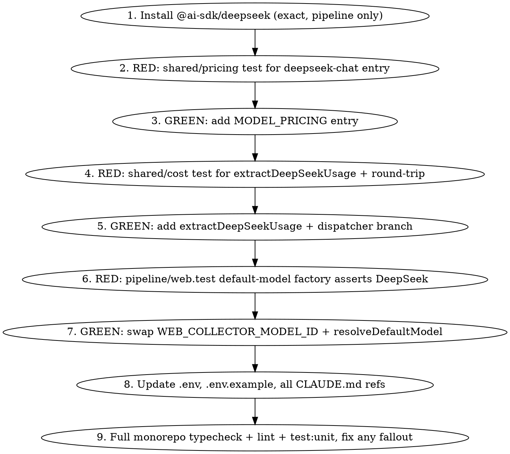

# Implementation Plan — deepseek-v4-web-discovery

**Single phase.** The change is tightly scoped (one prod file in pipeline, two in shared, env + docs). All steps run sequentially in TDD order — no parallelism opportunity.

## Phase graph


## Phase 1: DeepSeek swap + cost wiring + docs

**Files touched (final):**
- `packages/pipeline/src/collectors/web.ts` — change `WEB_COLLECTOR_MODEL_ID`, rewrite `resolveDefaultModel`
- `packages/pipeline/tests/unit/collectors/web.test.ts` — update Phase 2 block (REQ-015)
- `packages/pipeline/package.json` — add `@ai-sdk/deepseek` exact-pinned to `ai-v5`-resolved version
- `packages/shared/src/pricing.ts` — add `MODEL_PRICING["deepseek-chat"]` entry
- `packages/shared/src/cost.ts` — add `extractDeepSeekUsage` + dispatcher branch
- `packages/shared/tests/unit/pricing.test.ts` (existing or new) — add REQ-016 rate-exactness test
- `packages/shared/tests/unit/cost.test.ts` (existing or new) — add REQ-017 round-trip cost-math test
- `.env.example` — add `DEEPSEEK_API_KEY=`, remove `GEMINI_API_KEY=`
- `.env` — same (gitignored, runtime)
- `CLAUDE.md` (root) — update Required env vars + web-collector references
- `packages/pipeline/CLAUDE.md` — update web-collector LLM block
- `packages/shared/CLAUDE.md` — update `MODEL_PRICING` description

### Step graph



### Step detail

**Step 1 — Install dependency.**
```bash
pnpm add @ai-sdk/deepseek@ai-v5 --save-exact --filter @newsletter/pipeline
pnpm typecheck  # gate per ai-sdk-provider-version-must-match-ai-major.md learning
```
The version that lands in `package.json` MUST be the literal version (currently `1.0.41`), not `^1.0.41` or `ai-v5`. If `--save-exact` resolved the dist-tag literally, that's fine; otherwise hand-edit.

**Step 2 — RED: pricing test.**
Add a unit test asserting `MODEL_PRICING["deepseek-chat"]` deep-equals the five-field object from REQ-004. Run, observe failure (entry doesn't exist).

**Step 3 — GREEN: pricing entry.**
Insert the new entry in `packages/shared/src/pricing.ts` alongside the preserved `"gemini-3.1-flash-lite"` entry. Run pricing test → green.

**Step 4 — RED: cost extractor + round-trip test.**
Two assertions in one test file:
- `extractUsage("deepseek-chat", {inputTokens:351, outputTokens:157, cachedInputTokens:256})` returns the six-field shape from REQ-006 (cache-creation/reasoning forced to 0).
- `computeCallCost` of the extracted shape against `"deepseek-chat"` returns `costUsd` matching `(351-256)/1e6 * 0.14 + 256/1e6 * 0.0028 + 157/1e6 * 0.28`. Use `expect(...).toBeCloseTo(0.00005732168, 9)` for FP tolerance.

Run, observe failure (dispatcher routes deepseek to anthropic extractor, wrong shape).

**Step 5 — GREEN: extractor + dispatcher branch.**
Add `extractDeepSeekUsage` in `packages/shared/src/cost.ts` (mirror `extractGeminiUsage` exactly; the live probe confirmed identical shape). Insert dispatcher branch `if (modelId.startsWith("deepseek-")) return extractDeepSeekUsage(usage);` immediately above the existing `gemini-` branch. Run cost test → green.

**Step 6 — RED: pipeline factory test.**
Update the existing Phase-2 block in `web.test.ts` (search for "Phase 2: default provider built from @ai-sdk/google"):
- Rename describe to reference DeepSeek.
- `vi.stubEnv("DEEPSEEK_API_KEY", "test-deepseek-key-123")` (drop the Gemini stub).
- Mock `@ai-sdk/deepseek` via `vi.mock`, assert `createDeepSeek` is called with `{ apiKey: "test-deepseek-key-123" }`.
- Assert `WEB_COLLECTOR_MODEL_ID === "deepseek-chat"`.

Run, observe failure (real code still imports `@ai-sdk/google`).

**Step 7 — GREEN: web collector swap.**
In `packages/pipeline/src/collectors/web.ts`:
- Change line 27: `export const WEB_COLLECTOR_MODEL_ID = "deepseek-chat";`
- Rewrite `resolveDefaultModel`:
  ```ts
  async function resolveDefaultModel(): Promise<LanguageModel> {
    if (cachedDefaultModel) return cachedDefaultModel;
    const { createDeepSeek } = await import("@ai-sdk/deepseek");
    const deepseek = createDeepSeek({ apiKey: process.env.DEEPSEEK_API_KEY });
    cachedDefaultModel = deepseek(WEB_COLLECTOR_MODEL_ID);
    return cachedDefaultModel;
  }
  ```

Run pipeline tests → green.

**Step 8 — Env + docs sweep.**
- `.env` + `.env.example`: swap `GEMINI_API_KEY` → `DEEPSEEK_API_KEY`.
- Root `CLAUDE.md`: edit the "Required env vars for a full run" sentence — replace the `GEMINI_API_KEY (...)` clause with `DEEPSEEK_API_KEY (DeepSeek V4 Flash key; powers web-collector discovery + extraction on deepseek-chat via @ai-sdk/deepseek)`.
- Root `CLAUDE.md`: in the "Per-stage LLM cost" paragraph, replace the "(the web-collector discovery + extraction stages discoverPostUrls + extractPostFields run on gemini-3.1-flash-lite via @ai-sdk/google ...)" subordinate clause with the DeepSeek equivalent.
- `packages/pipeline/CLAUDE.md`: edit the long collectors paragraph — every reference to gemini-3.1-flash-lite, @ai-sdk/google, GEMINI_API_KEY, createGoogleGenerativeAI must update.
- `packages/shared/CLAUDE.md`: in the MODEL_PRICING description, replace the gemini entry text with the deepseek-chat entry text (or both if we keep gemini for legacy — keep both, document gemini as "legacy entry preserved for historical cost_breakdown rows; new web-collector runs use deepseek-chat").

**Step 9 — Full quality gate.**
```bash
pnpm typecheck
pnpm lint
pnpm --filter @newsletter/pipeline test:unit
pnpm --filter @newsletter/shared test:unit
```
All must exit 0. Lint warnings must stay at baseline 17 (any new warning is a defect).

### Phase claims

After Step 9 passes, write `.harness/deepseek-v4-web-discovery/phase-1-claims.json` per `skills/tdd/references/phase-claims-format.md` covering at minimum:
- REQ-001 through REQ-008 (unit test claims)
- REQ-009, REQ-010 (package.json claim)
- REQ-015 through REQ-017 (test-file claims)
- REQ-011 through REQ-014 (doc/env claims as `type: "docs"`)

`executed > 0`, `failed = 0`. No UI claims (no UI surface in this feature).

## Open questions for review

None — the spec, the probe, and the call sites are unambiguous. The only risk requiring vigilance during implementation is the pin: ensure `package.json` has a literal version string, not the `ai-v5` dist-tag alias (npm allows aliasing in versions but it breaks reproducibility and the repo's exact-pin policy).
