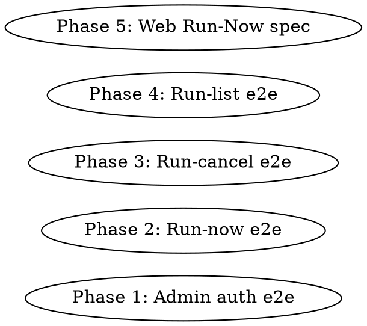

# Implementation plan — e2e-auth-run-lifecycle

**Spec:** `docs/spec/e2e-auth-run-lifecycle/spec.md`
**Branch:** `feat/e2e-auth-run-lifecycle`
**Worktree:** `.worktrees/e2e-auth-run-lifecycle`

## Phase graph

All five phases are **independent** — they each touch a single new test file
and depend only on already-existing source code. They can be dispatched in
parallel. However, since each phase is small (~80–160 LoC) and the total
work is ~600 LoC, I will dispatch them as a **single coder agent** working
sequentially rather than incurring four parallel-agent overhead. The
phase boundaries below describe the work done by that single agent in a
strict order.

## Phase 1: Admin auth e2e

**File:** `packages/api/tests/e2e/admin.e2e.test.ts`
**Maps to:** REQ-A1..A5, VS-1.

**Pattern:** Pure-Hono test (no Redis needed). Builds the admin router
via `createAdminRouter({ adminPassword: "test-pw", sessionSecret: "test-secret-at-least-32-chars-yes!", logger })` with a `logger` fake. Asserts via `app.request(...)`.

**Test cases:**
1. REQ-A1 — `POST /login` with correct password → 200, `{ ok: true }`, `Set-Cookie` header matches `/^admin_session=[^;]+/`.
2. REQ-A2 — `POST /login` with wrong password → 401, `{ error: "invalid_password" }`.
3. REQ-A3 — `POST /login` with `{ password: "" }` → 400, `{ error: "invalid_body" }`.
4. REQ-A3 — `POST /login` with `{}` → 400.
5. REQ-A3 — `POST /login` with non-JSON body → 400 (route's `c.req.json().catch(() => null)` + safeParse path).
6. REQ-A4 — `POST /logout` → 200, `{ ok: true }`, `Set-Cookie` header contains `admin_session=` AND `Max-Age=0` (Hono's `deleteCookie` semantics).
7. REQ-A5 — `GET /me` → 200, `{ admin: true }`.

**Notes:**
- The admin router does NOT enforce auth on `/me` — gating is in upstream middleware. Don't pretend to test the gate here; the web Playwright spec covers the user-visible cookie redirect.
- `posthog.captureAnalytics` is called from `/login`. It's already a fire-and-forget `void` — no need to mock it (it short-circuits when posthog is not configured).

## Phase 2: Run-now e2e

**File:** `packages/api/tests/e2e/runs-now.e2e.test.ts`
**Maps to:** REQ-N1..N5, VS-2.

**Pattern:** Mirrors `runs.e2e.test.ts` — real Redis (cleanup seeded `run:*` keys), fake queue (`vi.fn` Queue), fake `UserSettingsRepo` and `RunArchivesRepo`. Builds the runs router via `createRunsRouter({...})`.

**Test cases:**
1. REQ-N1 — settings = HN-enabled only → 202, body has `runId`; queue.add called once with `name === "run-process"`, `opts.jobId === runId`; resulting Redis state has `status: "running"` and `sources.hn` present.
2. REQ-N2 — settings = `null` → 409, `{ error: "settings not configured" }`; queue NOT called.
3. REQ-N3 — settings present but `hnEnabled=false`, all flags false → 409, `{ error: "no sources enabled" }`; queue NOT called.
4. REQ-N4 — settings = HN-enabled, body `{ dryRun: true }` → 202; queue.add's `data.dryRun === true`.
5. REQ-N5 — body `{ dryRun: "yes" }` → 400; queue NOT called.

**Test helper:** A small `buildSettings(overrides?)` function in-file (NOT extracted to shared) returning a `UserSettings` with all fields populated to known defaults. Per `code-quality.md`'s "no premature abstractions" rule, this lives inside the test file.

## Phase 3: Run-cancel e2e

**File:** `packages/api/tests/e2e/runs-cancel.e2e.test.ts`
**Maps to:** REQ-C1..C3, VS-3.

**Pattern:** Two real Redis connections — one passed to the router as `redis` + `publisher`, one (separately created in the test) `subscribes` to `run:cancel:<runId>` before issuing the cancel request and pushes received messages onto a local array. After the HTTP call returns, the test polls the array up to 1 s for the message.

**Test cases:**
1. REQ-C1 — seed Redis with `RunState{status:"running"}`, fakeArchiveRepo.findById not called; subscribe to `run:cancel:<id>` BEFORE the request; POST cancel → 200, response `run.status === "cancelling"`, Redis state updated to `cancelling`, ≥1 message received on the channel.
2. REQ-C2 — no Redis key + fakeArchiveRepo.findById returns null → 404, `{ error: "not found" }`.
3. REQ-C3 — seed Redis with `RunState{status:"completed"}` → 409, body matches `{ error: "run is not cancellable", status: "completed" }`.

**Cleanup:** `afterEach` unsubscribes the listener and deletes the seeded `run:<id>` keys. `afterAll` quits both connections.

## Phase 4: Run-list e2e

**File:** `packages/api/tests/e2e/runs-list.e2e.test.ts`
**Maps to:** REQ-L1..L3, VS-4.

**Pattern:** Real Redis (no keys seeded in the simple cases), fake `RunArchivesRepo.list()` returning `[]`. The route's `listRuns` service scans `run:*` keys — for a clean repo with no seeded keys, the response is `{ runs: [] }`. We don't test sort semantics — that's a unit-test concern for `listRuns()`. The e2e simply confirms route plumbing and limit validation.

**Test cases:**
1. REQ-L1 — `GET /api/runs` → 200, body `{ runs: [] }` (or any array).
2. REQ-L2 — `GET /api/runs?limit=5` → 200, `runs.length <= 5`.
3. REQ-L2 boundary — `GET /api/runs?limit=100` → 200.
4. REQ-L3 — `GET /api/runs?limit=0` → 400, error starts with `"limit must be an integer"`.
5. REQ-L3 — `GET /api/runs?limit=101` → 400.
6. REQ-L3 — `GET /api/runs?limit=abc` → 400.

## Phase 5: Web Run-Now Playwright spec

**File:** `packages/web/tests/e2e/dashboard-run-now.spec.ts`
**Maps to:** REQ-W1, VS-5.

**Pattern:** Mirrors `admin-social-credentials.spec.ts`. Direct pg client to seed `user_settings` with `hnEnabled=true` + a non-null `hnConfig`. `adminLogin(page)` (POST to `/api/admin/login`), navigate to `/admin`, click the Run Now button (selector: `getByRole("button", { name: /^Run now$/i })` — confirmed by reading `RunNowSplitButton`; if not, fall back to `data-testid="run-now-button"` if that exists, otherwise the first button matching `name: /run now/i`), poll for a runs-table row showing `running` or `queued` within 5 s.

**Cleanup:** truncate `user_settings` and any `run_archives` rows the test created. Don't touch `raw_items` (won't be created by this test since no worker is running).

**Risks called out by review-readers:**
- The Run Now button POSTs to `/api/runs/now` which enqueues a BullMQ job. No worker is running in the Playwright env, so the runs table will show a `queued`/`running` row that never completes. That's fine — REQ-W1 says "within 5 seconds the row shall display status running or queued."
- If the dashboard polling interval is > 5 s, the test might miss the row. The polling hook is `useRunPolling` — confirm interval before writing the test.

**Read before writing the spec:**
- `packages/web/src/hooks/useRunPolling.ts` for refetch interval.
- `packages/web/src/components/dashboard/RunNowSplitButton.tsx` for the actual accessible name of the button.
- `packages/web/src/components/dashboard/RunsTable.tsx` for the row selector / `data-testid`.

## Files and changes

| File | Status | LoC est |
|---|---|---|
| `packages/api/tests/e2e/admin.e2e.test.ts` | NEW | ~110 |
| `packages/api/tests/e2e/runs-now.e2e.test.ts` | NEW | ~180 |
| `packages/api/tests/e2e/runs-cancel.e2e.test.ts` | NEW | ~150 |
| `packages/api/tests/e2e/runs-list.e2e.test.ts` | NEW | ~110 |
| `packages/web/tests/e2e/dashboard-run-now.spec.ts` | NEW | ~110 |
| `docs/spec/e2e-auth-run-lifecycle/` (whole tree) | NEW | spec artefacts only |

No product code is modified. No new packages or env vars added.

## Verification

After all phases:
1. `pnpm --filter @newsletter/eslint-plugin build` (prerequisite for lint).
2. `pnpm typecheck` → 0 errors.
3. `pnpm lint` → 0 errors (same 10 pre-existing warnings as baseline).
4. `pnpm infra:up`, then:
   - `pnpm --filter @newsletter/api test:e2e -- --project=e2e admin runs-now runs-cancel runs-list` → all new tests pass.
5. With api + web dev servers running:
   - `pnpm --filter @newsletter/web exec playwright test dashboard-run-now.spec.ts` → passes.
6. Capture command output as the `proof-report.md`.

## Risks

- **R-1 (Playwright timing):** dashboard polling cadence. Mitigation:
  read the hook first; if it's > 5 s the test will use `page.reload()`
  after a short wait.
- **R-2 (test cleanup order):** truncating `user_settings` after the
  Playwright test must not race with the dashboard's settings query.
  Mitigation: tear-down only after the page has navigated away or the
  test has completed (Playwright `test.afterEach`).
- **R-3 (pub/sub race in cancel test):** subscribe before request, not
  after; allow up to 1 s polling for the captured-messages array.
