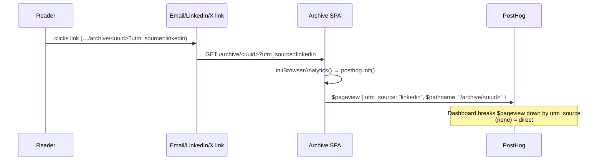

# Engagement Source Tracking — Design

## Problem Statement

We publish each daily digest to multiple channels — email, LinkedIn, X/Twitter — and every channel links back to our public archive page (`/archive/:runId`). Today we have no idea which channel actually drives readers to the archive. We want to attribute incoming archive traffic to its origin channel (linkedin / twitter / email / direct) and view the breakdown in PostHog.

## Context

What exists today:
- All three auto-publish channels already link to **our own** public archive (`/archive/<uuid>`), resolved from `PUBLIC_BASE_URL`/`NEWSLETTER_BASE_URL`:
  - Email digest — archive ribbon CTA + footer link (`packages/pipeline/src/workers/email-send.ts:259`, `packages/pipeline/src/lib/email-render.ts:358,617`).
  - LinkedIn — archive URL posted as a comment/reply (`packages/pipeline/src/social/linkedin/notifier.ts:128`).
  - X/Twitter — archive URL posted as a reply tweet (`packages/pipeline/src/social/twitter/notifier.ts:117`).
- PostHog is **already fully integrated** in `packages/web`: `posthog-js` + `@posthog/react` installed, `initBrowserAnalytics()` in `packages/web/src/lib/analytics.ts`, config served from `/api/public/analytics-config`, with `autocapture: true` and `capture_pageview: "history_change"` already enabled.
- `posthog-js` automatically captures `utm_*` query parameters on every `$pageview` (verified against current PostHog docs) — no client code is needed to record them.

What triggered this: we want traffic-source attribution for the digest with a dashboard view in PostHog.

The run id is a **UUID in the URL path** (`run_archives.id`), so per-digest breakdown is already available for free via PostHog's `$pathname` property — that's why per-digest campaign tagging was dropped as redundant.

## Product Requirements (PRD)

### Personas
- **Operator (Aman / Ritesh)** — runs the newsletter, wants to know which channel earns the most archive reads so they can invest effort where it pays off. Reads the answer in PostHog, not in our app.

### Goals & Non-Goals
- **Goals:**
  - Attribute each visit to the public archive to the channel that referred it (linkedin / twitter / email / direct).
  - Surface the breakdown in a PostHog dashboard view.
- **Non-Goals:**
  - No in-app analytics UI — the dashboard lives in PostHog's own UI. (We document the insight spec; we do not build a custom `/admin/analytics` view for this.)
  - No tracking of clicks on per-item **external** article links — those leave for third-party sites we don't control and PostHog cannot see them. Only landings on our `/archive` page are tracked.
  - No `utm_medium` / `utm_campaign` tagging — `utm_source` alone is sufficient; per-digest is covered by `$pathname`.
  - No new PostHog account/project setup, no consent/cookie-banner work, no change to what PostHog already captures.

### User Stories

| Story | Persona | Fulfilled by |
|-------|---------|--------------|
| See how many archive visits came from LinkedIn vs X vs email vs direct | Operator | F1, F2, F3, F4 |
| Trust that a disabled/misconfigured PostHog never breaks the published links | Operator | F5, EC1 |

### User Flows

**Flow: Reader clicks a digest link**
1. Operator publishes a digest → email / LinkedIn / X links to the archive now carry `?utm_source=<channel>`.
2. Reader clicks the link → lands on `https://…/archive/<uuid>?utm_source=linkedin` → sees the normal archive page (unchanged).
3. PostHog records a `$pageview` with `utm_source=linkedin` (automatic).

**Flow: Operator reads the breakdown**
1. Operator opens the PostHog dashboard → sees a `$pageview` insight broken down by `utm_source`.
2. Bars/lines show `linkedin`, `twitter`, `email`, and `(none)` (= direct) over the chosen window.

## Requirements

### Functional Requirements
- **F1:** When the pipeline builds the email digest's archive links (ribbon CTA + footer/home link), the URL SHALL carry `utm_source=email`.
- **F2:** When the pipeline builds the LinkedIn archive URL, the URL SHALL carry `utm_source=linkedin`.
- **F3:** When the pipeline builds the X/Twitter archive URL, the URL SHALL carry `utm_source=twitter`.
- **F4:** A reader landing on the archive from a tagged link SHALL have the visit recorded in PostHog with the corresponding `utm_source` value; an untagged (direct) visit SHALL be recorded with no `utm_source` (PostHog `(none)`).
- **F5:** The `utm_source` parameter SHALL be appended without disturbing the existing path, any existing query parameters, or URL encoding (use a robust URL builder, not string concatenation).

### Non-Functional Requirements
- **NF1 (reliability):** Link tagging SHALL be pure, synchronous, side-effect-free string work — it cannot fail a publish job. If PostHog is disabled or unreachable, the tagged links still work; only the analytics capture is lost.
- **NF2 (maintainability):** Channel→`utm_source` mapping and the tagging logic SHALL live in one shared helper with one set of constants, reused by all three notifiers — no per-site string concatenation.
- **NF3 (consistency):** The `utm_source` values SHALL be a fixed, typed set (`email` | `linkedin` | `twitter`) so the PostHog breakdown has stable, predictable buckets.

### Edge Cases and Boundary Conditions
- **EC1:** PostHog disabled (`POSTHOG_ENABLED=false`) or token absent → links remain valid; no capture happens; nothing throws.
- **EC2:** Base URL with a trailing slash (e.g. `https://host/`) → builder must produce exactly one `?utm_source=…` with no doubled slashes (the notifiers already `stripTrailingSlash`; the builder must also be correct on its own).
- **EC3:** A target URL that already has a query string (defensive) → builder appends `utm_source` as an additional parameter, preserving the existing ones.
- **EC4:** Social platforms (LinkedIn/X) may wrap the posted link with their own redirect/tracker → our `utm_source` survives as part of the destination URL and is present when the browser finally loads the archive.
- **EC5:** Per-item external article links in the email are **not** tagged (untrackable) — only archive/home links on our own domain are tagged.

## Architectural Challenges

- **Single source of truth for URL tagging.** The archive URL is currently built inline in 3+ places with slightly different patterns. Introducing a shared, well-tested helper (`withUtmSource(url, source)`) in `@newsletter/shared` and routing all three notifiers through it is the core structural change — it prevents drift and makes the behavior testable in one place.
- **Which links to tag.** Only links pointing at our own domain are taggable (email archive ribbon + footer/home link; LinkedIn reply URL; X reply URL). The email's per-item external links and the API unsubscribe redirect are deliberately left untouched.
- **Capture is already solved.** Because `posthog-js` auto-captures `utm_*` on `$pageview` and our init already enables pageview capture, the web package needs no functional change for capture. The remaining web concern is only verification (prove the param lands on the event).

## Approaches Considered

### Approach A: UTM tagging via a shared helper, native PostHog capture (chosen)
Append `utm_source=<channel>` to the archive URLs in the three notifiers using one shared helper; rely on PostHog's built-in `utm_*` capture; build the dashboard in PostHog's UI. Minimal code, native dashboards, zero new web capture code.

### Approach B: Custom `source=` param + explicit web capture
Use a non-UTM `source=` param and write a web hook to parse it and call `captureBrowserEvent`/register a property. More code, no native channel dashboards, reinvents what PostHog already does. Rejected.

### Approach C: In-app dashboard querying PostHog's REST API
Build a custom `/admin/analytics` traffic view. Larger surface, needs a PostHog read key, duplicates PostHog's own dashboarding. Rejected — out of scope per "dashboard view in posthog".

## Chosen Approach

**Approach A.** A pure URL-tagging helper in `@newsletter/shared`, consumed by the email, LinkedIn, and X notifiers, emitting `utm_source=<channel>`. Capture is PostHog-native (no web code change). The dashboard is a PostHog insight (`$pageview` broken down by `utm_source`), specified in this doc and created in PostHog's UI.

Trade-offs accepted: the dashboard itself is external config (not version-controlled in our repo); external article-link clicks remain invisible (acceptable — we control only our own pages).

## High-Level Design

New/changed pieces:
- **`@newsletter/shared`** — new pure helper `withUtmSource(url: string, source: UtmSource): string` plus a `UtmSource` union/const (`"email" | "linkedin" | "twitter"`). Implemented with the `URL` API so it is correct on trailing slashes, existing query strings, and encoding (F5, EC2, EC3).
- **Pipeline notifiers** — email (`email-send.ts` / `email-render.ts` archive ribbon + footer link), LinkedIn (`linkedin/notifier.ts`), X (`twitter/notifier.ts`) call `withUtmSource(archiveUrl, <channel>)` instead of using the raw URL.
- **PostHog dashboard (external config, documented here)** — an insight: event `$pageview`, broken down by property `utm_source`, optionally filtered to `$pathname` starting with `/archive`. Saved to a dashboard. `(none)` bucket = direct.

```mermaid
graph TB
  subgraph shared["@newsletter/shared"]
    H["withUtmSource(url, source)"]
  end
  subgraph pipeline["pipeline notifiers"]
    E["email-send / email-render"]
    L["linkedin/notifier"]
    T["twitter/notifier"]
  end
  subgraph web["web (already integrated)"]
    P["posthog-js<br/>auto-captures utm_* on $pageview"]
  end
  PH["PostHog<br/>dashboard: $pageview by utm_source"]

  E -->|withUtmSource(url,'email')| H
  L -->|withUtmSource(url,'linkedin')| H
  T -->|withUtmSource(url,'twitter')| H
  E -. tagged link .-> P
  L -. tagged link .-> P
  T -. tagged link .-> P
  P --> PH
```



## External Dependencies & Fallback Chain

The **new** code (URL tagging) is pure-internal string manipulation — no external dependency. The feature's end-to-end value depends on **PostHog's existing, already-integrated** `utm_*` auto-capture, which the probe should confirm.

### Primary: posthog-js (already installed & live in prod)
- **Purpose:** Automatically captures `utm_source` from the landing URL onto the `$pageview` event, powering the channel breakdown.
- **Use cases to probe:** (1) `posthog-js` records `utm_source` from a URL query string onto a captured `$pageview` (the one behavior we rely on).
- **Auth:** api-key (PostHog project token).
- **Required env keys:** `POSTHOG_PROJECT_TOKEN`, `POSTHOG_HOST` (already wired via `/api/public/analytics-config`; `POSTHOG_ENABLED` gate).

### Fallbacks (in order)
1. **Explicit capture via existing `captureBrowserEvent`** — if native `utm_*` capture proves unreliable, add a small web hook that reads `utm_source` from the URL and calls the already-present `captureBrowserEvent("archive_view", { utm_source })`. (Code already exists; only a thin caller would be added.)
2. **Server-side capture via posthog-node** — last resort: emit the event from the API when the archive page is served. Heavier; only if both client paths fail.

## Open Questions

None blocking. (The PostHog dashboard is created in the PostHog UI after the URLs ship; its spec is captured above.)

## Risks and Mitigations

- **Risk:** A notifier bypasses the helper and emits an untagged URL (drift). **Mitigation:** single shared helper + unit tests asserting each notifier's emitted URL carries the right `utm_source`; review checklist item.
- **Risk:** PostHog `utm_*` auto-capture doesn't behave as expected for our SPA/init timing. **Mitigation:** library-probe verifies the capture use case before coding; fallback chain (explicit `captureBrowserEvent`) is ready.
- **Risk:** A malformed base URL breaks the `URL` constructor. **Mitigation:** the base URLs are operator-configured env values already used to build links today; the helper handles trailing slashes and is unit-tested on the real base shapes.

## Assumptions

- The archive links in email/LinkedIn/X are the engagement surface the operator cares about (confirmed: external per-item links are explicitly out of scope).
- `PUBLIC_BASE_URL`/`NEWSLETTER_BASE_URL` produces an absolute, well-formed origin (it already does — it builds today's links).
