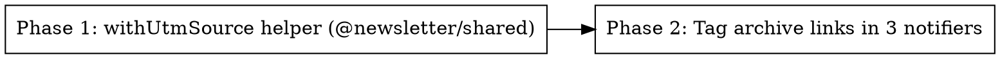

# Plan: Engagement Source Tracking

> **Source:** .harness/features/engagement-source-tracking/design.md
> **Created:** 2026-06-09
> **Status:** planning

## Goal

Tag the archive links we publish to email / LinkedIn / X with `utm_source=<channel>` via one shared helper, so PostHog (which already auto-captures `utm_*` on `$pageview`) attributes archive traffic to its origin channel; direct traffic is `(none)`.

## Acceptance Criteria

- [ ] `withUtmSource(url, source)` + `UtmSource` type exist in `@newsletter/shared/utils`, set `utm_source` robustly (trailing slash, existing query, encoding) (REQ-001, REQ-002, REQ-006, EDGE-001, EDGE-002, EDGE-005).
- [ ] Email archive ribbon link + "Browse every issue →" home CTA carry `utm_source=email`; external per-item article links stay untagged (REQ-003, EDGE-003).
- [ ] LinkedIn archive URL carries `utm_source=linkedin` (REQ-004).
- [ ] X/Twitter archive URL carries `utm_source=twitter` (REQ-005).
- [ ] Link construction never throws and is independent of analytics state (REQ-008).
- [ ] VS-0 probe re-confirms posthog-js captures `utm_source` onto `$pageview` (REQ-007); direct (no-utm) → no `utm_source` (EDGE-004). *(verify stage)*
- [ ] No new lint errors vs baseline; `pnpm typecheck` clean; touched-package unit suites green.

## Codebase Context

### Context Map (Step 2.0)
- **Context map read:** 5 PACKAGE.md/context docs (ARCHITECTURE, DECISIONS, shared/PACKAGE, pipeline/PACKAGE) + 2 standards files (global, pipeline).
- **Decisions honored:**
  - `D-009` — PostHog analytics are fire-and-forget; this feature adds no synchronous dependency on PostHog (link build is pure; capture is best-effort). 
  - `D-024` — PostHog init dedup by config key is untouched; we rely on the existing init, add no second init.
  - `D-100` — the new helper lives under the browser-safe `@newsletter/shared/utils` subpath (already exported), never the root barrel, so web stays db-free if it ever consumes it.
  - `D-051` / `S-pipeline-03` — no credential/per-job resolution changes; notifiers' publish-deps closures are untouched.
- **Standards honored:**
  - `S-global-01` — strict typing: `UtmSource` is a string-literal union, no `any`, no unsafe casts.
  - `S-global-03` — a shared helper is justified (4 call sites: email archive, email home CTA, LinkedIn, X) and mandated by NF2 — not a single-call-site abstraction.
  - `S-global-04` — no logging added inside the pure helper.
  - `S-pipeline-01` — no HTTP framework imports added.
- **Gotchas carried forward:**
  - email-render `baseUrl` is rendered as **display text** (email-render.ts:701) and reused at 697 — so we must NOT blanket-tag the `baseUrl` prop; tag only the "Browse every issue →" home CTA href (email-render.ts:617).
  - Email per-item links are `story.url` (email-render.ts:155) / `story.sourceUrl` (264) → external; leave untagged (EDGE-003).
  - `stripTrailingSlash` is a local fn duplicated in both notifiers (linkedin:79, twitter:43); keep it for the path join and wrap the final URL — do not refactor it out (out of scope).

### Existing Patterns to Follow
- **Shared util module + barrel:** `packages/shared/src/utils/reading-time.ts` re-exported from `packages/shared/src/utils/index.ts` (ESM `.js` specifiers). New helper mirrors this.
- **Archive URL construction:** `email-send.ts:259`, `linkedin/notifier.ts:128`, `twitter/notifier.ts:117` — wrap each with `withUtmSource(...)`.

### Test Infrastructure
- Vitest 3. Shared unit tests: `packages/shared/tests/unit/*.test.ts` (add `utm.test.ts`).
- Pipeline unit tests to EXTEND (do not duplicate): `packages/pipeline/tests/unit/lib/email-render.test.ts`, `tests/unit/social/linkedin/notifier.test.ts`, `tests/unit/social/twitter/notifier.test.ts`.
- Run scoped: `pnpm --filter @newsletter/shared test:unit`, `pnpm --filter @newsletter/pipeline test:unit`. eslint-plugin must be built once (`pnpm build`) before `pnpm lint`.
- VS-0 probe (already passing): `bash .harness/runtime/engagement-source-tracking/probes/posthog-js/probe-utm-capture.sh`.

## Phase Graph

Phase 2 depends on Phase 1 (consumes the helper). REQ-007 / EDGE-004 are proven by the VS-0 probe + functional-verify (verify stage), not a separate coding phase.
