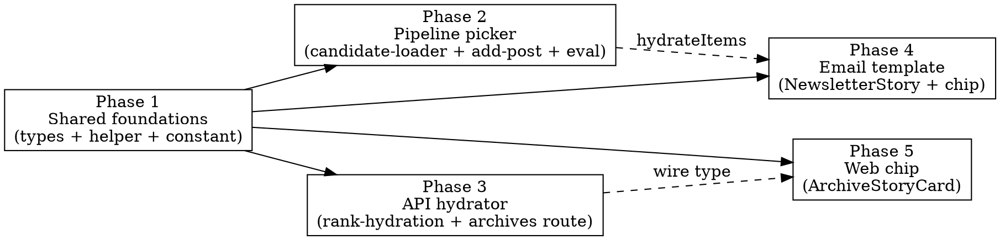

# Implementation Plan — enriched-summary-source-attribution

**Spec:** [`spec.md`](./spec.md)
**Design:** [`design.md`](./design.md)

## Phase Graph

Phase 1 is the only hard predecessor — once the shared helper + types compile, phases 2-5 can be built independently. We dispatch sequentially anyway (the diff is small enough that the orchestration overhead of parallel phase agents costs more than the wall-clock saving).

## Phase 1: Shared foundations

**Scope:** new pure module + constant + type extension. No business logic, no integration. This is the spine the other four phases compile against.

**Files:**
- `packages/shared/src/services/summary-source.ts` (NEW) — `pickSummarySource`, `deriveHostname`, `getPlatformLabel`, `PLATFORM_LABEL` map, `SummarySource` discriminated union.
- `packages/shared/src/services/index.ts` — re-export.
- `packages/shared/src/services/__tests__/summary-source.test.ts` (NEW) — unit tests for all three helpers (REQ-026: ≥6 picker cases, ≥5 hostname cases, exhaustive platform-label map).
- `packages/shared/src/constants.ts` — add `ENRICHED_SUMMARY_LAUNCHED_AT`.
- `packages/shared/src/types/run.ts` — extend `RankedItem` with `enrichedSource: { hostname: string; url: string } | null`.

**TDD slice:**
1. Write the test file first: 6 picker cases, 5 hostname cases, platform-label exhaustiveness. Tests fail because the module doesn't exist.
2. Implement the helper. Tests pass.
3. Add the constant. Add the type field. `pnpm --filter @newsletter/shared typecheck`.

**Acceptance:**
- `pnpm --filter @newsletter/shared test:unit` — all new tests pass.
- `pnpm --filter @newsletter/shared typecheck` — clean.
- `pnpm --filter @newsletter/shared build` — clean (tsup emits the new module).

## Phase 2: Pipeline picker

**Scope:** Apply the helper at the three pipeline call sites. Add the `enrichedSource` derivation to `email-send.ts::hydrateItems` and extend `NewsletterStory` (mirror gets extended in Phase 4 in the api package).

**Files:**
- `packages/pipeline/src/services/candidate-loader.ts` — refactor `pickCandidateContent` to delegate to `pickSummarySource`. Keep public signature identical.
- `packages/pipeline/src/services/__tests__/candidate-loader.test.ts` — extend with VS-1 case (Twitter tweet text + enriched OK → enriched wins).
- `packages/pipeline/src/services/add-post-helper.ts` — route both `row.content` and `saved.content` sites through `pickCandidateContent` before passing to `generateRecap` (REQ-006).
- `packages/pipeline/tests/unit/services/add-post-helper.test.ts` (verify location — may need creation) — VS-4 test.
- `packages/pipeline/src/eval/replay.ts` — verify it already calls `pickCandidateContent`; if not, route through (REQ-005).
- `packages/pipeline/src/workers/email-send.ts` — extend `NewsletterStory` interface with `sourceLabel`/`sourceUrl`/`readVerb`; populate via `pickSummarySource` + `getPlatformLabel` in `hydrateItems`; apply launch-date gate (REQ-017).
- `packages/pipeline/tests/unit/workers/email-send-hydrate.test.ts` (NEW) — enriched / native / gated cases.

**TDD slice per file:** failing test → implementation → green.

**Acceptance:**
- `pnpm --filter @newsletter/pipeline test:unit` — green, including new cases.
- `pnpm --filter @newsletter/pipeline typecheck` — clean.

## Phase 3: API hydrator + route plumbing

**Scope:** Populate `enrichedSource` on every hydrated `RankedItem` returned by the api. Thread `archive.completedAt` from the archive route handlers into the hydrator for the launch-date gate.

**Files:**
- `packages/api/src/services/rank-hydration.ts` — accept optional `archiveCompletedAt` argument; populate `enrichedSource` from `pickSummarySource(row.content, row.metadata.enrichedLink)`; force `null` when `archiveCompletedAt < ENRICHED_SUMMARY_LAUNCHED_AT`.
- `packages/api/src/services/__tests__/rank-hydration.test.ts` (create or extend) — VS-8 test (legacy archive forces null), VS-7 (native item null), VS-6-equivalent on api side (enriched item populated).
- `packages/api/src/routes/archives.ts` — both `hydrateRankedItems` call sites (lines 124, 179) pass `archive.completedAt`.
- `packages/api/src/routes/runs.ts` — the live `/run` hydration call passes `null` (no archive yet → no gating).

**Acceptance:**
- `pnpm --filter @newsletter/api test:unit` — green.
- `pnpm --filter @newsletter/api typecheck` — clean.

## Phase 4: Email template

**Scope:** Mirror the `NewsletterStory` extension in the api email template; render the new chip section.

**Files:**
- `packages/api/src/lib/email/templates/newsletter.tsx` — extend `NewsletterStory` interface to add `sourceLabel`/`sourceUrl`/`readVerb`; add chip render section between bottom line and `
`.
- `packages/api/tests/unit/email/newsletter-template.test.ts` (create or extend) — VS-9 (enriched chip), VS-10 (native chip).

**Acceptance:**
- `pnpm --filter @newsletter/api test:unit` — green.
- `pnpm --filter @newsletter/api build` — clean.

## Phase 5: Web chip

**Scope:** Replace `ArchiveStoryCard`'s inline `SOURCE_LABEL` + `readVerb` with derived chip data driven by `item.enrichedSource`. Use subpath imports from `@newsletter/shared/services`.

**Files:**
- `packages/web/src/components/ArchiveStoryCard.tsx` — remove inline `SOURCE_LABEL` and `readVerb`; compute `{ sourceLabel, sourceUrl, readVerb }` at the top of the component from `item.enrichedSource` + `item.sourceType`; render chip with new values.
- `packages/web/src/components/__tests__/ArchiveStoryCard.test.tsx` (NEW) — VS-6 (enriched), VS-7 (native).

**Acceptance:**
- `pnpm --filter @newsletter/web test:unit` — green.
- `pnpm --filter @newsletter/web typecheck` — clean.
- `pnpm --filter @newsletter/web build` — bundle size unchanged ±5% (subpath-import guard).

## Cross-cutting Acceptance

- `pnpm typecheck` — all packages clean.
- `pnpm lint` — zero new errors. Pre-existing 17 warnings preserved exactly.
- `pnpm -r test:unit` — green across all four packages.
- No new dependencies in any `package.json`.
- No DB migration files generated under `packages/shared/drizzle/`.

## Quality Gate Mapping

| Quality-gate check | Where satisfied |
|---|---|
| Typecheck pass | Phases 1–5 each verify own package |
| Lint pass / no new errors | Cross-cutting acceptance |
| Unit-test pass | Per-phase + cross-cutting |
| Coverage non-regression | Per-phase tests target new code paths |
| No new deps | Cross-cutting; verify `git diff package.json` empty |
| Spec verification | All 12 VS rows have a corresponding unit test in phases 1–5 |

## Risk Register (carried from design)

- **Rerank token cost** (R3 in design): monitor in Stage 5 verify. No code mitigation in this PR.
- **Launch-date gate timing**: `ENRICHED_SUMMARY_LAUNCHED_AT` set at spec-write time; bump in Stage 6 if merge slips.
- **Email render snapshot churn**: expected. Update snapshots intentionally; do not bypass with `-u` blindly.
