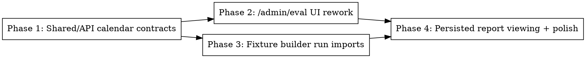

# Plan: Eval Calendar Rework

> **Source:** docs/spec/eval-calendar-rework/design.md, docs/spec/eval-calendar-rework/spec.md
> **Created:** 2026-05-22
> **Status:** planning

## Goal

Replace Top-N fixture batching with a run-centered calendar eval workflow and add run-source importing to the fixture builder.

## Acceptance Criteria

- [ ] Mode A is single-fixture-only with no Top-N or window-size controls.
- [ ] Calendar mode loads completed runs for a selected date, supports multi-select, and submits selected run IDs.
- [ ] Calendar eval runs the draft prompt once per selected run and produces previous-vs-draft reports with prompt diff data.
- [ ] Calendar eval reports are persisted and can be reopened from eval run details.
- [ ] New fixture creation can inspect runs by date and import individual/all source candidates into a fixture draft.
- [ ] Existing URL-paste fixture creation remains usable.

## Codebase Context

### Existing Patterns to Follow

- **Admin eval route:** `packages/api/src/routes/admin-eval.ts` owns all `/api/admin/eval/*` routes and already streams SSE progress for eval runs.
- **Eval run persistence:** `packages/api/src/repositories/eval-runs.ts` persists arbitrary JSON score/cost breakdowns in `eval_runs`; no migration is required for calendar report payloads.
- **Run fixture reconstruction:** `packages/pipeline/src/eval/export-fixtures.ts` builds run fixtures from `run_archives` plus raw items collected between `startedAt ?? createdAt` and `completedAt`.
- **Manual fixture page:** `packages/web/src/pages/EvalManualFixturePage.tsx` already owns fixture creation and navigation to grading.
- **Report UI:** `packages/web/src/components/eval/ReportTab.tsx` and `RunDetailDrawer.tsx` show existing scored reports; calendar reports should reuse low-level ranking row presentation where practical but keep separate previous-vs-draft wording.

### Test Infrastructure

- Web unit tests use Vitest + Testing Library under `packages/web/tests/unit/`.
- API route tests use Hono app instances under `packages/api/src/routes/__tests__/admin-eval.test.ts`.
- Targeted stable commands:
  - `pnpm --filter @newsletter/api exec vitest run --project unit src/routes/__tests__/admin-eval.test.ts`
  - `pnpm --filter @newsletter/web exec vitest run --project unit tests/unit/EvalIndexPage.test.tsx tests/unit/EvalManualFixturePage.test.tsx`
  - `pnpm --filter @newsletter/web typecheck`
  - `pnpm --filter @newsletter/api typecheck`
- Full web `test:unit` has a pre-existing localStorage failure recorded in `.harness/eval-calendar-rework/baseline.json`.

## Phase Graph

## Phase Summary

### Phase 1: Shared/API calendar contracts

Remove Top-N request fields from shared schemas, add calendar run request/report types, add run-by-date/preview API support, and change calendar eval SSE to run draft-only per selected run.

### Phase 2: /admin/eval UI rework

Remove Top-N controls, add calendar date run loading/multi-select, submit selected run IDs, show calendar per-run results, and add previous-vs-draft report dialog with prompt diff.

### Phase 3: Fixture builder run imports

Extend `/admin/eval/fixtures/new` with date-run browsing, run preview dialog, source import one/all, deduped fixture draft state, and submit imported sources while preserving URL paste.

### Phase 4: Persisted report viewing + polish

Ensure persisted calendar eval runs can reopen reports from the eval runs drawer, sync docs, and close any shared type/UI gaps discovered by the first three phases.
