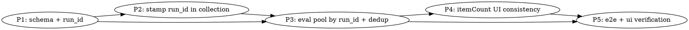

# Plan: Eval ranker ranks the deduped collected pool, correlated by run_id

Spec: `docs/spec/eval-ranker-shortlist-fix/spec.md`

## Phase graph

Phases run sequentially (P1 → P2 → P3 → P4 → P5); each is small and the later
phases depend on earlier types/queries. TDD throughout.

## Phase 1 — Schema: add `raw_items.run_id` (REQ-001)
- Add `runId: uuid("run_id")` (nullable) to `rawItems` in
  `packages/shared/src/db/schema.ts`, plus an index on `run_id`.
- Generate migration: `pnpm --filter @newsletter/shared db:generate`.
- Apply against the dev DB and confirm `RawItemInsert` now carries optional `runId`.
- Build shared so downstream packages see the new type.
- **Tests:** type-level — `RawItemInsert` accepts `runId`; migration file present.

## Phase 2 — Stamp `run_id` during collection (REQ-002, REQ-003, REQ-010)
- `packages/pipeline/src/repositories/raw-items.ts`: ensure `upsertItems` persists
  `runId` when present and updates it in the `onConflictDoUpdate` set clause.
- `packages/pipeline/src/workers/run-process.ts`: pass `runId` into the collect path
  so collected rows are stamped. Collectors map source → `RawItemInsert`; thread
  `runId` through the upsert call (worker has `runId` in scope).
- Verify the add-post single-item path still writes `run_id = NULL` and does not error.
- **Tests (unit):** VS-4 — upsert writes provided runId; without runId writes NULL;
  on conflict run_id updated. Guard REQ-010: ranked output unchanged for fixed input.

## Phase 3 — Eval pool: load by run_id, fall back to window, dedup (REQ-004..009, EDGE-*)
- `packages/pipeline/src/repositories/eval-exports.ts`:
  - Add a `findRawItemsByRunId(runId)` query.
  - In `getCompletedRunDetail`: load by `run_id` first; if empty, fall back to
    `findRawItemsInWindow` (REQ-005). Apply `dedupCandidates` to the loaded items;
    `sourcePool` = deduped survivors (REQ-006). `itemCount = sourcePool.length`.
  - In `listCompletedRunsByDate`: change `itemCount` to the **deduped pool size** for
    each run (load + dedup, or a count consistent with detail) so list == detail
    (REQ-009). Keep it efficient — prefer counting from the same query path used by
    detail, or document the chosen approach in the phase report.
  - `buildPreviousRanking`: keep rendering previous rows from `RankedItemRef` even
    when an id is absent from the deduped pool (REQ-008, EDGE-005) — already does via
    `?? source?.title`; confirm and test.
- `packages/api/src/routes/admin-eval.ts`: `buildCalendarRunFixture` already sets
  `pool: detail.sourcePool` — now deduped. Confirm `fixtureToCandidates` does not
  re-add duplicates (pool already deduped; `dedupClusters` may stay `[]` since the
  pool is pre-deduped, OR populate clusters — planner note: pre-dedup the pool is
  simpler and keeps `fixtureToCandidates` honest).
- **Tests (unit):** VS-1 (dedup), VS-2 (run_id + fallback), VS-3 (itemCount equality),
  REQ-007/008 coverage.

## Phase 4 — itemCount UI consistency (REQ-009, UI)
- `packages/web/src/pages/EvalIndexPage.tsx` and
  `packages/web/src/components/eval/CalendarReportComparison.tsx`: ensure the
  displayed counts use the deduped pool size consistently (list row count == detail
  pool count) and that the comparison view labels the candidate-pool size, not just
  `previousRanking.length`. Use `@newsletter/shared/...` **subpath** imports only.
- **Tests (unit):** component test asserting list and detail show the same count;
  comparison shows pool items beyond the ranked set.

## Phase 5 — e2e + UI verification (VS-5, VS-6)
- e2e (pipeline/api): VS-5 against live DB+Redis — real run stamps run_id, dedups,
  ranks; `getCompletedRunDetail` returns the deduped run_id pool; ab-mode `POST /run`
  can surface a pool item absent from original `rankedItems`. Seed a duplicate to
  prove dedup.
- ui (Playwright via functional-verify): VS-6 — `/admin/eval` list/detail count match
  and the comparison shows beyond-ranked items.

## Risks / notes
- `listCompletedRunsByDate` currently returns `itemCount = rankedItems.length` cheaply
  (no raw_items read). Making it the deduped pool size requires loading per-run raw
  items for the day. Keep it bounded (one day's runs); the planner/coder should batch
  or accept the per-run query cost — document the choice.
- Migration on populated `raw_items`: nullable column + index is non-blocking.
- Web learnings: subpath imports from `@newsletter/shared` only (browser bundle).
