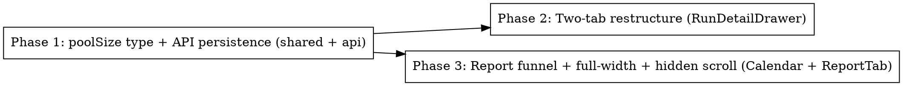

# Plan: Eval Run Report — Two-Tab Redesign + "Items Sent for Ranking"

> **Source:** docs/spec/eval-report-component/spec.md
> **Created:** 2026-05-23
> **Status:** planning

## Goal

Restructure the eval run-detail modal into two full-width tabs (Prompt & Cost / Report) for both eval modes, and surface a "items sent for ranking → ranked" funnel on the Report tab, where "sent" = the deduped fixture/pool size. Matches the approved mock at `docs/mocks/eval-report-redesign.html`.

## Acceptance Criteria

- [ ] Modal shows exactly two tabs: "Prompt & Cost" (prompt snapshot + score + cost) and "Report" (full-width rankings). (REQ-001..003)
- [ ] Default tab = Report when report data exists, else Prompt & Cost. (REQ-004, REQ-005)
- [ ] Four scroll regions (two ranking columns + two prompt panes) scroll independently with hidden scrollbars. (REQ-006)
- [ ] Report tab shows a 3-cell funnel: Sent for ranking → Ranked (top-N) → Cost, with an italic considered-but-not-surfaced note. (REQ-007)
- [ ] "Sent for ranking" = deduped pool size; persisted as optional `poolSize` on the report entry (Mode B) / per-fixture record (Mode A). (REQ-008, REQ-009)
- [ ] Report tab label shows a `N → ranked` hint when poolSize is known. (REQ-010)
- [ ] Legacy runs without `poolSize` render gracefully (funnel hides the sent step, no crash). (EDGE-001)
- [ ] `pnpm typecheck`, `pnpm lint`, `pnpm test:unit` pass; `pnpm --filter @newsletter/web build` clean (no DB code leaked to browser).

## Codebase Context

### Key files & data flow
- **Shared types:** `packages/shared/src/types/eval-ranking.ts` — `CalendarRunReportEntry` (Mode B `done` entry), `PerFixtureResult`/`PerFixtureRecord` shape (Mode A). `poolSize?: number` added to the `done` variant + per-fixture.
- **API persistence:** `packages/api/src/routes/admin-eval.ts`
  - Mode B AB SSE handler (~line 775): builds `CalendarRunReportEntry` `done` → add `poolSize: detail.sourcePool.length` (== `fixture.pool.length`).
  - Mode A scored SSE handler (~line 606-654): local `PerFixtureRecord` carries `actualRanking`/`expectedRanking` → add `poolSize: t.fixture.pool.length`.
- **Web modal:** `packages/web/src/components/eval/RunDetailDrawer.tsx` — owns tab state, type-guards (`isCalendarRunReportEntry`, `extractReportData`, `extractCalendarReports`), default-tab logic, and the current split layout (prompt pane left, breakdown/report tabs right). Tab keys `breakdown`/`report` → `prompt-cost`/`report`.
- **Web report (Mode B):** `packages/web/src/components/eval/CalendarReportComparison.tsx` — the previous/draft ranking columns + prompt panes + stat tiles (currently 3 tiles: Previous/Draft/Cost).
- **Web report (Mode A):** `packages/web/src/components/eval/ReportTab.tsx` — Expected vs Actual columns + score strip.

### Confirmed facts
- `rankCandidates(input, …)` ranks ALL input, truncates only output to `topN`(=EVAL_K=10); it does NOT shortlist internally. So sent-for-ranking = `fixture.pool.length`. (`packages/pipeline/src/processors/rank.ts`, `packages/pipeline/src/eval/index.ts`)
- Report data is read from the persisted `eval_runs.scoreBreakdown` JSONB (`unknown`-typed) — Mode B under `.calendarRuns[]`, Mode A under `.perFixture[]`. No migration needed; `poolSize` rides inside.

### Existing patterns to follow
- **Web → shared imports use subpaths** (`@newsletter/shared/types/eval-ranking`), never the root barrel (learnings/web-shared-subpath-imports). Verify with `pnpm --filter @newsletter/web build`.
- **Type-guards** in `RunDetailDrawer.tsx` validate JSONB shape defensively at the boundary — extend them to read optional `poolSize`.
- **Tailwind Ledger tokens:** `font-serif` (Newsreader), `font-mono` (Geist Mono), `#8c3a1e` rust, `#FAFAF7` paper, hairline `border-neutral-200`.
- **Hidden scrollbar:** Tailwind has no built-in; add a small utility class (`.scrollbar-none` in `index.css` or inline `[scrollbar-width:none] [&::-webkit-scrollbar]:hidden`).

### Test infrastructure
- Web: Vitest + jsdom + Testing Library. Existing: `packages/web/src/components/eval/EvalResultsPanel.test.tsx`, and tests colocated/under `packages/web/tests/unit/`. Run: `pnpm --filter @newsletter/web test:unit`.
- API: Vitest. AB-route unit tests likely under `packages/api/tests/unit/`. Run: `pnpm --filter @newsletter/api test:unit`.
- E2E: `pnpm --filter @newsletter/web test:e2e` (Playwright). Existing eval-runs e2e covers the modal open + tab switching.

## Phase Graph

Phase 1 is the foundation (types + data). Phases 2 and 3 both depend on Phase 1 but are **independent of each other** (different files: 2 = tab shell in `RunDetailDrawer`; 3 = column layout + funnel in `CalendarReportComparison`/`ReportTab`) and may run in parallel.
