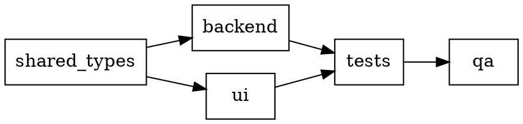

# Plan — Eval run comparison report

Spec: [`spec.md`](./spec.md).

Linear scope: extending PR `feat/ranking-eval-pipeline`; same branch.

## Approach

Two-layer change behind one tab:

1. **Persist actual + expected at finalize.** The SSE handler in
   `packages/api/src/routes/admin-eval.ts` already holds the fixture, ground
   truth, and the `RunEvalOutput` from `runEval()`. Wire a small builder
   function that produces `actualRanking` (from `result.rankedItems` joined
   with the fixture pool) and `expectedRanking` (from `groundTruth.labels`
   joined with the same pool, sorted by tier). Attach both to the existing
   `perFixtureRecords[i]` *before* the `persistFinish` call. No new DB column.
2. **New Report tab in the drawer.** The drawer becomes a two-tab right pane
   (Breakdown / Report). The Breakdown tab preserves the existing score + cost
   block verbatim. The Report tab is a new `<ReportTab>` component that reads
   `scoreBreakdown.perFixture[0]` and renders score sheet, missing-must banner,
   side-by-side table, and per-row expanders.

## Phases



### Phase 1 — Shared types

**Files:**
- `packages/shared/src/types/eval-ranking.ts` — extend `PerFixtureResult` with optional `actualRanking?: ActualRankingItem[]` and `expectedRanking?: ExpectedRankingItem[]`. Add the two new interfaces.

**Why optional:** legacy rows must still parse and round-trip cleanly. No
migration.

**Verification:** `pnpm --filter @newsletter/shared typecheck`.

### Phase 2 — Backend persistence

**Files:**
- `packages/api/src/routes/admin-eval.ts` — inside the Mode A loop where
  `result = await runEvalFn(args)` returns, build `actualRanking` and
  `expectedRanking` and attach them to the `perFixtureRecords` entry alongside
  `status` / `score` / `cost` / `error`. Pure derivation — no new I/O.

**Algorithm — actualRanking:**
```ts
const itemById = new Map(fixture.pool.map(p => [p.rawItemId, p]));
const actualRanking = result.rankedItems.map(r => ({
  rawItemId: r.rawItemId,
  url: itemById.get(r.rawItemId)?.url ?? "",
  title: r.title ?? itemById.get(r.rawItemId)?.title ?? "",
  score: r.score,
  rationale: r.rationale,
  summary: r.summary ?? "",
  bullets: r.bullets ?? [],
  bottomLine: r.bottomLine ?? "",
}));
```

**Algorithm — expectedRanking:**
```ts
// Only when groundTruth !== null.
const tierOrder = { must: 0, nice: 1, drop: 2 };
const labelById = new Map(groundTruth.labels.map(l => [l.rawItemId, l.tier]));
const labelled = fixture.pool
  .filter(p => labelById.has(p.rawItemId))
  .map(p => ({ pool: p, tier: labelById.get(p.rawItemId)! }))
  .sort((a, b) => tierOrder[a.tier] - tierOrder[b.tier]);
const expectedRanking = labelled.map((entry, idx) => ({
  rawItemId: entry.pool.rawItemId,
  url: entry.pool.url,
  title: entry.pool.title,
  tier: entry.tier,
  rank: idx + 1,
}));
```

Edge cases:
- `groundTruth === null` → `expectedRanking` omitted entirely (undefined).
- Cache hit path (`cached !== null` inside `runEval`) → we still rebuild
  `actualRanking` from `result.rankedItems` because the cached object carries
  them; recap fields are persisted in the cache too. Same code path.

**Verification:** `pnpm --filter @newsletter/api typecheck` + unit test that
asserts the persist call receives the new fields.

### Phase 3 — UI

**Files (new):**
- `packages/web/src/components/eval/ReportTab.tsx` — the side-by-side table,
  sticky score header, missing-must banner, per-row expander. Subpath imports
  only.

**Files (edit):**
- `packages/web/src/components/eval/RunDetailDrawer.tsx` — refactor the right
  pane to host two tabs. Preserve every existing `data-testid`.

**Tabs implementation:** plain `useState<"breakdown" | "report">("breakdown")`
with two `<button>`s wired to a `role="tablist"` / `role="tab"` /
`role="tabpanel"` pattern. Keyboard accessibility falls out of using real
buttons.

For Mode A done runs that carry the new fields, `useEffect` defaults the active
tab to `"report"` on open — the Report is the high-signal view; Breakdown is
secondary detail.

**Test IDs the UI must expose:**
- `drawer-tab-breakdown`, `drawer-tab-report` (the tab buttons)
- `drawer-tab-panel-breakdown`, `drawer-tab-panel-report` (the panels)
- `drawer-report-score-strip` (sticky header)
- `drawer-report-missing-must-banner` (banner; absent when none missing)
- `drawer-report-table` (side-by-side `<table>`)
- `drawer-report-row-{rawItemId}` (each row)
- `drawer-report-rationale-{rawItemId}` (each expanded body)
- `drawer-report-empty` (empty state)

### Phase 4 — Tests

**Unit (web):**
- `packages/web/tests/unit/RunDetailDrawer.test.tsx` — add tests covering
  VS-3..VS-7. Reuse the existing `makeRun` factory with a richer
  `scoreBreakdown` shape.

**Unit (api):**
- `packages/api/src/routes/__tests__/admin-eval.test.ts` — add at least one
  test confirming `updateFinish` receives a `scoreBreakdown.perFixture[0]`
  containing `actualRanking` (length 10) and `expectedRanking` populated from
  the groundTruth. Mode B run asserts absence of these fields.

**Live (Playwright MCP):** in the verify stage, open
`/admin/eval/runs` against a fresh dev server, switch to the Report tab on the
most recent Mode A run, screenshot, then check an old run shows the
empty-state.

### Phase 5 — Quality gate + commit + push

- `pnpm lint`, `pnpm typecheck`, `pnpm test:unit` all clean.
- Commits split logically:
  - `feat(eval): persist actual + expected rankings per fixture`
  - `feat(eval): add Report tab with side-by-side comparison`
  - `test(eval): cover Report tab + persisted ranking shapes`
  - `docs(spec): add artifacts for eval-run-comparison-report`
- Push to existing branch `feat/ranking-eval-pipeline`.

## Navigation & usage walkthrough

1. Operator opens `/admin/eval/runs`. Existing list with `nDCG@10` and Cost
   columns is unchanged.
2. Operator clicks the short `r/abc123` button on any row. Drawer opens, same
   as today.
3. For a Mode A done run with persisted report data: the drawer **lands on
   the Report tab by default**. Operator immediately sees the score header,
   any missing-must banner, and the side-by-side table.
4. Operator presses Tab → Enter on the Breakdown tab button to flip back to
   the existing score + cost view, then back to Report. No latency, all
   client-side state.
5. Operator clicks a row in the actual column to expand the rationale +
   recap. Pressing Esc closes the drawer (existing Dialog behaviour) — the
   expander state resets next time.
6. For a Mode A run with no report data, the Report tab still exists but
   shows the empty-state copy. Operator understands without further action
   that the run pre-dates the feature.
7. Mode B runs: Report tab not rendered. Drawer behaves exactly as today.

This pathway leaves every existing surface intact, adds one tab affordance,
and never blocks the operator from the data they came for — Breakdown
remains one keystroke away.

## Risks

- **Cache hit doesn't repopulate `result.rankedItems` recap fields.** Reading
  `pipeline/src/eval/index.ts:80-99` confirms the cache stores
  `rankedItems` as-is, so recap fields survive cache hits. No issue.
- **Type drift between shared types and the persisted JSON shape** — see
  learning `cross-phase-type-alignment`. Mitigation: tests in Phase 4 construct
  the full nested fixture from the literal shape that lives in admin-eval.ts.
- **`groundTruth.labels.tier === "drop"`** — drop-tier items should still
  appear in `expectedRanking` (sorted to the end). The operator may want to
  see "the ranker correctly excluded these".

## Out-of-scope

- Compare-across-runs view. The Compare bar on the list page already collects
  two run IDs; building a two-up diff of their Report tabs is future work.
- Server-side rendering / SEO of the drawer — unchanged from today
  (`/admin/*` is auth-gated and never indexed).
