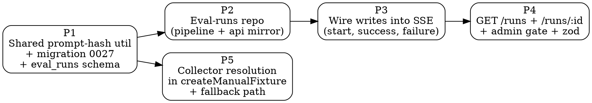

# Plan: Eval-runs persistence + collector reuse

> **Source:** `docs/spec/eval-runs-persistence-collectors/spec.md`
> **Created:** 2026-05-22
> **Status:** in-progress

## Goal

Land two scoped backend changes in one PR:

1. New `eval_runs` Postgres table + writes at run start / finish / failure + two read endpoints.
2. `createManualFixture` reuses the admin review page's collector resolution (`detectAddPostSourceType` + `dispatchFetch`) so fixtures get real HN / Reddit engagement instead of generic web fetches.

No UI changes in this PR — the Stage C UI rewire consumes the new endpoints in a follow-up.

## Source-of-truth design references

The HTML mocks at [`docs/mocks/eval-redesign/`](../../mocks/eval-redesign/) define the user flows Stage C will build. **Every backend decision here is shaped by those mocks.** When in doubt about a payload shape or filter, the mock and the four navigation flows in [spec.md § End-to-end navigation flows](./spec.md#end-to-end-navigation-flows) are the source of truth.

Critical mock dependencies that constrain backend choices:

- **Mock 04 list filters** → list endpoint must support `mode` + `status` + `fixtureId` filters from day one (REQ-5).
- **Mock 04 compare CTA** → backend exposes NO compare endpoint; two parallel detail calls satisfy this (REQ-11).
- **Mock 05 detail drawer** → detail endpoint returns the full `prompt_snapshot`, no second call needed (REQ-6).
- **Mock 03 post-submit navigation** → the fixture POST response shape is intentionally unchanged; the UI handles the new redirect target (REQ-12).

The four end-to-end flows (build→eval, browse→detail, compare-two, debug-failed) must work without orphan states or surprise round-trips. Every phase below cites the flow it enables.

## Acceptance criteria

- [ ] Drizzle migration `0027_eval_runs.sql` applies cleanly.
- [ ] Every Mode A and Mode B run writes one row, transitioning `running → done` or `running → failed`.
- [ ] `GET /api/admin/eval/runs` and `/runs/:id` return well-typed payloads, gated by `requireAdmin`.
- [ ] `createManualFixture("https://news.ycombinator.com/item?id=...")` produces a fixture item with `sourceType='hn'` and real points/comment_count.
- [ ] A failing native collector for one URL doesn't abort the rest of the fixture build.
- [ ] `pnpm lint`, `pnpm typecheck`, `pnpm --filter @newsletter/api test:unit`, `pnpm --filter @newsletter/pipeline test:unit` all pass.
- [ ] No regression in the existing eval/grade/manual-fixture e2e behavior.

## Codebase context (from recon)

**Eval runs:**
- API SSE route: `packages/api/src/routes/admin-eval.ts` `POST /api/admin/eval/run` (line 260). Hook INSERT after Zod validate (~line 273), UPDATE inside per-mode success branches (~line 407, ~line 508), UPDATE inside outer catch (~line 513).
- Mode A score type: `PerFixtureResult` + aggregate, in `packages/shared/src/types/eval-ranking.ts:132`. Mode B: `ModeBResult` in `packages/pipeline/src/eval/mode-b.ts:70`.
- Existing private hash: `hashPrompt()` in `packages/pipeline/src/eval/index.ts:48`. Promote to `packages/shared/src/utils/prompt-hash.ts`.
- Existing read-only eval repo: `packages/pipeline/src/repositories/eval-exports.ts`. New mutating repo goes alongside as `eval-runs.ts`. API needs read-side; add a mirror in `packages/api/src/repositories/eval-runs.ts` (matches the rest of the codebase's pattern — `run-archives.ts` exists in both packages).
- Schema lives in `packages/shared/src/db/schema/` — find the existing `runArchives` definition for the closest pattern; mirror it for `evalRuns`.

**Collector reuse:**
- `detectAddPostSourceType(url)` and `dispatchFetch(url, sourceType, opts)` live in `packages/api/src/services/add-post-helper.ts`. They're tied to the api package today.
- `createManualFixture` lives in `packages/pipeline/src/eval/manual-fixture.ts`. Currently builds synthetic `RawItemInsert` with `sourceType='web_search'` and runs `enrichRawItems()`.
- The collector functions (`fetchHnPost`, `fetchRedditPost`, `fetchWebPost`) live in `packages/pipeline/src/services/add-post/*`. The detect helper currently lives in api; we need to move/duplicate the detection to a location the pipeline can import — or expose it from shared. Easiest: extract `detectAddPostSourceType` + `dispatchFetch` to `packages/pipeline/src/services/add-post/` (it's pipeline code anyway; api was just wrapping it).

**Test infrastructure:**
- Vitest 3, two projects per package: `unit` and `e2e`.
- Existing test patterns to follow: `packages/api/tests/unit/routes/admin-eval.test.ts` (if exists) or look at `archives.test.ts`. For pipeline unit tests on collectors, look at `packages/pipeline/tests/unit/services/add-post/*.test.ts`.

## Phase graph



Phases 1, 5 are independent of each other so they could run in parallel; phases 2 → 3 → 4 are a strict chain through the SSE route.

## Phases

### Phase 1 — Shared prompt-hash util + schema + migration

**Serves:** Foundation for Flow A (persist on run) and Flow B (browse). No flow visible to user yet.

**Goal:** Lay the foundation. Extract `hashPrompt` to shared; add the Drizzle table; generate the migration.

**Files:**
- Create: `packages/shared/src/utils/prompt-hash.ts` — exports `hashPrompt(prompt: string): string` (`sha256.slice(0,16)`).
- Modify: `packages/shared/src/utils/index.ts` — re-export.
- Modify: `packages/shared/src/db/schema/index.ts` or wherever `runArchives` is defined — add `evalRuns` table per the spec columns.
- Generate: `packages/shared/src/db/migrations/0027_*.sql` via `pnpm --filter @newsletter/shared db:generate`.
- Modify: `packages/pipeline/src/eval/index.ts` — replace private `hashPrompt` with shared import.
- Modify: `packages/shared/tsup.config.ts` + `package.json#exports` — add `./utils/prompt-hash` subpath if not already covered by the existing `./utils` barrel.

**Schema (Drizzle TypeScript):**
```ts
export const evalRuns = pgTable("eval_runs", {
  id: uuid("id").primaryKey().defaultRandom(),
  mode: text("mode").notNull(),               // "scored" | "ab"
  fixtureId: text("fixture_id"),              // nullable; only Mode A
  date: text("date"),                          // nullable; YYYY-MM-DD, only Mode B
  windowSize: integer("window_size"),         // nullable; only Mode A Top-N
  draftPromptHash: text("draft_prompt_hash").notNull(),
  draftPromptSnapshot: text("draft_prompt_snapshot").notNull(),
  savedPromptHash: text("saved_prompt_hash"), // nullable; only Mode B
  savedPromptSnapshot: text("saved_prompt_snapshot"), // nullable
  status: text("status").notNull(),           // "running" | "done" | "failed"
  startedAt: timestamp("started_at", { withTimezone: true }).notNull().defaultNow(),
  finishedAt: timestamp("finished_at", { withTimezone: true }),
  scoreBreakdown: jsonb("score_breakdown"),
  costBreakdown: jsonb("cost_breakdown"),
  errorMessage: text("error_message"),
}, (t) => ({
  startedAtIdx: index("eval_runs_started_at_idx").on(t.startedAt.desc()),
  promptHashIdx: index("eval_runs_prompt_hash_idx").on(t.draftPromptHash),
}));
```

**Tests (unit):**
- `prompt-hash.test.ts` — deterministic, length === 16, matches the old private impl on a fixed string.

**Commit:** `feat(eval): add eval_runs table + shared prompt-hash util`

**Done when:** `pnpm --filter @newsletter/shared db:migrate` succeeds on a local DB; `pnpm typecheck` green.

---

### Phase 2 — Eval-runs repo (pipeline + api mirror)

**Serves:** Flows A (writes), B (list + detail), C (compare via parallel detail calls), D (failed-run inspection).

**Goal:** A small CRUD repo. INSERT, UPDATE-by-id (partial), GET-by-id, LIST paginated with filters.

**Files:**
- Create: `packages/pipeline/src/repositories/eval-runs.ts` — `createEvalRunsRepo(db)` returning `{ insert, updateFinish, updateFailed, getById, list }`.
- Create: `packages/api/src/repositories/eval-runs.ts` — same interface, same impl (mirrors the pattern of `run-archives.ts` in both packages).
- Create matching shared types under `packages/shared/src/types/eval-ranking.ts` — `EvalRun`, `EvalRunInsert`, `EvalRunSummary` (omits snapshots).

**Crucial design note:** Per the partial-update learning rule at `.claude/rules/learnings/partial-update-db-writers-precondition.md`, `updateFinish` and `updateFailed` document explicitly in JSDoc that they require the row to exist (the SSE handler always INSERTs first). The writers return `rowsAffected` so callers can log if the partial update silently no-ops.

**`list` signature must match the mock-04 filter contract:**
```ts
list(opts: {
  page: number;     // 1-indexed
  perPage: number;  // clamped 1..100
  mode?: "scored" | "ab";
  status?: "running" | "done" | "failed";
  fixtureId?: string;
}): Promise<{ runs: EvalRunSummary[]; total: number }>
```

**Tests (unit):**
- `eval-runs.repo.test.ts` (pipeline) — INSERT, UPDATE happy path, UPDATE on missing id returns rowsAffected=0.

**Commit:** `feat(eval): add eval_runs repository (pipeline + api)`

---

### Phase 3 — Wire writes into the SSE route

**Serves:** Flow A (a fresh run lands in `eval_runs` and survives refresh / server restart) and Flow D (failed runs are inspectable later).

**Goal:** The behavior change. Every run inserts/updates.

**Files:**
- Modify: `packages/api/src/routes/admin-eval.ts`. Inside the `streamSSE` callback:
  - After `EvalRunRequestSchema.parse(...)`: call `evalRunsRepo.insert({...})`, store `runId`.
  - Inside the per-mode success branch, just before `event: "done"`: call `evalRunsRepo.updateFinish(runId, { scoreBreakdown, costBreakdown })`.
  - Inside the outer `try`'s catch: call `evalRunsRepo.updateFailed(runId, { errorMessage })`. Use `String(err).slice(0, 512)` to handle non-Error throws.
- All three calls wrapped in `.catch(logger.error)` so a repo failure doesn't break the stream (EDGE-1.4 / EDGE-3.2).

**Tests (unit + integration):**
- Unit: assert the repo is called with the right shapes for Mode A start, Mode A done, Mode A failed; same three for Mode B.
- Integration: stand up the API + DB + a real Anthropic mock, run an SSE flow end-to-end, query the DB to assert one row in `done` for success and one in `failed` for a forced failure.

**Commit:** `feat(eval): persist eval runs in admin-eval SSE route`

---

### Phase 4 — Read endpoints

**Serves:** Flow B (browse + detail), Flow C (compare via parallel detail calls — no compare endpoint per REQ-11), Flow D (debug failed run).

**Goal:** Surface the table.

**Files:**
- Modify: `packages/api/src/routes/admin-eval.ts` — add:
  - `GET /api/admin/eval/runs?page=N&perPage=M&mode=&status=&fixtureId=` returning `{ runs: EvalRunSummary[], total, page, perPage }`. All four filter params optional; compose with AND. Sort `started_at DESC`.
  - `GET /api/admin/eval/runs/:id` returning `{ run: EvalRun }` or 404. Includes full `prompt_snapshot`, `score_breakdown`, `cost_breakdown`, and `error_message` (when set).
- Both behind `requireAdmin` middleware (already applied to the router).
- Zod schemas for query params with the clamping from EDGE-5.1 / EDGE-5.2.

**Explicit non-goal:** no `POST /runs/compare` route. The mock-04 compare CTA calls two `/runs/:id` endpoints client-side (REQ-11).

**Tests:**
- API contract: list returns paginated results; filters by `mode` and `fixtureId`; bad id → 404; oversized `perPage` clamped.

**Commit:** `feat(eval): GET /admin/eval/runs list + detail`

---

### Phase 5 — Collector resolution in createManualFixture

**Serves:** Flow A step 3 — the fixture built on `/admin/eval/fixtures/new` now contains real engagement data when the user pastes HN / Reddit URLs, which makes downstream eval scores meaningfully grounded.

**Goal:** Replace the synthetic web-fetch path with native collectors for matched URLs.

**Files:**
- Move/extract: `detectAddPostSourceType` and `dispatchFetch` from `packages/api/src/services/add-post-helper.ts` to `packages/pipeline/src/services/add-post/dispatch.ts` (pipeline already owns the collectors). Update the API import to consume from pipeline via the existing `eval-entry`/`add-post-entry` mechanism.
- Modify: `packages/pipeline/src/eval/manual-fixture.ts` — for each URL:
  1. Call `detectAddPostSourceType(url)` → `"hn" | "reddit" | "web"`.
  2. Try `dispatchFetch(url, sourceType, { signal, fetchFn })` to get a `RawItemInsert`.
  3. On any throw, log and fall back to the existing synthetic-`web_search` path for that URL only.
  4. Skip the explicit `enrichRawItems` step for items that already have rich content from the native collector — let it run only on the web-fetched items.

**Tests:**
- Unit: with a mocked dispatch, an HN URL produces `sourceType='hn'`, a Reddit URL produces `sourceType='reddit'`, a blog URL produces `sourceType='web_search'`.
- Unit: a thrown HN collector falls back to `web_search` for that URL only; other URLs in the batch are unaffected.

**Commit:** `feat(eval): manual fixtures use native collectors via dispatchFetch`

---

## Order of execution

Sequential by default (1 → 2 → 3 → 4 → 5). Phases 4 and 5 are independent of each other; could parallelize if the coder agent supports it cleanly, but the gain is small (each is ~30 min of work). I'll run them sequentially for cleaner commits.
