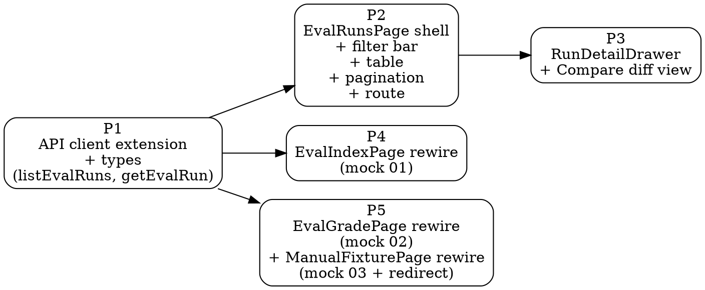

# Plan: Eval UI rewire (Stage C)

> **Source:** `docs/spec/eval-ui-rewire/spec.md`. Mocks at `docs/mocks/eval-redesign/`.
> **Created:** 2026-05-22
> **Status:** in-progress

## Goal

Rewire the eval admin UI to match the approved mocks. Four existing surfaces redesigned, one brand-new page added. Stage B backend already shipped — Stage C is pure UI + API client work.

## Acceptance criteria

- [ ] `/admin/eval/runs` route renders the new page with list + filters + compare + drawer.
- [ ] `EvalIndexPage` reflowed to the mock-01 layout.
- [ ] `EvalGradePage` reflowed to the mock-02 layout.
- [ ] `EvalManualFixturePage` reflowed to the mock-03 layout AND navigates to `/admin/eval?fixtureId=<id>` on success.
- [ ] All existing unit tests in `packages/web/tests/unit/Eval*.test.tsx` continue to pass (or are updated where the visual contract changed).
- [ ] `pnpm --filter @newsletter/web lint`, `typecheck`, `test:unit` all green.

## Codebase context (already known from prior work)

- Web package is React 19 + Vite + Tailwind + shadcn. Path alias `@/*` → `src/*`.
- Existing eval pages: `packages/web/src/pages/{EvalIndexPage,EvalGradePage,EvalManualFixturePage}.tsx`.
- Existing eval components: `packages/web/src/components/eval/{PromptEditor,PromptDiffModal,EvalResultsPanel,ABResultsPanel,SourcingReportPanel,ClusterRow}.tsx`.
- API client: `packages/web/src/api/eval.ts`. Adds `listEvalRuns`, `getEvalRun`.
- Router: `packages/web/src/main.tsx` (or wherever the `createBrowserRouter` config lives — check first).
- Tests: `packages/web/tests/unit/Eval*.test.tsx`. The existing `EvalIndexPage.test.tsx` has 12 tests (URL fixture seed, sessionStorage hydration, Mode B panel, etc.) that must keep passing.
- Theme tokens — extracted from `packages/web/src/index.css` (per prior recon): `--color-cream`, `--color-rust: #8c3a1e`, `--font-serif: Newsreader`, `--font-mono: Geist Mono`. We'll reuse these.
- Library probe: `diff-match-patch` is a candidate for the compare diff view; verify it's a small, dep-light pure-JS lib before adding. If not, fall back to a tiny hand-rolled line-diff (LCS over lines).

## Phase graph

P1 is the foundation; P2/P3 are the new runs page; P4 and P5 are independent visual rewires that can run in parallel after P1 lands.

## Phases

### Phase 1 — API client extension

**Serves:** Foundation for P2/P3.

**Files:**
- Modify: `packages/web/src/api/eval.ts` — add `listEvalRuns({page, perPage, mode?, status?, fixtureId?})` and `getEvalRun(id)`. Both go through `apiFetchAdmin`, throw `EvalApiError` on non-2xx.
- Add: types `ListEvalRunsResponse`, `GetEvalRunResponse` imported from `@newsletter/shared/types/eval-ranking` where possible (the backend uses `EvalRunSummary` and `EvalRun` from shared).
- Tests: `packages/web/tests/unit/api/eval-runs.test.ts` — 4 tests covering happy path + 404 + filter-param serialization + EvalApiError on 500.

**Commit:** `feat(eval): web API client for eval_runs endpoints`

### Phase 2 — `EvalRunsPage` shell

**Serves:** Flow B (browse + detail). Includes the route registration and the basic table without the drawer or compare logic (those land in P3).

**Files:**
- Create: `packages/web/src/pages/EvalRunsPage.tsx` — page shell with filter bar (search, mode segmented control, status segmented control), table rendering `EvalRunSummary[]`, pagination buttons.
- Create: `packages/web/src/components/eval/RunsTable.tsx`, `RunsFilterBar.tsx`, `RunsPagination.tsx` — extracted for testability.
- Modify: `packages/web/src/main.tsx` (or the router config) — add `/admin/eval/runs` route.
- Modify: `packages/web/src/pages/EvalIndexPage.tsx` — add the "Past runs" link in the page header per mock 01 (small inline change; full layout rewire lands in P4).
- Tests:
  - `EvalRunsPage.test.tsx`: renders the table, empty state, filter param URL state, pagination buttons, row click stub.

**Commit:** `feat(eval): /admin/eval/runs page with list + filters + pagination`

### Phase 3 — `RunDetailDrawer` + compare prompts

**Serves:** Flow B detail and Flow C compare.

**Files:**
- Create: `packages/web/src/components/eval/RunDetailDrawer.tsx` — dialog/drawer rendering full `EvalRun` per mock 05-B. Left pane: line-numbered prompt snapshot. Right pane: score breakdown + cost breakdown tables.
- Create: `packages/web/src/components/eval/CompareBar.tsx` — the bottom-of-table action bar that arms when 2 are checked.
- Create: `packages/web/src/components/eval/ComparePromptsDialog.tsx` — dialog that fires two `getEvalRun` calls in parallel and renders the diff. Use the existing `PromptDiffModal`'s diff logic as a starting point (already in `packages/web/src/components/eval/PromptDiffModal.tsx`) — extract the diff renderer into a small utility if needed.
- Modify: `EvalRunsPage.tsx` — manage selection state, wire the drawer + compare bar.
- Tests:
  - `RunDetailDrawer.test.tsx`: renders snapshot + breakdowns; placeholder when `status='running'`; error banner when `status='failed'`.
  - `ComparePromptsDialog.test.tsx`: two parallel API calls; identical-prompts edge case; one-call-fails edge case.

**Library probe:** Before adding `diff-match-patch` or similar, check whether the existing `PromptDiffModal.tsx` already implements a satisfactory line-diff. If yes, reuse it (no new dep). The mock 05 diff body uses simple line-level coloring which a 30-line LCS implementation can produce.

**Commit:** `feat(eval): runs detail drawer + compare prompts diff`

### Phase 4 — `EvalIndexPage` rewire (mock 01)

**Serves:** Flow A polish + Flow B entry point.

**Files:**
- Heavy modify: `packages/web/src/pages/EvalIndexPage.tsx` — restructure to: page header with eyebrow + serif H1 + "Past runs" + "+ New fixture" actions; two-col workspace (1fr | 380px); editor goes full-width on the left; right rail has mode tabs + controls; aggregate hero strip appears above the results table when `rows.length > 0`.
- Modify: `EvalResultsPanel.tsx` — visual tweaks to match the dense monospace table in mock 01. The data shape stays the same.
- Replace: `SourcingReportPanel.tsx` — stacked-source-bar layout from mock 01.
- Existing sessionStorage hydration (REQ-12) MUST keep working — re-test after the rewire.

**Tests:**
- All 12 existing tests in `EvalIndexPage.test.tsx` continue to pass. Update test IDs if the data-testid attributes get renamed.
- Add 1 new test: aggregate hero only renders when `rows.length > 0` AND mode === "scored".

**Commit:** `feat(eval): rewire EvalIndexPage to mock-01 layout`

### Phase 5 — `EvalGradePage` + `EvalManualFixturePage` rewire

**Serves:** Flow A (the fixture → eval handoff) + the grading UX polish.

**Files:**
- Heavy modify: `EvalGradePage.tsx` — flat cluster rows in a single bordered table; selected state via 3px rust left rail (CSS only); progress sidebar replaced with conic-ring + tier bars; persistent keyboard hint bar below the page header.
- Heavy modify: `ClusterRow.tsx` — kept as a component but restyled: no card-on-card, no amber border, keycap-tile label buttons (1/2/3).
- Heavy modify: `EvalManualFixturePage.tsx` — action bar moves below textarea + invalid panel; right rail with pipeline explainer + source-mix preview (these are static — the source mix is computed from the parsed lines, not from an API call); navigate target changes from `/admin/eval/grade/:fixtureId` → `/admin/eval?fixtureId=:fixtureId`.

**Tests:**
- Existing `EvalGradePage.test.tsx` (2 tests) and `EvalManualFixturePage.test.tsx` (7 tests) must continue to pass. The manual-fixture test that asserts navigation needs updating: the destination is now `/admin/eval`, not `/admin/eval/grade/:id`. Update the `MemoryRouter` `Routes` accordingly.

**Commit:** `feat(eval): rewire EvalGradePage + EvalManualFixturePage to mocks 02/03`

## Order of execution

- P1 first (mandatory).
- P2 → P3 sequential.
- P4 and P5 can run in parallel after P1.

I'll dispatch P1 alone, then a single wave of P2+P4+P5 after P1, then P3 after P2 completes.
