# Plan: Tech Debt Fix Pass (2026-06-04 audit, issues #247–#251)

> **Source:** docs/spec/fix-tech-debt-2026-06-04/design.md + spec.md; manifest `.harness/tech-debt/2026-06-04/findings.json`
> **Created:** 2026-06-04
> **Status:** planning

## Goal

Land five behavior-preserving fix streams — one branch+PR per tech-debt issue — covering dependency CVE bumps, dead-code removal, the two architecture god-modules, the top complexity offenders, and the top non-test duplication, with every one of the 1,085 manifest findings reaching a terminal disposition in `fix-manifest.json`.

## Acceptance Criteria

- [ ] REQ-1…REQ-8 of spec.md hold; `pnpm build/typecheck/lint/test:unit` green at every phase boundary
- [ ] Five PRs, each referencing its issue (#247–#251) and carrying its reconciliation table
- [ ] `fix-manifest.json`: 1,085 ids, all terminal, no auto_fixable dropped without reason

## Codebase Context

### Context Map (Step 2.0)
- **Context map read:** 6 PACKAGE.md (root 4 + pipeline/workers + api/routes), 4 standards files (14 S-* titles)
- **Decisions honored:**
  - `D-052` — newsletter-send.ts kept for back-compat: Phase 5 extracts shared helpers only, never merges/deletes the handler.
  - `D-051` — publish deps are per-job closures: Phase 3 extraction keeps all credential/notifier resolution per-job; no module-level singletons introduced.
  - `D-100` — web subpath imports from shared: Phase 5's schema/type consolidation adds shared subpaths and web imports them via subpath only.
  - `D-102` — schema definitions live only in shared: no schema movement out of shared anywhere.
  - `D-060`/`D-003` — partial-UPDATE writers' row-existence precondition: Phase 3's extracted `writeFailedArchive` keeps its create-row semantics and call sites unchanged.
  - `D-010` — EMAIL_PROVIDER startup switch in api: Phase 5 does NOT unify api/pipeline email providers (deferred, see WS-5 scope cut).
- **Standards honored:**
  - `S-api-03` (thin route handlers) — Phase 3 moves admin-eval logic into services; this *is* the standard's direction.
  - `S-global-03` (no premature abstractions) — Phase 5 extracts only where ≥2 live call sites exist today; Privacy/Terms skip recorded.
  - `S-global-02` (exact versions) — Phase 1 pins exact versions from library-probe.md.
  - `S-web-01` (subpath-only shared imports) — Phase 5 schema move adds `package.json#exports` subpath + tsup entry.
  - `S-pipeline-01` (no HTTP framework in pipeline) — untouched.
- **Gotchas carried forward:**
  - run-process tests mock via deps and do NOT import internal helpers → extraction is clean (Phase 3).
  - `buildActualRanking`/`buildExpectedRanking` ARE imported directly by `admin-eval-report-builders.test.ts` → Phase 3 moves them to a service and updates that one test import (re-export shim avoided — they were flagged unused-export precisely because route-level export is wrong surface).
  - api email providers throw plain `Error` while pipeline throws typed `EmailSendError` → flagged as drift in #250, NOT unified in this pass (behavior-change risk).

### Existing Patterns to Follow
- **Pipeline services:** `packages/pipeline/src/services/` — pure helpers + `createX()` factories (e.g. `cost-tracker.ts`, `source-telemetry.ts`)
- **API services:** `packages/api/src/services/` — exported functions with injected deps (e.g. `run-observability.ts`, `review.ts`)
- **Web dashboard components:** `packages/web/src/components/dashboard/` — colocated helpers; new shared module `run-status.ts` follows `format.ts` style

### Test Infrastructure
- Vitest 3 (unit + e2e projects per package). Commands in `.harness/fix-tech-debt-2026-06-04/baseline.json`.
- Scoped: `pnpm --filter <pkg> exec vitest run --project unit <file>`; package suite: `pnpm --filter <pkg> test:unit`.
- Web e2e: `packages/web/tests/e2e/*.spec.ts`; pipeline seam e2e: `packages/pipeline/tests/e2e/seam/`.

## Scope decisions recorded (planner calls under the "everything feasible" mandate)
1. **vitest 4.1.8 attempted with fallback** to 3.2.1 (finding → `issue`) if config migration exceeds config-file changes.
2. **uuid override skipped** (Low CVE, not exploitable here; forcing v11+ risks breaking bullmq/svix) → `dropped` w/ reason.
3. **ai@6/@ai-sdk@3 deferred** → `issue` (repo learnings require live cost probes).
4. **Email-provider api↔pipeline unification deferred** → `issue` (typed-error contract drift = behavior change in api send path).
5. **PrivacyPolicy↔Terms dedup skipped** → `issue` (low ROI on static pages).
6. **804 test-only clone groups suppressed** via generated `.claude/harness/tech-debt-ignore.md` (per-file rules).
7. **Unused files:** delete only verified-dead; keep `deployment/migrate.mjs` + operator scripts referenced by docs/package.json → `dropped` w/ reason.

## Phase Graph

```dot
digraph phases {
  rankdir=LR
  node [shape=box]

  phase_1 [label="Phase 1: Dependency bumps (#247)"]
  phase_2 [label="Phase 2: Dead code removal (#251)"]
  phase_3 [label="Phase 3: Architecture decomposition (#249)"]
  phase_4 [label="Phase 4: Complexity refactors (#248)"]
  phase_5 [label="Phase 5: Duplication extraction (#250)"]

  phase_1 -> phase_2 -> phase_3 -> phase_4 -> phase_5
}
```

Sequential by design: each phase = one commit series on the integration branch `fix/tech-debt-2026-06-04`; Stage 6 cherry-picks each phase's commits onto a per-issue branch off `origin/main` (`td/247-dependency-bumps`, `td/251-dead-code`, `td/249-architecture`, `td/248-complexity`, `td/250-duplication`) and opens one PR per issue. If a cherry-pick conflicts (shared-file hunks), that PR is stacked on the conflicting predecessor branch instead and the PR body says so.

**File-ownership (conflict avoidance):** package.json/lockfile → P1 only · deleted dead files → P2 only · `run-process.ts`+`admin-eval.ts` → P3 only · WS-4 function list → P4 only · `email-send.ts`/`newsletter-send.ts`/`RunsCardList`/`RunsTable`/`validate.ts`(schema block)/`settingsSchema.ts`/`review.ts` types → P5 only. P2 touches `validate.ts` only to delete flagged unused exports (disjoint hunks from P5's schema block).

**Disposition bookkeeping:** each phase writes `.harness/tech-debt/2026-06-04/dispositions-phase-N.json` (`[{id, disposition, reason?}]`) for findings it fixed/dropped. Stage 6 merges them + defaults (`issue`) + P5's suppression list into `fix-manifest.json` and reconciles per REQ-6.
