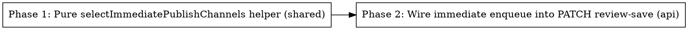

# Plan: Late-Review Publish Trigger

> **Source:** docs/spec/late-review-publish-trigger/design.md, spec.md
> **Created:** 2026-05-26
> **Status:** planning

## Goal

When the admin reviews a newsletter after a channel's scheduled publish time has passed,
that channel publishes immediately on review save; channels still in the future continue
to publish via their existing daily cron.

## Acceptance Criteria

- [ ] A pure `selectImmediatePublishChannels({ settings, completedAt, now })` returns the
      enabled, past-due channels and never throws (REQ-004,005,006).
- [ ] `PATCH /api/admin/archives/:runId`, on a successful review save, enqueues `delay: 0`
      runId-targeted jobs for each past-due enabled channel (REQ-001,002).
- [ ] Future-scheduled channels and disabled channels are not enqueued immediately
      (REQ-003,004).
- [ ] Channels already sent (`emailSentAt`/`linkedinPostedAt`/`twitterPostedAt`) are not
      re-enqueued (REQ-008).
- [ ] No double-publish across the immediate path and the daily cron (REQ-011).
- [ ] `processingQueue` absent → no-op, PATCH still 200 (REQ-010).
- [ ] Existing scheduler + worker behavior unchanged (REQ-007); full baseline suite green.

## Codebase Context

### Existing Patterns to Follow
- **Pure scheduling helper:** `packages/shared/src/scheduling/published-at.ts`
  (`resolveScheduledPublishAt` wraps `publishDateForWindow`, returns null on bad input,
  never throws). The new helper lives beside it and follows the same defensive contract.
- **Per-channel window math:** `packages/shared/src/scheduling/tz.ts`
  (`publishDateForWindow({ timezone, pipelineTime, publishTime, completedAt })`).
- **Enqueue on the route:** `packages/api/src/routes/archives.ts:233` `POST /:runId/send`
  shows `deps.processingQueue.add("email-send", { runId }, { jobId, delay: 0 })`.
- **Channel constants:** `packages/shared/src/scheduling/job-ids.ts` —
  `PublishChannel = "email-send" | "linkedin-post" | "twitter-post"`, `PUBLISH_CHANNELS`,
  `jobIdFor(channel, runId)`. Channel values ARE the BullMQ job names.
- **Settings + archive reads on the route:** `ArchivesRouterDeps` already exposes
  `getSettingsRepo?(): { get(): Promise<UserSettings|null> }` and `getArchiveRepo()`
  (`createUserSettingsRepo`/`createRunArchivesRepo`, wired in `packages/api/src/index.ts`
  `createDefaultArchivesDeps`).

### Key types
- `UserSettings` (`packages/shared/src/types/settings.ts`): `scheduleEnabled`,
  `scheduleTimezone`, `pipelineTime`, `emailTime`, `linkedinTime`, `twitterTime`,
  `emailEnabled`, `linkedinEnabled`, `twitterPostEnabled`.
- `RunArchiveRow` (`packages/api/src/repositories/run-archives.ts`): `reviewed`,
  `completedAt`, `emailSentAt`, `linkedinPostedAt`, `twitterPostedAt`.

### Decisions (from brainstorm + planning Q&A)
- Trigger = review save (`PATCH /:runId`), fire on **every** successful save (idempotency
  absorbs re-saves; no `patchArchive` contract change).
- Per-channel past-due via `publishDateForWindow` with each channel's own time.
- Target the specific reviewed `runId`. Keep the cron. Skip disabled channels +
  `scheduleEnabled=false`.

### Test Infrastructure
- Runner: Vitest 3 (unit + e2e projects per package). Unit: `pnpm test:unit`.
  E2E: `pnpm infra:up` then `pnpm --filter <pkg> test:e2e`.
- Shared unit tests: `packages/shared/tests/unit/scheduling/*` (mirror `published-at`
  tests). API e2e: `packages/api/tests/e2e/archives.e2e.test.ts` (extend for PATCH
  enqueue). Pipeline e2e: `packages/pipeline/tests/e2e/seam/workers/{email,linkedin,twitter}-post.e2e.test.ts`
  (idempotency). Global infra setup in `packages/*/tests/e2e/setup/`.

## Phase Graph

Phase 2 depends on Phase 1 (imports the helper). No parallelism — two sequential phases.
