# Implementation Plan — llm-shortlisting-rewrite

**Linked:** [design.md](./design.md) | [spec.md](./spec.md) | [library-probe.md](./library-probe.md)

## Phase graph

```dot
digraph plan {
  rankdir=LR
  node [shape=box]
  p1 [label="Phase 1: Shared types + DB schema + default constant"]
  p2 [label="Phase 2: Pipeline shortlist rewrite + run-process wiring"]
  p3 [label="Phase 3: API /settings + zod schema"]
  p4 [label="Phase 4: Web UI (Settings + CostDialog)"]
  p1 -> p2 -> p3 -> p4
}
```

All phases are sequential — each downstream phase depends on the type/schema changes of the upstream one. No parallelism.

## Phase 1: Shared types + DB schema + default constant

**Files (4):**
- `packages/shared/src/constants/shortlist-prompt.ts` (NEW) — export `DEFAULT_SHORTLIST_PROMPT` (non-empty string, ~30–60 lines, focused newsletter-shortlister system prompt with 3–4 axes: developer/builder relevance, signal vs hype, recency-of-claim, neutrality)
- `packages/shared/src/constants/index.ts` — re-export `DEFAULT_SHORTLIST_PROMPT`
- `packages/shared/src/types/cost-breakdown.ts` — extend `CostStage` union to include `"shortlist"`
- `packages/shared/src/db/schema.ts` — add `shortlistSize: integer("shortlist_size").notNull()` and `shortlistPrompt: text("shortlist_prompt").notNull()` to `userSettings` table

**Migration:**
- Run `pnpm --filter @newsletter/shared db:generate` to produce `0027_<auto>.sql`
- Hand-edit the generated migration to backfill defaults in the same migration (singleton row): `UPDATE user_settings SET shortlist_size = 30, shortlist_prompt = '<verbatim DEFAULT_SHORTLIST_PROMPT>' WHERE singleton = true;` — pattern matches migration 0026

**Tests (write FIRST per TDD):**
- `packages/shared/src/constants/__tests__/shortlist-prompt.test.ts` — `DEFAULT_SHORTLIST_PROMPT` is non-empty string, length under 20000
- Existing type-check of consumers proves `CostStage` extension works

**Exit criteria:**
- `pnpm --filter @newsletter/shared build` passes
- `pnpm --filter @newsletter/shared db:migrate` applies cleanly against local Postgres (run `pnpm infra:up` first if needed)
- `select shortlist_size, length(shortlist_prompt) from user_settings;` shows `30, ~3000` (or whatever the default-prompt length is)

**Asserts REQ:** 010, 011, 012, 013, 020, 021

## Phase 2: Pipeline shortlist rewrite + run-process wiring

**Files (3):**
- `packages/pipeline/src/processors/shortlist.ts` — **full rewrite**:
  - New `ShortlistOptions`: `{ shortlistSize: number; systemPrompt: string; modelId?: string; tracker?: CostTracker; abortSignal?: AbortSignal; runId: string; generate?: (...) => Promise<...> /* injectable for tests */; now?: () => Date /* optional, unused */ }`
  - New constant `DEFAULT_SHORTLIST_MODEL = "claude-haiku-4-5-20251001"`
  - Implementation: extract `{id, title}` pairs, build prompt payload, call `generateObject` with `{ ids: z.array(z.string()) }` schema, hydrate by lookup map, drop unknown, return in LLM order
  - Remove constants: `DEFAULT_SHORTLIST_SIZE`, `MIN_SHORTLIST_SIZE`, `MAX_SHORTLIST_SIZE`, `DEFAULT_SCORE_FLOOR`, `DEFAULT_ENGAGEMENT_WEIGHT`, `DEFAULT_RECENCY_WEIGHT`
  - Remove `ShortlistBreakdown` math; return `breakdowns: []` for back-compat. (If `breakdowns` is unused downstream by rank, also drop the field — verify during impl.)
- `packages/pipeline/src/workers/run-process.ts`:
  - Read `settings.shortlistPrompt` and `settings.shortlistSize` (already loaded via `userSettingsRepo.get()`)
  - Update the `shortlistFn` call site to pass new options; remove `halfLifeHours` etc.
- `packages/pipeline/src/workers/run-process.ts` deps wiring — confirm `deps.shortlistFn` default signature still matches; update if needed

**Tests (write FIRST):**
- `packages/pipeline/src/processors/__tests__/shortlist.test.ts` — full rewrite mirroring spec VS-1..VS-4:
  - generate returns 30 of 50 ids → shortlist length 30, order preserved
  - generate returns mix of valid + bogus ids → only valid ids in result, in LLM order
  - generate returns fewer than N → length matches return count
  - generate returns 0 ids → empty shortlist
  - generate throws → error rethrown
  - tracker.record called once with stage=shortlist
  - modelId env override works (`process.env.SHORTLIST_MODEL` precedence)
- `packages/pipeline/src/workers/__tests__/run-process.shortlist-wiring.test.ts` — stub shortlistFn, assert it received `systemPrompt: settings.shortlistPrompt` and `shortlistSize: settings.shortlistSize`

**Exit criteria:**
- `pnpm --filter @newsletter/pipeline test:unit` passes
- `pnpm --filter @newsletter/pipeline typecheck` passes (will fail if rank still references removed fields — fix any breaks)
- Grep `run-process.ts` for `halfLifeHours` shortlist call — confirms removal

**Asserts REQ:** 001-008, 040-043

## Phase 3: API /settings + zod schema

**Files (2):**
- `packages/api/src/routes/settings.ts`:
  - Extend the zod upsert schema (find existing `userSettingsUpsertSchema` or equivalent) with `shortlistPrompt: z.string().min(1).max(20000)` and `shortlistSize: z.number().int().min(5).max(100)`
  - Ensure the GET response shape includes both fields
- `packages/shared/src/schemas/settings.ts` (or wherever the shared validation schema lives — confirm during impl):
  - Mirror the additions if the shared schema is the source of truth

**Tests (write FIRST):**
- `packages/api/src/routes/__tests__/settings.test.ts`:
  - PUT with valid new fields → 200, persisted row has new values
  - PUT missing `shortlistPrompt` → 400
  - PUT with `shortlistSize = 3` → 400 (below min)
  - PUT with `shortlistSize = 101` → 400 (above max)
  - PUT with `shortlistPrompt = ""` → 400 (min 1)
  - GET returns the new fields with current values

**Exit criteria:**
- `pnpm --filter @newsletter/api test:unit` passes
- `pnpm --filter @newsletter/api typecheck` passes

**Asserts REQ:** 030, 031, 032

## Phase 4: Web UI (Settings page + CostDialog)

**Files (3–4):**
- `packages/web/src/components/settings/ShortlistPromptSection.tsx` (NEW) — mirror `RankingPromptSection.tsx` exactly (label "Shortlist prompt", textarea bound to `shortlistPrompt`, char counter, reset-to-default button reading `DEFAULT_SHORTLIST_PROMPT` from `@newsletter/shared/constants` SUBPATH import)
- `packages/web/src/components/settings/ShortlistSizeField.tsx` (NEW) OR inline addition to SettingsPage — number input bound to `shortlistSize`, min 5, max 100, integer
- `packages/web/src/pages/SettingsPage.tsx` — mount both above `<RankingPromptSection />`; ensure react-hook-form `defaultValues` includes the new fields from `settingsQuery.data`; per existing learnings, the useEffect that resets the form on data load must include the new fields
- `packages/web/src/components/dashboard/CostDialog.tsx` — add `shortlist: "Shortlist"` to `STAGE_LABELS`. Verify the row iteration is order-stable (define a STAGE_ORDER if needed: `["web-discovery", "web-extraction", "shortlist", "rank", "recap"]`)

**Tests (write FIRST):**
- `packages/web/src/components/settings/__tests__/ShortlistPromptSection.test.tsx`:
  - Renders textarea with current value
  - Char counter updates on input
  - Reset button restores `DEFAULT_SHORTLIST_PROMPT`
- `packages/web/src/components/dashboard/__tests__/CostDialog.test.tsx`:
  - When `breakdown.stages.shortlist` is present, a "Shortlist" row renders with the expected columns
  - When `breakdown.stages.shortlist` is absent, no "Shortlist" row renders (old archive case)
  - Total at the bottom matches the sum of all rendered stages

**Live UI verification (Playwright MCP, run during verify stage):**
- VS-8: `/admin/settings` shows both new fields (screenshot)
- VS-9: `/admin` → Cost button on a post-migration run → Shortlist row visible (screenshot)
- VS-10: `/admin` → Cost on a pre-migration archive → no Shortlist row, no error (screenshot)

**Exit criteria:**
- `pnpm --filter @newsletter/web test:unit` passes
- `pnpm --filter @newsletter/web typecheck` passes
- `pnpm --filter @newsletter/web build` produces a bundle with no Node-built-in warnings (subpath import learning)

**Asserts REQ:** 050, 051, 052, 053, 070

## Cross-cutting

- Throughout: any `@newsletter/shared` import in `packages/web/` MUST use subpath form (rule from `.claude/rules/learnings/web-shared-subpath-imports.md`)
- Cost-tracker `setCostBreakdown` precondition (run_archives row must exist) is unchanged — shortlist stage is recorded alongside existing stages on the same archive row
- After all phases, run `pnpm lint && pnpm typecheck && pnpm test:unit && pnpm build` from the repo root — all pass

## Final gate

- E2E pipeline test (existing) updated to include the shortlist stage stub and assert `cost_breakdown.stages.shortlist` is present.
- Manual playwright run captures three screenshots (VS-8, VS-9, VS-10).
- Quality gate runs against baseline (`.harness/llm-shortlisting-rewrite/baseline.json`): typecheck 0, lint 0 errors, all unit tests pass.
