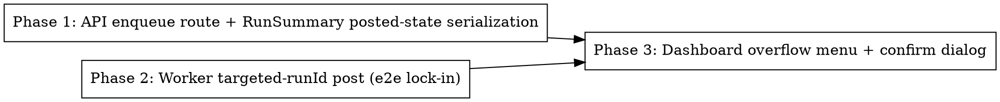

# Plan: Manual LinkedIn / X (Twitter) Post Trigger

> **Source:** docs/spec/manual-social-post-trigger/design.md + spec.md
> **Created:** 2026-05-26
> **Status:** planning

## Goal

Let an admin manually trigger a LinkedIn or X (Twitter) post for a specific newsletter run
from an uncluttered overflow (⋮) menu on each dashboard run row, gated by a confirm dialog,
with the row reflecting posted state (linking to the platform permalink once posted).

## Acceptance Criteria

- [ ] `POST /api/runs/:runId/post/:channel` (admin-gated) enqueues the matching post job with
      `{ runId }` and returns 202 for an eligible archive; 404 missing; 409 ineligible; 400 bad channel.
- [ ] The post worker, given a job with `data.runId`, posts that specific archive (not the latest),
      and a second job no-ops once `*_posted_at` is set.
- [ ] `GET /api/runs` serializes `linkedinPostedAt` / `twitterPostedAt` / `linkedinPermalink` /
      `twitterPermalink` onto each `RunSummary`.
- [ ] Each dashboard run row has a ⋮ menu with LinkedIn + X items: enabled trigger when eligible,
      disabled when ineligible, and a permalink-linking posted indicator when already posted.
- [ ] Activating an enabled item opens a confirm dialog; the POST fires only on confirm; the run
      list refetches after a 202.
- [ ] `pnpm typecheck`, `pnpm lint`, `pnpm test:unit` pass; e2e for the worker targeted-runId path passes.

## Codebase Context

### Existing Patterns to Follow
- **Enqueue + 202 route:** `packages/api/src/routes/runs.ts` `POST /now` (lines 88–136) — has `processingQueue`, admin context, `runNowBodySchema` validation. New route is a sibling.
- **Worker targeted-runId (ALREADY EXISTS):** `packages/pipeline/src/workers/publish-target.ts::resolvePublishTarget({ channel, runId })` already loads a specific archive, rejects dry-run + unreviewed; `{linkedin,twitter}-post.ts` already idempotency-check `*_postedAt !== null`. We only add a CALLER that supplies `runId`.
- **Scheduler enqueue shape:** `packages/api/src/services/scheduler.ts` — jobs `linkedin-post` / `twitter-post` go on the same processing queue; manual = `processingQueue.add("linkedin-post", { runId })`.
- **Run-list serialization:** `packages/api/src/services/run-list.ts` (archive→RunSummary map, ~lines 60–81) — add the new fields here from `row.linkedinPostedAt` / `row.twitterPostedAt` / `row.socialMetadata`.
- **Repo select:** `packages/api/src/repositories/run-archives.ts` `list()` (line 458) selects the two timestamps but NOT `socialMetadata`; `RunArchiveRow` (lines 29–52) lacks `socialMetadata`. Both need extending. Mirror the pipeline repo only if it serializes to the dashboard (it does not — pipeline repo unaffected).
- **Confirm dialog:** reuse the existing `<Dialog>` delete-confirm pattern in `RunsTable.tsx` (lines 236–307) + `@/components/ui/dialog`.
- **Overflow menu:** reuse the custom `role="menu"` dropdown pattern from `DashboardPage.tsx` `RunNowSplitButton` (lines 140–222) — click-outside + Escape handling. Do NOT add `@radix-ui/react-dropdown-menu` (not a dependency; custom pattern is the established idiom).
- **Mutation:** `useMutation` + `queryClient.invalidateQueries({ queryKey: ["runs"] })` (see `hooks/useDeleteArchive.ts`); errors via `toast.error` (sonner). Query key for the list: `["runs", { limit: null }]`.
- **Client fn:** add `triggerSocialPost(runId, channel)` to `packages/web/src/api/runs.ts` beside `triggerRunNow` / `deleteArchive` (uses `apiFetchAdmin`).
- **SocialMetadata shape:** `@newsletter/shared/types` → `{ linkedinPermalink?, twitterPermalink?, ... }`.

### Test Infrastructure
- **Runner:** Vitest 3, `pnpm test:unit` (unit) / `pnpm test:e2e` (needs DB+Redis via `pnpm infra:up`).
- **API unit/e2e:** `packages/api/tests/` — handler tests inject fake queue (assert `Queue.add` calls) and a fake archive repo; e2e hit a live Hono app + DB.
- **Worker e2e:** `packages/pipeline/tests/e2e/` — existing post-worker tests; extend an existing `{linkedin,twitter}-post` spec rather than create a duplicate.
- **Web unit:** `packages/web/tests/unit/components/dashboard/RunsTable*.test.tsx` — `makeRun()` fixture + `MemoryRouter` + `@testing-library/react`; props-based, callbacks are `vi.fn()`.

## Phase Graph

Phase 1 and Phase 2 are independent (different packages/files) and may run in parallel.
Phase 3 depends on both (UI needs the serialized fields from Phase 1 and the worker behavior from Phase 2).
