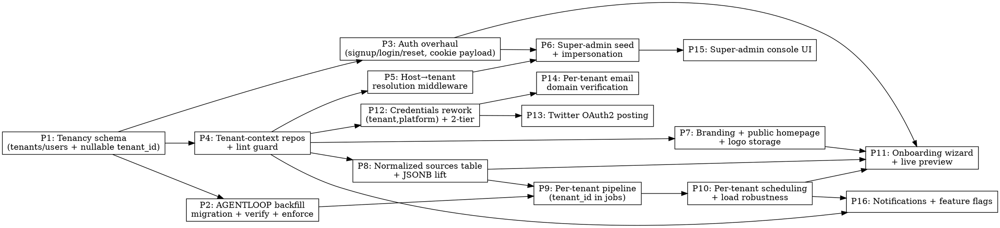

# Plan: Multi-Tenancy (VER-110)

> **Source:** `.harness/features/multi-tenant/spec.md` (design: `design.md`; probe: `library-probe.md`; mocks: `mocks/index.html`)
> **Created:** 2026-06-10
> **Status:** planning

## Goal

Turn the single-admin newsletter engine into an isolated multi-tenant product — public signup, per-tenant onboarding, branding, sources, pipeline, scheduling, social/email, notifications, and a super-admin console — with AGENTLOOP migrated in as tenant 0 with zero data loss.

## Acceptance Criteria

- [ ] Every spec REQ-* has its one matrix test passing (see spec Verification Matrix).
- [ ] No cross-tenant data access through any request path (isolation suite green; lint guard active).
- [ ] AGENTLOOP migrated to tenant 0: no NULL `tenant_id`, counts match, dry-run pipeline succeeds, public site + publishing unchanged.
- [ ] A new tenant can sign up → onboard → activate → run → review → publish to its own subscribers, isolated end-to-end.
- [ ] Super admin can list tenants and impersonate one's dashboard.
- [ ] `pnpm lint`, `pnpm typecheck`, `pnpm test:unit`, e2e green at each phase boundary.

## Codebase Context

### Context Map (Step 2.0)
- **Context map read:** ARCHITECTURE.md + DECISIONS.md (full index) + 4 standards files + per-package docs for shared/api/pipeline/web (this session also deep-explored all four packages and the homepage components).
- **Decisions honored:**
  - `D-008`/`D-104` — `SESSION_SECRET` signs the session cookie AND is the credential KEK; we extend the cookie payload (userId+tenantId+role) without changing the secret, and the migration must NOT rotate it (would wipe all tenants' encrypted creds).
  - `D-010` — `EMAIL_PROVIDER` chosen at startup; per-tenant sending uses the active provider (Resend verified live for domains).
  - `D-012` — credentials encrypted at rest via `CredentialCipher`; new `(tenant_id, platform)` rows reuse it.
  - `D-100`/`S-web-01` — web imports shared only via subpaths; any new shared export needs a `tsup`/`exports` subpath entry.
  - `D-102` — schema lives only in `@newsletter/shared`; all new tables/columns go there.
  - `D-103` — jsonb columns carry explicit Drizzle `$type`.
  - `D-105`/`D-113` — generated migrations inspected for bare `NOT NULL` adds; journal `when` timestamps strictly increasing. Tenant_id columns added **nullable**, backfilled, then tightened.
  - `D-107`/`D-111` — Slack idempotency via `run_archives.notification_state`; per-tenant notifier reuses this; collector-health stays markerless.
  - `D-110` — collector-health is a dedicated queue/worker; per-tenant scheduling keeps it separate, never `concurrency:1` on processing.
  - `D-112` — custom job ids use `-`; `*_SCHEDULER_KEY` keep `:`. Per-tenant scheduler keys namespaced as `pipeline-run:<tenantId>` (scheduler-key form).
  - `D-014` — run cancel via Redis pub/sub `run:cancel:<runId>` (runId already globally unique; tenant scoping additive).
  - `D-051` — publish deps built per-job (per-tenant creds resolve per-job naturally).
  - `D-109` — LinkedIn token refresh uses `FOR UPDATE`; Twitter OAuth2 refresh mirrors it.
- **Standards honored:** `S-global-01` strict TS (no `any`); `S-global-02` exact dep versions (all libs already pinned — no new deps needed, probe-confirmed); `S-global-03` no premature abstraction; `S-api-01`/`S-api-04` repository pattern + narrow interfaces (tenant scope threads through factories); `S-api-02` no static pipeline imports at route boundary (dynamic import preserved); `S-api-03` thin routes; `S-pipeline-01` no HTTP framework in pipeline; `S-pipeline-03` per-job credential resolution; `S-web-01` subpath shared imports; `S-web-02` API via client wrappers; `S-web-03` thin pages; `S-web-04` e2e sends no real external messages (use DB/log assertions; webhook force-blanked).
- **Gotchas carried forward:**
  - `user_settings` singleton (`singleton=true` unique index) is the spine of single-tenancy → becomes one row per tenant; the singleton constraint is dropped, replaced by unique `(tenant_id)`.
  - Sources are JSONB in `user_settings` today → promoted to a normalized `sources` table (Phase 8); migration lifts AGENTLOOP's JSONB into rows.
  - `social_credentials`/`social_tokens` PK is `platform` alone → becomes `(tenant_id, platform)` (Phase 12); app-level secrets split to a separate store.
  - Recipients effectively env-driven today; `subscribers` table exists but underused → becomes the real per-tenant subscriber store.
  - Public homepage must stay the **existing layout** (HomePage.tsx + blocks) — only branding slots swapped (Phase 7).

### Existing Patterns to Follow
- **Repository factory:** `packages/{api,pipeline}/src/repositories/*` — `createXRepo(db)`; extend to `createXRepo(db, tenantCtx)`.
- **Auth/session:** `packages/api/src/auth/{session.ts,middleware.ts}` (HMAC cookie) — extend payload, keep HMAC.
- **OAuth flow:** `packages/api/src/routes/linkedin-oauth.ts` + Redis CSRF state — template for Twitter OAuth2.
- **Scheduler reconcile:** `packages/api/src/services/scheduler.ts` (`reconcilePipelineSchedule`) — make per-tenant.
- **Pipeline orchestration:** `packages/pipeline/src/workers/run-process.ts` loads `settings?.…` per job — switch to tenant-scoped load.
- **Credential cipher:** `packages/shared/src/services/credential-cipher.ts`.
- **Public homepage:** `packages/web/src/pages/HomePage.tsx` + `components/home/*`, `components/shell/{Masthead,Footer,BrandMark}.tsx`.
- **Settings UI:** `packages/web/src/pages/SettingsPage.tsx` + `settingsSchema.ts` + `components/settings/*`.
- **Migrations:** `packages/shared/src/db/migrations/` via `pnpm --filter @newsletter/shared db:generate|db:migrate`.

### Test Infrastructure
- Unit: Vitest 3 (`pnpm test:unit`), jsdom for web.
- E2E: Playwright, hermetic (private PG/Redis on ephemeral ports), `playwright.config.ts` env allowlist; `SLACK_WEBHOOK_URL` force-blanked (S-web-04).
- DB tests: repository tests against a test PG; migrations applied via drizzle-kit.
- Local infra: `pnpm infra:up` (PG 5434 per local quirk, Redis).

### Library Probe (resolved)
- All deps pinned + in production use. **Tavily** + **Resend Domains** VERIFIED live; **Twitter OAuth2** confirmed via docs. No new dependencies. Carry forward: Resend domains needs a **full-access key** and a **plan domain-quota** sized to tenant count (at-scale risk, not a v1 blocker).

## Assumptions (planner)
- One mega-feature branch `aman/ver-110-add-support-for-multi-tenancy`; phases land as separate commits, behind the activation gate so partial work never affects AGENTLOOP (tenant 0 keeps the legacy paths working via backfill until each phase cuts over).
- Phasing granularity chosen by the planner (16 phases) since the brainstorm resolved substantive decisions; no further Q&A needed.
- Production apex/`app.` host + wildcard DNS/TLS + AGENTLOOP's exact custom domain are ops inputs (design Open Questions) — code reads them from config/env, so the build is not blocked.

## Phase Graph

Ready first: **P1**. After P1: P2, P3, P4 in parallel. P4 unblocks the bulk. P11 (onboarding) is the convergence point needing branding (P7), sources (P8), auth (P3), scheduling (P10).

## Phases

| Phase | Delivers | Key REQ |
|-------|----------|---------|
| P1 | `tenants` + `users` tables; nullable `tenant_id` on all tenant-owned tables; per-tenant settings row (drop singleton) | F8, F10(schema), REQ-010 |
| P2 | Idempotent AGENTLOOP backfill → tenant 0; verification gate; tighten to NOT NULL/enforced scope | REQ-110–115, REQ-122, EDGE-012 |
| P3 | Real auth: signup (+confirm), login, forgot/reset, argon2 hashes, extended HMAC cookie, rate-limit; replace `ADMIN_PASSWORD` gate | REQ-001–007, REQ-121 |
| P4 | Repository factories carry `TenantContext`; all tenant-owned queries scoped; `enforce-repository-access` lint rule extended | REQ-011–014, REQ-120, REQ-126 |
| P5 | Host→tenant middleware (`app.*` vs `<slug>.*`), tenant-0 custom-domain map, slug-change 301 | REQ-020–023, EDGE-013 |
| P6 | Super-admin seed (env allowlist); impersonation token + banner + exit + audit | REQ-082, REQ-100–103, EDGE-008 |
| P7 | Per-tenant branding (name/logo/headline/strip/subtagline) from tenant ctx; logo in Postgres (bytea); homepage existing-layout slot-swap; per-tenant nav | REQ-040–044, REQ-029, REQ-039 |
| P8 | Normalized per-tenant `sources` table; lift AGENTLOOP JSONB → rows; sources panel in Settings | REQ-050, REQ-070–074 |
| P9 | `tenant_id` through BullMQ payloads; workers load tenant settings/sources/prompts; run derivatives attributed | REQ-060–061, REQ-064, REQ-041 |
| P10 | Per-tenant scheduler keys + reconcile; global concurrency cap; start jitter; per-source rate limits; collector throttle | REQ-062–063, REQ-065–068, REQ-123, EDGE-009/011 |
| P11 | Resumable onboarding wizard (8 steps), slug availability, prompt-gen, source discovery, activation gate, live preview | REQ-030–038, REQ-051, REQ-052(setup) |
| P12 | Re-key `social_credentials`/`social_tokens` to `(tenant_id, platform)`; app-level secrets store (super-admin only) | REQ-062, REQ-080, REQ-083, REQ-086, NF6 |
| P13 | Twitter OAuth2 3-legged connect + per-tenant tokens + refresh + post | REQ-081 |
| P14 | Per-tenant Resend sending-domain register/verify; broadcast gate; transactional via shared sender | REQ-053, REQ-084–085, REQ-037, EDGE-005/006 |
| P15 | Super-admin console UI (tenant list, open/impersonate) | REQ-100 |
| P16 | Per-tenant notifications (email + Slack webhook); feature flags (Deliverability/Canon/Eval, off) | REQ-070–073(flags), REQ-090–094, EDGE-014 |

Per-phase detail: `.harness/runtime/multi-tenant/phase-<n>.md` (gitignored).
