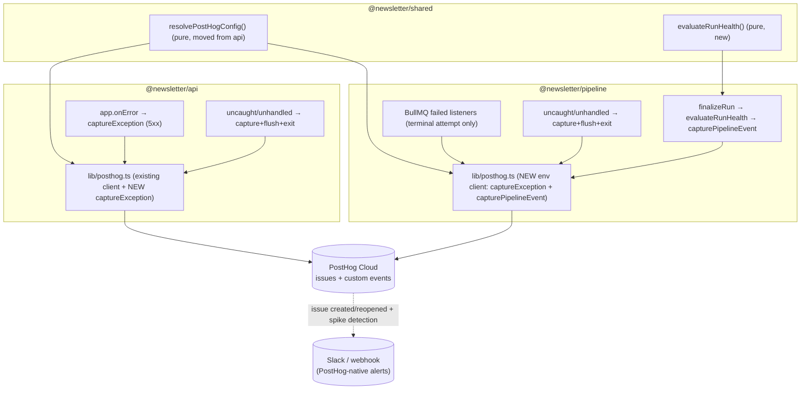
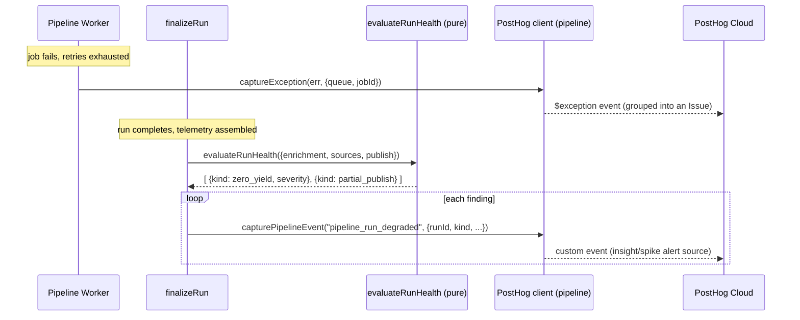

# Design — PostHog Error Tracking (supersedes the custom incident system)

**Status:** Draft for review
**Author:** orchestrate / brainstorm
**Spec name:** `posthog-error-tracking`
**Branch:** `feature/posthog-error-tracking` (off `main`)

---

## Problem Statement

The pipeline + api have no error-tracking surface on `main`. When something breaks
mid-run (a collector tunnel failure, a BullMQ job exhausting retries, a 5xx in the
api, an uncaught exception in a worker), it is visible only in raw logs — there is no
grouped, searchable error view and no alerting. PR #267 proposed a bespoke in-house
incident system (durable `incidents` table, `AlertDispatcher` with fingerprint dedup, an
`alert-delivery` BullMQ sweep, and an `/admin/incidents` page) to close that gap. It is
still an **open, unmerged WIP**.

PostHog is **already integrated in this codebase for product analytics** — `posthog-node`
is a dependency in api, `posthog-js`/`@posthog/react` in web, with DB-backed settings and
env config already wired. PostHog also ships first-class **error tracking** (grouped issues,
stack traces, trends) and **native alerting** (issue created/reopened + spike detection →
Slack/Discord/Teams/webhook). Building and maintaining a parallel in-house system is
redundant when the platform we already run covers the "view errors well + alert me" need.

**This feature implements error tracking on PostHog and supersedes PR #267** (which the
operator will close). It is *not* a deletion/migration against `main` — none of #267's code
is in `main`. The one genuinely valuable, non-exception idea from #267 — a **run-health
degradation evaluator** (domain signals that aren't thrown exceptions) — is rebuilt minimally
here and emitted as PostHog **custom events**.

## Context

What exists on `main` today (verified by reading the code, not assumed):

| Area | File | State |
|------|------|-------|
| api PostHog client | `packages/api/src/lib/posthog.ts` | Settings-backed client; `enableExceptionAutocapture: true` already set (line 68); exposes `captureAnalytics`/`identifyAnalytics`/`shutdownAnalytics`. **No `captureException`.** |
| api PostHog config | `packages/api/src/lib/posthog-config.ts` | Pure `resolvePostHogConfig(settings, env)` — DB-settings-first, env fallback, default host `https://us.i.posthog.com`. Reads `POSTHOG_PROJECT_TOKEN`/`POSTHOG_API_KEY`/`POSTHOG_HOST`/`POSTHOG_ENABLED`. |
| api settings schema | `packages/api/src/lib/validate.ts:128-130,310-312` | `posthogEnabled`/`posthogProjectToken`/`posthogHost` already in the settings zod schema (DB `/admin/settings`). |
| api startup | `packages/api/src/index.ts:108,210-212` | `configurePostHog(() => settingsRepo.get())`; `shutdownAnalytics()` on SIGINT/SIGTERM. **No `uncaughtException`/`unhandledRejection` handler; no `app.onError`.** |
| api Hono app | `packages/api/src/app.ts` | `app.use("*", mw)` at :136. **No `app.onError`.** |
| pipeline | `packages/pipeline/**` | **No `posthog-node` dependency, no PostHog client.** 3 workers with `.on("failed", …)` listeners at `index.ts:77/93/125` (log only). SIGTERM/SIGINT shutdown at :66-67; no crash handlers. |
| pipeline finalize | `packages/pipeline/src/services/finalize-run.ts` | Already builds `sourceTelemetry` (`buildSourceTelemetry`) + `enrichmentTelemetry` (`toEnrichmentTelemetry`) and receives `settings: UserSettings \| null` and `rankResult`. **All inputs the degradation evaluator needs are already here.** |
| web analytics | `packages/web` | `posthog-js@1.374.0` + `@posthog/react@1.9.0` already used for product analytics. |

Implication: api is ~80% there (just add a manual capture helper + the `onError` hook).
Pipeline needs the client added. The degradation evaluator is new but small and has a
ready-made call site with all its data.

## Product Requirements

`No PRD — internal-facing change.` (Operator-only observability; the "UI" is PostHog's own
dashboard. No end-user-facing surface, no new admin page — that's the whole point of choosing
PostHog over #267's `/admin/incidents`.)

## Requirements

### Functional

- **F1** — A shared, pure `resolvePostHogConfig` is available to both api and pipeline so
  both resolve the PostHog project token/host identically (DB-settings-first where available,
  env fallback, `POSTHOG_ENABLED=false` disables).
- **F2** — api exposes `captureException(error, context?)` that sends an exception event to
  PostHog via the existing settings-backed client, swallowing all transport/config errors
  (never throws into the caller).
- **F3** — api registers a Hono `app.onError` handler that, for unhandled errors / 5xx,
  calls `captureException` with request context (method, path) and then returns the existing
  500 response shape. Handled `HTTPException`s with <500 status are **not** captured.
- **F4** — api registers `uncaughtException` + `unhandledRejection` handlers that
  `captureException` + flush + exit, guaranteeing fatal errors reach PostHog before the
  process dies (autocapture alone can lose the event on immediate exit).
- **F5** — pipeline gains a `posthog-node` client (`packages/pipeline/src/lib/posthog.ts`)
  resolved from env (`POSTHOG_PROJECT_TOKEN`/`POSTHOG_HOST`), with
  `enableExceptionAutocapture: true`, exposing `captureException(error, context?)` and
  `capturePipelineEvent(event)`; both swallow errors; a `shutdownPostHog()` flushes on
  SIGINT/SIGTERM.
- **F6** — pipeline's three BullMQ `failed` listeners (collection, processing,
  collector-health) call `captureException` **only when the job has exhausted its retries**
  (`job.attemptsMade >= job.opts.attempts`), with `{ queue, jobId, jobName }` context. Keep
  existing logging.
- **F7** — pipeline registers `uncaughtException` + `unhandledRejection` handlers that
  `captureException` + flush + exit.
- **F8** — A pure `evaluateRunHealth(input)` (rebuilt from #267's idea) computes domain
  degradation signals from the run's telemetry: (a) enrichment failure rate over a threshold,
  (b) zero-yield sources (a source that historically yields but returned 0 this run),
  (c) partial publish (≥1 channel ok AND ≥1 failed). It returns a list of degradation findings;
  it does no IO.
- **F9** — `finalizeRun` calls `evaluateRunHealth` with the telemetry it already has and emits
  one PostHog custom event per finding (event name e.g. `pipeline_run_degraded`) with
  `{ runId, kind, severity, …detail }` properties, so PostHog insight/spike alerts can fire on
  them. Emission failures never affect run completion.
- **F10** — When PostHog is unconfigured (`POSTHOG_ENABLED=false` or no token), every capture
  path is a silent no-op — no throws, no behavior change, parity with the existing
  `SLACK_WEBHOOK_URL`-unset pattern.

### Non-Functional

- **NF1** — No new required env vars. `POSTHOG_PROJECT_TOKEN`/`POSTHOG_API_KEY`/`POSTHOG_HOST`/
  `POSTHOG_ENABLED` already exist; document them as the error-tracking config too.
- **NF2** — Capture is fire-and-forget and must never add latency to the api request path or
  block a pipeline job (no `await flush()` on the hot path; flush only on shutdown/crash).
- **NF3** — Repository/optional-integration conventions preserved; no `drizzle-orm`/`db`
  imports outside `repositories/**`; pipeline config read per process (env) not per job, since
  crash/worker errors occur outside any job's settings scope.
- **NF4** — Backwards compatible: legacy runs with null telemetry produce zero degradation
  events (no false positives), mirroring the existing null-telemetry tolerance.

### Edge Cases

- **EC1** — PostHog network/transport error during capture → swallowed + a single `warn` log;
  caller unaffected (F2/F5/F10).
- **EC2** — Fatal crash exits before the autocapture event flushes → explicit handler captures
  + `await flush()` (bounded timeout) before `process.exit` (F4/F7).
- **EC3** — A BullMQ job that fails but will be retried → **not** captured; only the terminal
  attempt is (F6) — avoids one logical failure producing N exception events.
- **EC4** — Per-URL link-enrichment failures are frequent and expected; they are **not**
  captured as individual exceptions (would flood PostHog). They remain telemetry counters that
  feed the `evaluateRunHealth` enrichment-failure-rate signal (F8) — one aggregate degradation
  event instead of hundreds of exceptions.
- **EC5** — `POSTHOG_HOST` set but token absent → disabled (resolver already returns
  `enabled:false`); no client constructed.
- **EC6** — Settings-backed api config changes at runtime (operator edits `/admin/settings`) →
  existing 30s TTL + `refreshPostHogConfig` path already handles client rebuild; the new
  `captureException` rides the same `getClient(loadConfig())` path, so it inherits this for free.

## Architectural Challenges

- **Two runtimes, one capture semantic.** api has a long-lived settings-backed client; pipeline
  is a standalone worker process that builds deps per job but whose errors are mostly *outside*
  any job. Resolution: share only the **pure config resolver** in `@newsletter/shared`; each
  package keeps its own thin client module (api reuses its existing one; pipeline gets a new
  env-resolved one). This matches the repo's api/pipeline duplication convention while killing
  the one duplication that would actually drift (config precedence rules).
- **Exception vs. degradation are different data.** Exceptions are thrown `Error`s →
  `captureException` → PostHog *issues*. Degradation is a *judgement about a finished run* (no
  exception exists) → `capture` custom *event* → PostHog *insights/spike alerts*. Keeping these
  as two distinct PostHog primitives is deliberate; collapsing them (e.g. throwing a synthetic
  Error for degradation) would pollute the issue list with non-bugs.
- **Delivery on crash.** PostHog batches events; a crashing process can lose the last batch.
  The explicit crash handlers + bounded flush (EC2) are the only way to make fatal errors
  reliably visible — autocapture registers handlers but does not guarantee flush-before-exit.

## Approaches Considered

Only one approach is viable given the constraints (PostHog already adopted; #267 superseded):
**reuse the existing PostHog integration and extend it to error tracking.** Why not the
alternatives:
- *Merge #267 then migrate* — rejected by the operator (ships a custom system only to gut it).
- *Build-our-own error store* — that **is** #267; the entire point is to not maintain it.

## Chosen Approach

Extend the existing PostHog integration with a thin error-tracking layer in each runtime, plus
a rebuilt-minimal degradation evaluator emitted as custom events. Alert configuration is done
once in the PostHog UI (documented, not coded).

### High-Level Design

### Module plan (what gets built)

| Package | File | Change |
|---------|------|--------|
| shared | `src/analytics/posthog-config.ts` (moved) | Move pure `resolvePostHogConfig` + types here; export via a server-safe subpath. |
| shared | `src/analytics/run-health.ts` (new) | Pure `evaluateRunHealth(input): RunHealthFinding[]` + types + thresholds. |
| api | `src/lib/posthog-config.ts` | Re-export from shared (or delete + update imports). |
| api | `src/lib/posthog.ts` | Add `captureException(error, context?)`. |
| api | `src/app.ts` | Add `app.onError(...)` → captureException for ≥500 / unhandled. |
| api | `src/index.ts` | Add `uncaughtException`/`unhandledRejection` → capture + flush + exit. |
| pipeline | `package.json` | Add `posthog-node` (pin to api's `5.34.2`). |
| pipeline | `src/lib/posthog.ts` (new) | Env-resolved client; `captureException`, `capturePipelineEvent`, `shutdownPostHog`. |
| pipeline | `src/index.ts` | Wire captureException into 3 `failed` listeners (terminal attempt only) + crash handlers + shutdown flush. |
| pipeline | `src/services/finalize-run.ts` | Call `evaluateRunHealth` + emit `pipeline_run_degraded` events. |
| docs | `.harness/features/posthog-error-tracking/alerts-setup.md` | Document PostHog alert config (issue created/reopened + spike → Slack). |

### Alert configuration (documented, not coded)

PostHog-native, set once in the project UI (captured in `alerts-setup.md`):
1. **Error tracking → Alerts → "Issue created or reopened"** → destination Slack. Fires when a
   new exception group appears or a resolved one recurs.
2. **Error tracking → spike detection** → Slack, for exception-volume spikes.
3. **Insight alert** on the `pipeline_run_degraded` custom event (threshold ≥1 in the run
   window) → Slack, so domain degradation pages the operator the same way exceptions do.

## External Dependencies & Fallback Chain

- **`posthog-node`** (PostHog server SDK) — the one external dependency.
  - **Already adopted:** present in `packages/api/package.json@5.34.2` and in production use
    for analytics; this feature adds it to `packages/pipeline` at the same pin and adds
    `captureException` usage in api.
  - **Distinct use cases to probe:** (1) `captureException(error, distinctId?, props)` reaches a
    live PostHog project and creates an issue; (2) `capture({event, distinctId, properties})`
    custom event lands; (3) graceful no-op when token is absent.
  - **Auth surface:** api-key — PostHog **project token** (write-only ingestion key). Env keys:
    `POSTHOG_PROJECT_TOKEN` (or `POSTHOG_API_KEY` alias) + optional `POSTHOG_HOST`. Probe creds
    from project-root `.env.harness`.
  - **Fallback chain:** `posthog-node` SDK → direct HTTP POST to PostHog `/i/v0/e/` (or
    `/capture/`) ingestion endpoint (no SDK) → build-our-own durable store (i.e. revert to
    #267). The SDK is strongly preferred and effectively pre-verified by existing prod usage;
    the probe smoke-tests the **exception** path specifically since analytics ≠ error tracking.

## Open Questions

None blocking. Tunable inline: enrichment-failure-rate threshold (default `0.3`, tune
empirically — carried over from #267's `ENRICHMENT_FAILURE_RATE_THRESHOLD`); degradation
custom-event name (`pipeline_run_degraded`, settle at spec time).

## Risks and Mitigations

- **PostHog error data leaves our infra** (internal tool; exception context may include request
  paths/headers). *Mitigation:* capture minimal context (method, path, queue, jobId) — no
  request bodies, no secrets; the SDK's default frame capture is code, not user data. PostHog
  is already trusted with our product analytics, so the trust boundary is unchanged.
- **Event flooding / cost** from over-capturing (e.g. per-URL enrichment failures). *Mitigation:*
  EC3 (terminal-attempt-only) + EC4 (enrichment failures aggregate into one degradation event).
- **Superseding #267 leaves it open.** *Mitigation:* the operator closes #267 explicitly; this
  design references it as superseded. Nothing in `main` depends on #267, so there is no code
  coupling to manage.

## Assumptions

- The PostHog project used for analytics is the same project we want errors/issues in (single
  project for analytics + error tracking). If the operator wants a separate errors project, that
  is just a different token in the same env var — no code change.
