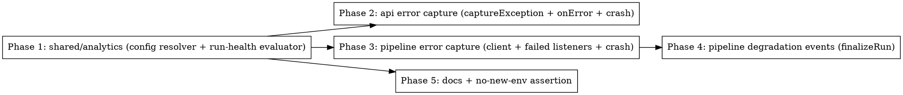

# Plan: PostHog Error Tracking (supersedes the custom incident system)

> **Source:** `.harness/features/posthog-error-tracking/spec.md`
> **Created:** 2026-06-09
> **Status:** planning

## Goal

Implement error tracking on the already-adopted PostHog platform (api + pipeline) plus a
rebuilt-minimal run-health degradation evaluator emitted as PostHog custom events, so the
operator gets grouped error views + native alerts without the bespoke #267 incident system.

## Acceptance Criteria

- [ ] `resolvePostHogConfig` + `evaluateRunHealth` live as pure functions in `@newsletter/shared/analytics`; api consumes the shared resolver (REQ-001, REQ-010).
- [ ] api captures exceptions via `captureException`, a Hono `app.onError` (≥500 only), and process crash handlers (REQ-002..REQ-005).
- [ ] pipeline has a `posthog-node` client capturing terminal job failures + process crashes; flushes on shutdown (REQ-006..REQ-009, REQ-015).
- [ ] `finalizeRun` emits one `pipeline_run_degraded` event per degradation finding (REQ-011).
- [ ] Every capture path is a silent no-op when PostHog is unconfigured and swallows transport errors (REQ-012, REQ-013).
- [ ] No new required env vars; alert setup documented in `alerts-setup.md` (REQ-014, REQ-016).
- [ ] One passing test per verification-matrix row; `pnpm typecheck` + `pnpm lint` clean (baseline `rasterize-mark.cjs` error excepted).

## Codebase Context

### Context Map (Step 2.0)
- **Context map read:** 3 PACKAGE.md (shared, api, pipeline) + 3 standards files (global, api, pipeline) + ARCHITECTURE + DECISIONS.
- **Decisions honored:**
  - `D-100` — web must use subpath imports from shared; the new `analytics` module is pure (type-only `UserSettings` import, no DB/drizzle), exported as a dedicated `./analytics` subpath, never pulled via the root barrel. Web is untouched.
  - `D-002` (pipeline) — publish/credential deps built per-job; the pipeline PostHog client is **process-level** (env-resolved at boot), distinct from per-job deps, because crash/worker-failure errors occur outside any job's settings scope. No conflict.
  - `D-001` (pipeline) — processing worker is a multi-type dispatcher; we only add a `captureException` call inside the existing `failed` listeners, no `concurrency` change.
- **Standards honored:**
  - `S-global-01` — strict TS, no `any`/`@ts-ignore`; test spy clients are typed against the real method signatures.
  - `S-global-02` — `posthog-node` pinned exactly `5.34.2` in pipeline (matches api).
  - `S-global-03` — no premature abstraction; api reuses its existing client path, pipeline gets its own thin module (the only shared extraction is the pure config resolver, which genuinely has two consumers).
  - `S-global-04` — log only at boundaries; capture helpers emit at most one `warn` on failure, nothing in loops.
  - `S-api` / `S-pipeline` — repository-access rule untouched (no DB/drizzle imports added anywhere; all env/settings driven).
- **Gotchas carried forward:**
  - **Shared rebuild before downstream typecheck** (verified at baseline: a fresh worktree needs `pnpm build`/shared dist before api+pipeline typecheck/lint resolve `@newsletter/shared/*`). Phase 1 ends by rebuilding shared; Phases 2-4 assume shared dist is current.
  - `finalize-run.ts` already assembles `sourceTelemetry` + `enrichmentTelemetry` and has `settings: UserSettings | null` — the degradation call site needs no new plumbing (Phase 4).

### Existing Patterns to Follow
- **Settings-backed PostHog client**: `packages/api/src/lib/posthog.ts` — `getClient(await loadConfig())`; `captureException` rides this exact path.
- **Optional-integration no-op**: `packages/shared/src/slack/notifier.ts` (disabled when `SLACK_WEBHOOK_URL` unset) — mirror for PostHog-unset.
- **Subpath export wiring**: `packages/shared/package.json` `exports` + `packages/shared/tsup.config.ts` `entry` (e.g. existing `./scheduling`, `./review-edits`).
- **Telemetry assembly**: `packages/pipeline/src/services/finalize-run.ts:54-56` (`buildSourceTelemetry`, `toEnrichmentTelemetry`).

### Test Infrastructure
- Vitest 3 per package (`pnpm --filter @newsletter/<pkg> test:unit`). Projects: api `unit`/`e2e`, pipeline `unit`/`seam`/`crawler`, shared `unit`.
- api Hono tests use `buildApp(deps)` with injected deps + a request harness. pipeline tests use fake/spy objects (no real Redis for unit). Spy PostHog client = an object implementing `captureException`/`capture`/`flush`/`shutdown` typed against `posthog-node`.
- Test budget = the spec verification matrix (one test per REQ/EDGE row).

## Phase Graph

Phase 1 is the root. After it: Phases 2 (api), 3 (pipeline), and 5 (docs) are independent and parallelizable (different packages). Phase 4 depends on Phase 3 (uses the pipeline client) and Phase 1 (uses `evaluateRunHealth`).
