# Plan: Newsletter date reflects scheduled publish date

> **Source:** docs/spec/publishedat-newsletter-date/design.md + spec.md
> **Created:** 2026-05-25
> **Status:** planning

## Goal

Display a newsletter issue's date as its **scheduled publish date** (derived from the
user's `emailTime` schedule) instead of its pipeline-run date, via a stored nullable
`run_archives.published_at` column populated at success finalize, with a `completedAt`
fallback for old/unschedulable archives.

## Acceptance Criteria

- [ ] `run_archives.published_at` (nullable timestamptz) exists via migration `0031`.
- [ ] Successful runs store the computed scheduled publish datetime; failed/cancelled and
      equal-times/missing-settings runs leave it NULL (no throw).
- [ ] Public listing date block + month grouping, public archive detail issue date, and
      admin dashboard rows show the effective publish date (`published_at ?? completedAt`).
- [ ] Listing/search ordering and issue numbering key off `COALESCE(published_at, completed_at)`.
- [ ] Pre-existing archives (NULL) and unschedulable runs show the prior `completedAt`-based
      date with no regression.
- [ ] `pnpm typecheck`, `pnpm lint`, `pnpm test:unit` pass; e2e + Playwright proofs pass.

## Codebase Context

### Existing Patterns to Follow
- **Publish-date math (reuse, do not reimplement):** `publishDateForWindow(input)` —
  `packages/shared/src/scheduling/tz.ts:102-121`. Returns the next occurrence of
  `publishTime` in the timezone, +1 local day when `publishTime < pipelineTime`. **Throws**
  when `publishTime === pipelineTime` or on malformed HH:MM → callers MUST guard.
- **Nullable timestamptz column precedent:** `emailSentAt`/`linkedinPostedAt` in
  `packages/shared/src/db/schema.ts:46-71` (`timestamp(..., { withTimezone: true })`).
- **Migration generation:** `pnpm --filter @newsletter/shared db:generate`; highest is
  `0030_common_thunderbird.sql` → next `0031`. Never hand-edit a generated migration's
  applied content; raw ALTER TABLE is lint-guarded — use the generated migration.
- **Pipeline upsert (writer):** `RunArchiveUpsertInput` + insert/update column lists in
  `packages/pipeline/src/repositories/run-archives.ts:15-31,232-267`. Success finalize call
  site: `packages/pipeline/src/workers/run-process.ts:787-803`; settings already loaded at
  `:654-656` (`settings.emailTime`, `.pipelineTime`, `.scheduleTimezone`).
- **API reader:** `listReviewed` SELECT + `ORDER BY` at
  `packages/api/src/repositories/run-archives.ts:337-355`; `findById` SELECT at `:178-209`;
  `toArchiveListItem` at `:773-788`. Detail route `getIssueDate` at
  `packages/api/src/routes/archives.ts:72,107-108`. Search ordering at `:412`.
- **Date formatting:** `formatDateInTimezone(value, tz)` —
  `packages/shared/src/utils/timezone-date.ts:79-87` (returns `""` for null/invalid).
- **Web display (no structural change needed):** date block reads `ArchiveListItem.runDate`
  (`ArchiveRow.tsx:26-44`); month grouping groups by `runDate`
  (`packages/web/src/components/archive-listing/format.ts:7-41`); issue number
  `recentIssues.length - idx` (`HomePage.tsx:85-91`). Admin rows render `run.startedAt`
  via `formatStartedAt` (`RunsCardList.tsx:74-89,292-320`) and the table equivalent.
- **`RunState.issueDate?`** already exists (`packages/shared/src/types/run.ts:61-80`); the
  detail route already populates `issueDate` — we make it publish-aware.

### Decisions (resolved in Q&A)
- Admin dashboard: **keep "Started"** and **add a "Publish date" line** reading the
  effective publish date. Do not drop the operational start time.
- API exposes only the derived date strings (`runDate`/`issueDate`); raw `publishedAt`
  is **not** added to public DTOs. (Admin RunState already carries `issueDate`.)
- Effective date everywhere = `published_at ?? (startedAt ?? completedAt)` for detail,
  `published_at ?? completedAt` for listing. Ordering = `COALESCE(published_at, completed_at)`.

### Test Infrastructure
- Vitest 3 (unit + e2e projects). Run: `pnpm test:unit`, `pnpm test:e2e` (needs
  `pnpm infra:up` for Postgres+Redis).
- API e2e: `packages/api/tests/e2e/archives.e2e.test.ts` — real DB via `getDb()`, seeds via
  `db.insert(runArchives).values({...})` (`insertArchive` helper, lines 152-180), asserts via
  `buildPublicApp().request()`. Cleanup tracks seeded ids.
- Pipeline e2e: `packages/pipeline/tests/e2e/seam/run-flow.e2e.test.ts` — drives
  `handleRunProcessJob` with fake collect/rank fns and `createRunArchivesRepo(db)`; polls
  Redis run-state. Extend to read back the `run_archives` row's `published_at`.
- Web unit: Vitest + Testing Library under `packages/web/tests/unit/`. UI e2e proof via
  Playwright MCP in the verify stage (seed DB, load pages, screenshot).

### Custom-lint guards to respect
- `newsletter/enforce-repository-access` (no direct table access outside repos),
  `no-restricted-imports` (web must not import drizzle; web→shared via **subpath**, never
  root barrel — see learnings), raw-ALTER-TABLE rule (use generated migrations).

## Phase Graph

```dot
digraph phases {
  rankdir=LR
  node [shape=box]

  phase_1 [label="Phase 1: Schema column + migration + guarded compute helper (shared)"]
  phase_2 [label="Phase 2: Pipeline writer — set published_at at success finalize"]
  phase_3 [label="Phase 3: API reader — select, order, fallback date strings"]
  phase_4 [label="Phase 4: Web admin Publish-date line + UI e2e proofs"]

  phase_1 -> phase_2 -> phase_3 -> phase_4
}
```

Phases are sequential: each depends on the prior phase's data contract (column → writer →
reader → UI). No independent parallel phases.

## Traceability

- **Phase 1** → REQ-001; provides the guarded compute used by REQ-002/004.
- **Phase 2** → REQ-002, REQ-003, REQ-004, REQ-005; EDGE-001/002/004/006/007/008.
- **Phase 3** → REQ-006, REQ-007, REQ-008; EDGE-003/005.
- **Phase 4** → REQ-009, REQ-010, REQ-011, REQ-012; EDGE-003/005 (UI proof).
