# Plan: Ranking Eval Pipeline

> **Source:** `docs/spec/ranking-eval-pipeline/design.md` + `spec.md` + `library-probe.md`
> **Created:** 2026-05-22
> **Status:** planning

## Goal

Build a ranking eval system with two surfaces — a `pnpm eval:ranking` CLI and an `/admin/eval` web UI — that lets Ritesh and Aman iterate on the ranking prompt against historical raw_items pools, with nDCG@10 scoring against admin-graded ground truth (Mode A) and unscored A/B calendar replay between saved and draft prompts (Mode B).

## Acceptance Criteria

- [ ] `pnpm --filter @newsletter/pipeline eval:export-fixtures [--days 15]` writes `evals/ranking/fixtures/run-<date>-<runId>.json`, idempotent.
- [ ] `pnpm --filter @newsletter/pipeline eval:ranking [--fixture <id>] [--all] [--prompt-file <path>] [--no-cache] [--window N] [--dry-run] [--json]` runs scored eval, prints nDCG@10 + delta + sourcing report.
- [ ] Scoring math is hand-rolled, sklearn-compatible (linear-gain form), and unit-tested against the worked example from `library-probe.md` (`nDCG@5 ≈ 0.8454`).
- [ ] LLM response cache hits return in < 2s. Cache lives under `evals/ranking/cache/responses/`, gitignored.
- [ ] `GET /api/admin/eval/fixtures`, `POST /api/admin/eval/fixtures`, `POST /api/admin/eval/groundtruth/:fixtureId`, `POST /api/admin/eval/run` (SSE) all behind existing admin cookie gate.
- [ ] `/admin/eval/grade/:fixtureId` lets the grader label every cluster via keyboard `1/2/3/space`, resumes from localStorage, exports ground-truth JSON.
- [ ] `/admin/eval/fixtures/new` accepts a newline-separated URL list, server enriches via `enrichRawItems`, writes `evals/ranking/fixtures/manual-<slug>-<ts>.json`.
- [ ] `/admin/eval` hosts the prompt editor (seeded from `user_settings.rankingPrompt`), fixture picker, calendar picker, Mode A + Mode B runs, results panel, "Save as current prompt" with diff confirmation.
- [ ] Mode B runs two rankers in parallel against any past date with raw_items, renders top-10 side-by-side.
- [ ] Cost guard: `--all` defaults to 20 fixtures; `--window N` up to 60; `--force-window` beyond 60 with dollar estimate confirmation.
- [ ] All baseline tests still pass (747 unit tests; 5 pre-existing reddit.test.ts failures allow-listed in `baseline.json`).

## Codebase Context

### Existing patterns to follow

- **Ranker entry point**: `packages/pipeline/src/processors/rank.ts::rankCandidates(shortlist, { systemPrompt, modelId, tracker, runId, abortSignal })` — already accepts the prompt as an arg, no env reads. This is the only LLM call we need to reuse.
- **Shortlist**: `packages/pipeline/src/processors/shortlist.ts` — recency-decay top-K from a `Candidate[]`.
- **Candidate type**: `@newsletter/shared/types/candidate` — used by both the live pipeline and the existing `evaluate-rank-prompt.ts` CLI.
- **Link enrichment**: `packages/pipeline/src/services/link-enrichment/index.ts::enrichRawItems(items, ctx)` — for manual fixture URL enrichment.
- **Settings**: `packages/api/src/routes/settings.ts` (GET/PUT `/api/settings`) reads/writes `user_settings.rankingPrompt`. We piggy-back on PUT for "Save as current prompt."
- **Admin auth**: `packages/api/src/auth/session.ts` — `verifyToken` from `admin_session` cookie. All new `/api/admin/eval/*` routes use the same middleware.
- **Web admin layout**: `packages/web/src/App.tsx` — admin routes under `<RequireAdmin />`. Add three new paths under it.
- **Form + query pattern**: `packages/web/src/pages/SettingsPage.tsx` — `useForm` + `useQuery` synced via `dataUpdatedAt`, `useMutation` + toast, `FormProvider` wrapping. Mirror this on `/admin/eval`.
- **Existing eval CLI scripts**: `packages/pipeline/src/scripts/evaluate-rank-prompt.ts` and `evaluate-run-rank-prompt.ts` — closest pattern for our new `eval:export-fixtures` and `eval:ranking` scripts. We keep them; the new ones are separate commands.
- **Shared subpath exports**: per `.claude/rules/learnings/web-shared-subpath-imports.md` — `@newsletter/shared/types/eval-ranking` (new), never the root barrel.
- **Cost tracker**: `packages/pipeline/src/services/cost-tracker.ts` — passed into `rankCandidates`. We capture per-eval-run cost via the same mechanism.

### Test infrastructure

- Vitest 3, two projects per package (unit + e2e).
- Pipeline unit tests: `packages/pipeline/tests/unit/**/*.test.ts`.
- API route tests: `packages/api/src/routes/__tests__/*.test.ts` (Hono app + stubbed repo deps).
- Web tests: `packages/web/tests/unit/**/*.test.tsx` (testing-library/react).
- Web e2e: `packages/web/tests/e2e/**/*.spec.ts` (Playwright). Existing e2e harness starts API + DB infra.
- Run all: `pnpm test:unit`. Per-package: `pnpm --filter @newsletter/pipeline test:unit`.

### Files we'll create

```
evals/ranking/                              # NEW (data; fixtures + groundtruth committed; cache/ ignored)
  fixtures/.gitkeep
  groundtruth/.gitkeep
  cache/.gitignore                          # contents ignored

packages/shared/src/types/eval-ranking.ts   # NEW — Fixture, GroundTruth, EvalRunRequest/Result, etc.
packages/shared/src/constants/eval-ranking.ts  # NEW — paths, defaults (TIER_RELEVANCE, K, WINDOW caps)

packages/pipeline/src/eval/                 # NEW (shared by CLI + API)
  index.ts                                  # runEval() orchestrator
  scoring.ts                                # ndcgAtK, precisionAtK, mustIncludeRecall, rankOneIsMustInclude, perItemDiff, sourcingReport
  fixture-io.ts                             # readFixture, writeFixture, readGroundTruth, listFixtures
  cache.ts                                  # LLM response cache (sha256 keying)
  replay.ts                                 # builds Candidate[] from Fixture, calls rankCandidates
  mode-b.ts                                 # synthesises calendar fixtures from raw_items for a date
  cost-estimator.ts                         # token estimate before running

packages/pipeline/src/scripts/
  eval-export-fixtures.ts                   # NEW — exports fixtures from raw_items
  eval-ranking.ts                           # NEW — the CLI

packages/api/src/routes/admin-eval.ts       # NEW — all /api/admin/eval/* routes
packages/api/src/routes/__tests__/admin-eval.test.ts  # NEW

packages/web/src/pages/EvalIndexPage.tsx    # NEW — /admin/eval
packages/web/src/pages/EvalGradePage.tsx    # NEW — /admin/eval/grade/:fixtureId
packages/web/src/pages/EvalManualFixturePage.tsx  # NEW — /admin/eval/fixtures/new
packages/web/src/hooks/useEvalFixtures.ts   # NEW
packages/web/src/api/eval.ts                # NEW — API client for /api/admin/eval/*
packages/web/tests/e2e/eval-flow.spec.ts    # NEW — Playwright covers grading + Mode A + Mode B + Save
```

### Files we'll modify

- `packages/shared/tsup.config.ts` — add new entry points.
- `packages/shared/package.json` — add `exports` for new subpaths.
- `packages/pipeline/package.json` — add `eval:export-fixtures` and `eval:ranking` scripts.
- `packages/api/src/app.ts` (or where routes mount) — mount `admin-eval` router.
- `packages/web/src/App.tsx` — register three new routes.
- `.gitignore` — add `evals/ranking/cache/`.

## Phase Graph

```dot
digraph phases {
  rankdir=LR
  node [shape=box]

  phase_1 [label="Phase 1: Shared types + zod + scoring math"]
  phase_2 [label="Phase 2: LLM cache + replay core (runEval)"]
  phase_3 [label="Phase 3: Export-fixtures CLI"]
  phase_4 [label="Phase 4: Mode A scored eval CLI (eval:ranking)"]
  phase_5 [label="Phase 5: API routes (/api/admin/eval/*) + SSE"]
  phase_6 [label="Phase 6: Grading UI (/admin/eval/grade)"]
  phase_7 [label="Phase 7: Manual-fixture builder UI"]
  phase_8 [label="Phase 8: /admin/eval iteration page (Mode A+B+Save)"]
  phase_9 [label="Phase 9: Sourcing report + cost guard polish + docs"]

  phase_1 -> phase_2
  phase_1 -> phase_3
  phase_2 -> phase_4
  phase_3 -> phase_4
  phase_4 -> phase_5
  phase_5 -> phase_6
  phase_5 -> phase_7
  phase_6 -> phase_8
  phase_7 -> phase_8
  phase_8 -> phase_9
}
```



Phase 1 is the root. Phases 2 and 3 can run in parallel after 1. Phase 4 depends on both 2 and 3. Phase 5 depends on 4 (it consumes `runEval`). Phases 6 and 7 can run in parallel after 5. Phase 8 depends on both 6 and 7. Phase 9 finalises.

## Phases at a glance

| # | Phase | Delivers | REQs covered |
|---|-------|----------|--------------|
| 1 | Shared types + scoring | `Fixture`/`GroundTruth`/`EvalResult` schemas + `ndcgAtK`/`precisionAtK`/`mustIncludeRecall`/`perItemDiff` pure functions | REQ-013–020, REQ-025, all VS-0.x |
| 2 | LLM cache + runEval core | `runEval()` callable from CLI/API; disk cache hit/miss handling | REQ-022, REQ-028 |
| 3 | Export-fixtures CLI | `pnpm eval:export-fixtures` writes run-derived fixtures, idempotent | REQ-001/002, REQ-004 |
| 4 | Mode-A CLI | `pnpm eval:ranking` with --fixture/--all/--window/--prompt-file/--no-cache/--json | REQ-015, REQ-023, REQ-030 |
| 5 | API routes + SSE | `/api/admin/eval/fixtures` (G/POST), `/groundtruth/:id`, `/run` (SSE) — same `runEval` core | REQ-003/005/006/011/021, REQ-034–036 |
| 6 | Grading UI | `/admin/eval/grade/:fixtureId` keyboard flow, dedup-collapsed, localStorage resume, download | REQ-007–010, REQ-012 |
| 7 | Manual-fixture builder | `/admin/eval/fixtures/new` URL paste → enrich → write fixture | REQ-003, REQ-006 |
| 8 | /admin/eval iteration page | Prompt editor, fixture/date pickers, Mode A + Mode B, Save as current prompt | REQ-013/014, REQ-026/027 |
| 9 | Sourcing report + polish | Aggregate sourcing-report panel, cost-guard UI, /admin/eval docs | REQ-025, REQ-024 |

## Done When

- [ ] All 9 phases completed, each committed separately
- [ ] `pnpm typecheck` passes (0 errors)
- [ ] `pnpm lint` passes (no new errors beyond baseline 10 warnings)
- [ ] `pnpm test:unit` passes — only the 5 pre-existing reddit.test.ts failures remain
- [ ] Playwright e2e covers the grading flow + Mode A + Mode B + Save as current prompt
- [ ] nDCG implementation verified against the worked example in `library-probe.md` (nDCG@5 ≈ 0.8454)
- [ ] Manifest in `.harness/ranking-eval-pipeline/manifest.json` updated with `pr_number`
- [ ] `docs/spec/ranking-eval-pipeline/README.md` written for reviewer index
