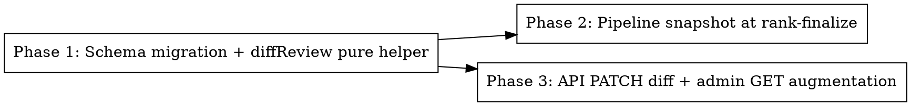

# Plan: Record Review Edits as Signals

> **Source:** docs/spec/record-review-edits-as-signals/spec.md
> **Created:** 2026-05-28
> **Status:** planning

## Goal

Capture an immutable snapshot of the LLM's rank output at rank-finalize and materialise the diff (`reorder` / `add` / `remove` / `text_edit`) into a queryable `review_edits` table on every admin PATCH — so future eval/prompt-tuning has a clean signal of what admins actually change.

## Acceptance Criteria

- [ ] Migration 0035 adds `run_archives.pre_review_snapshot jsonb` (nullable) and a new `review_edits` table with `ON DELETE CASCADE` from `run_archives`.
- [ ] `@newsletter/shared/review-edits` exports a pure `diffReview(snapshot, patch)` returning typed `ReviewEditRow[]`, unit-tested for each edit type.
- [ ] The pipeline rank-finalize upsert (success path only) writes `preReviewSnapshot` into the archive row.
- [ ] `patchArchive` computes the diff and replaces `review_edits` rows in the same transaction as the archive UPDATE.
- [ ] The admin `GET /api/admin/archives/:runId` route returns `preReviewSnapshot` and `reviewEdits[]`; the public `GET /api/archives/:runId` route does not.
- [ ] No-op PATCH writes 0 edit rows; pre-migration archives (snapshot=NULL) patch successfully with 0 edit rows.

## Codebase Context

### Existing Patterns to Follow

- **Migrations**: `packages/shared/src/db/migrations/0034_encrypt_social_tokens.sql` is the most recent; follow Drizzle-generated SQL conventions but hand-edit per learning `drizzle-not-null-add-column-existing-rows.md` (nullable column = safe).
- **Schema definitions**: `packages/shared/src/db/schema.ts` — `runArchives` table at line 49, `evalRuns` at line 260 is the closest precedent for a separate JSONB-heavy event-style table.
- **Pure helpers in shared**: existing helpers like `packages/shared/src/scheduling/immediate-publish.ts` — pure function with unit tests, exported via package.json subpath. Follow same pattern.
- **Repository write surface**: `packages/pipeline/src/repositories/run-archives.ts` and `packages/api/src/repositories/run-archives.ts` — `upsert()` is the pipeline write, `updateRankedItems()` is the API write (called via `patchArchive` in `packages/api/src/services/review.ts:101`).
- **Pipeline finalize site**: `packages/pipeline/src/workers/run-process.ts:983` is the success-path upsert; this is where `preReviewSnapshot` must be added.
- **API route augmentation**: `packages/api/src/routes/archives.ts:206` is the PATCH; `:118` and `:178` are the GET response builders (separated by public vs admin). The admin-gated detail response is built around line 178.

### Test Infrastructure

- Vitest 3 with `unit` + `e2e` project per package.
- Pure-function unit tests live in `packages/shared/src/**/__tests__/*.test.ts`.
- API e2e tests live in `packages/api/src/routes/__tests__/*.test.ts` and use a real Postgres (per project rule "integration tests must hit real DB").
- Pipeline integration tests live in `packages/pipeline/tests/e2e/`.

### Web subpath import rule (must follow)

Per `.claude/rules/learnings/web-shared-subpath-imports.md`: any future web-side consumption must import from `@newsletter/shared/review-edits` (subpath), not the root barrel. Add the subpath to `packages/shared/tsup.config.ts` and `package.json#exports`.

## Phase Graph

Phase 2 and Phase 3 are independent after Phase 1 lands and can run in parallel.

## Phases

- **Phase 1**: Add migration 0035 (nullable JSONB column on `run_archives` + new `review_edits` table). Add `diffReview` pure helper + types in `@newsletter/shared/review-edits` with unit tests covering all four edit types + no-op + pre-migration snapshot-null cases. **Covers REQ-002, EDGE-001 through EDGE-005, EDGE-007, EDGE-009, EDGE-011.**
- **Phase 2**: Wire the success-path upsert in `packages/pipeline/src/workers/run-process.ts:983` to build a `PreReviewSnapshot` from `rankResult.rankedItems` + digest meta and pass it into `archiveRepo.upsert`. Extend `RunArchiveUpsertInput` and `RunArchivesRepo.upsert` to accept `preReviewSnapshot`. Add pipeline integration test asserting the column is populated after a real run. **Covers REQ-001, REQ-008, EDGE-006.**
- **Phase 3**: Extend `patchArchive` in `packages/api/src/services/review.ts:101` to load snapshot, compute diff, replace `review_edits` rows in the same transaction as the archive UPDATE. Augment `GET /api/admin/archives/:runId` response with `preReviewSnapshot` and `reviewEdits[]`. Add e2e tests covering REQ-003, REQ-004, REQ-005, REQ-006, REQ-007, EDGE-008, EDGE-010. **Covers REQ-003, REQ-004, REQ-005, REQ-006, REQ-007, EDGE-008, EDGE-010.**
