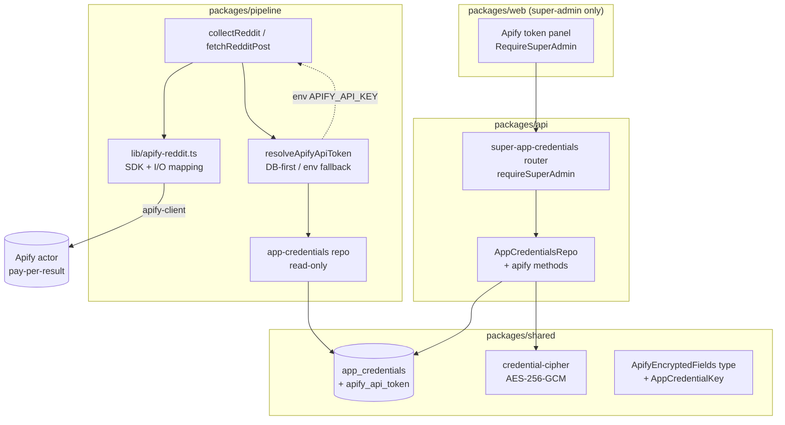
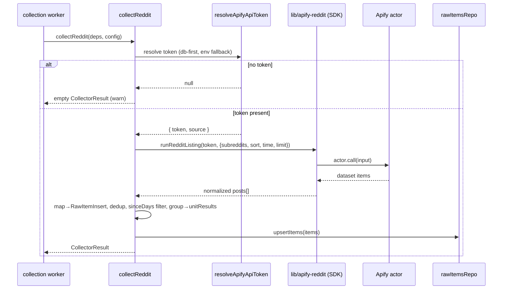

# Design: Apify-Based Reddit Collector

## Problem Statement

Reddit heavily rate-limits its public RSS feeds (`/r//<sort>.rss`). The current
Reddit collector (`packages/pipeline/src/collectors/reddit.ts`) fetches and parses those
feeds with jsdom, and frequently fails or returns truncated results under rate limiting.
It also cannot provide real engagement metrics (votes/comments) — those fields are always
zeroed. Replace the RSS approach end-to-end with the Apify platform's Reddit scraper
(pay-per-result actor), which needs no Reddit auth and is not subject to Reddit's RSS rate
limits, and remove the old RSS code entirely.

## Context

- **Batch collector:** `collectReddit(deps, config): Promise<CollectorResult>` is the
  primary entry point, called from three sites — the BullMQ collection worker
  (`workers/collection.ts`), and the `collectFns.reddit` slot in both
  `workers/run-process.ts` and `workers/processing.ts`. The signature is the integration
  contract: keep it identical and all three callers keep working.
- **Single-post path:** `fetchRedditPost(url, deps)` + `parseRedditPostUrl(url)` power the
  manual "add post by URL" flow via `services/add-post/dispatch.ts`. In scope for removal —
  both paths move to Apify.
- **Output shape:** both paths produce `RawItemInsert` (Drizzle `raw_items` row) and the
  batch path persists via `rawItemsRepo.upsertItems()` with tenant-scoped dedup on
  `[tenantId, sourceType, externalId]`. Unchanged.
- **Comments:** the current collector never collects comments (`metadata.comments: []`,
  `engagement` zeroed, `commentsPerItem` accepted but ignored). We preserve posts-only
  behavior.
- **Credential infrastructure already exists** for app-level (non-tenant, super-admin-only)
  secrets: `app_credentials` table + `AppCredentialKey` enum + AES-256-GCM
  `credential-cipher` + `super-app-credentials` API router behind `requireSuperAdmin` +
  `createAppCredentialsRepo` + the DB-first/env-fallback resolver pattern
  (`resolveTwitterCollectorCookie`). The Apify token reuses all of it.

## Product Requirements (PRD)

No PRD — internal-facing change. The one human-facing surface (super-admin Apify-token
field) is an operator control, not an end-user feature; its behavior is captured in F7–F9
below.

## Requirements

### Functional

- **F1** — `collectReddit(deps, config)` collects Reddit posts for the configured
  subreddits via an Apify Reddit actor instead of RSS, returning a `CollectorResult` with
  the same shape as today.
- **F2** — Each collected post maps to a `RawItemInsert` with the same fields the RSS path
  produced: `sourceType: "reddit"`, `externalId` (Reddit post id, no `t3_` prefix), `title`,
  `url` (external link if the post links out, else the Reddit permalink), `sourceUrl`
  (permalink), `author` (no `/u/`), `content` (selftext), `publishedAt`, `imageUrl`,
  `metadata.sourceUnit = { identifier: "r/", displayName: "r/" }`,
  `metadata.comments: []`.
- **F3** — Engagement is populated from real actor data:
  `engagement = { points, commentCount }` (score and number of comments). This is an
  improvement over the RSS path, which always emitted zeros.
- **F4** — `config` knobs (`subreddits`, `sort` ∈ hot|new|top, `timeframe` ∈
  hour|day|week|month, `limit`, `sinceDays`) continue to drive collection, mapped onto the
  actor's input. `commentsPerItem` remains accepted-but-ignored (posts-only). Defaults match
  today (`DEFAULT_SUBREDDITS`, sort `top`, timeframe `day`, limit `25`).
- **F5** — Per-subreddit `unitResults` (`SourceUnitResult[]`) are still returned, derived by
  grouping the actor's returned items by their subreddit.
- **F6** — `fetchRedditPost(url, deps)` fetches a single post by permalink via Apify;
  `parseRedditPostUrl(url)` (pure URL parsing, no network) is retained for source detection
  in `detectAddPostSourceType`. The add-post dispatch contract is unchanged.
- **F7** — The Apify API token is stored as a new `apify_api_token` app-credential
  (encrypted, no tenant scope), settable via a super-admin-only API route
  (`PUT /api/super/app-credentials/apify` + included in `DELETE /:key` + `GET /` status),
  behind `requireSuperAdmin`.
- **F8** — A super-admin-only web panel lets the super-admin set/clear the Apify token and
  see its configured status (configured boolean + `updatedAt`); the secret is never returned
  to the client. Tenant admins cannot see or reach this control.
- **F9** — Pipeline jobs resolve the token DB-first via `resolveApifyApiToken({ appRepo,
  env })`, falling back to the `APIFY_API_KEY` env var when no DB row exists; a row that
  fails to decrypt returns "unconfigured" rather than falling through to env. (Note: the
  **env var name `APIFY_API_KEY` deliberately differs** from the app-credential key
  `apify_api_token` — `APIFY_API_KEY` is what already exists in `.env`; do not "correct"
  either to match the other.)
- **F10** — `fetchRedditPost(url, deps)` throws a typed "Apify integration not configured"
  error when no token resolves (it cannot return an empty `CollectorResult` like the batch
  path); the add-post flow surfaces it as a fetch failure.

### Non-Functional

- **NF1 (cost containment)** — collection issues a bounded number of actor results; `limit`
  is applied as the actor's per-subreddit cap so a run cannot fan out unboundedly. Pay-per-
  result (~$1.15/1k posts); no monthly rental actor.
- **NF2 (graceful disable)** — when no token is configured (DB or env), the collector logs a
  warning and returns an empty `CollectorResult` (itemsFetched 0) rather than throwing —
  matching the "optional integration disabled when unset" convention. Actor-run errors
  still throw (caught by the worker → source marked failed), preserving current failure
  semantics.
- **NF3 (secret hygiene)** — the token is never logged, never serialized to any client, and
  only the super-admin can write it. Reuses the established `app_credentials` secret-hygiene
  rules.
- **NF4 (repository boundary)** — all DB access stays in repository factories; the collector
  imports no `drizzle-orm`/`@newsletter/shared/db` directly (enforced by
  `newsletter/enforce-repository-access`).
- **NF5 (actor isolation)** — Apify SDK usage and actor-input/output mapping live in one
  module so the specific actor is swappable without touching collector logic.
- **NF6 (observability)** — structured logs at run start/completion with item counts,
  actor id, run id, and token source (db|env) — never the token value.

### Edge Cases

- **EC1** — Token unconfigured → empty result + warning (NF2), not a crash.
- **EC2** — Actor run fails / times out → throw; worker marks the `reddit` source failed
  (current behavior preserved).
- **EC3** — Actor returns 0 items for a subreddit → that unit reports
  `itemsFetched: 0, status: "completed"`.
- **EC4** — A returned item missing required fields (no title/permalink/id) is skipped, as
  the RSS parser did.
- **EC5** — `sinceDays` filtering still applies post-fetch against `publishedAt`, keeping the
  existing "dropped 0 → warn truncated" log.
- **EC6** — Duplicate post ids across subreddits within one run are de-duplicated by
  `externalId` (current `seenIds` behavior).
- **EC7** — `fetchRedditPost` for a permalink the actor returns nothing for → throw
  "post not found", as today.
- **EC8** — DB credential row present but undecryptable (rotated `SESSION_SECRET`) → treated
  as unconfigured (no silent env fallthrough), per resolver contract (F9).
- **EC9** — Actor over-delivers (returns more items than `limit` for a subreddit, a
  pay-per-result cost leak) → results are capped to `limit` per subreddit client-side after
  grouping, so downstream and cost accounting honor the configured cap regardless of actor
  behavior.

## Architectural Challenges

- **Actor I/O coupling.** Each Apify Reddit actor has its own input schema and output field
  names. The collector must be written against one specific actor's contract. Resolved by
  (a) the library-probe stage selecting and documenting the actor's exact I/O schema, and
  (b) NF5 isolating all actor-specific code in one module (`lib/apify-reddit.ts`) with a
  narrow internal type, so a future actor swap touches only that file.
- **Single run vs per-subreddit runs.** Most Reddit actors accept multiple subreddit
  targets in one input and return a `subreddit` field per item. One run for all subreddits
  is cheaper, faster, and removes the inter-subreddit delay; `unitResults` are reconstructed
  by grouping returned items by subreddit (subreddits that yield no items still get a
  `completed` unit with 0 items). Chosen over N runs.
- **Credential wiring into two entry points.** Both `collectReddit` and `fetchRedditPost`
  need a resolved token / Apify client. Mirror the existing Twitter pattern in
  `add-post/dispatch.ts`: production lazily builds default Apify deps from the
  app-credentials repo; tests inject a fake actor-runner. Keeps the public signatures
  (`collectReddit(deps, config)`, `fetchRedditPost(url, deps)`) intact.
- **Run latency vs BullMQ.** An actor `.call()` blocks until the run finishes (tens of
  seconds). BullMQ auto-renews the job lock while the processor awaits, so this is safe; we
  pass the job's `AbortSignal` through to abort the wait on shutdown.

## Approaches Considered

**Chosen: `apify-client` SDK, single run per collection, app-credential token.**
Use the official `apify-client` npm package to start a pay-per-result Reddit actor with all
subreddits in one run, read its dataset, and map items to `RawItemInsert`. Token via the
existing app-credential / super-admin infrastructure.

Why not the alternatives:
- **Raw Apify REST via `fetch`** — reimplements run-polling, dataset pagination, and retries
  that the SDK already provides; no benefit.
- **Env-only token (no DB)** — rejected by product decision: the token must be managed by
  the super-admin in the DB (env remains a fallback only).
- **Keep RSS for the single-post add flow** — rejected; the goal is to remove the RSS path
  entirely and stop hitting Reddit directly.

## High-Level Design

### Components

### Batch collection flow

### Key modules

- `packages/pipeline/src/lib/apify-reddit.ts` *(new)* — wraps `apify-client`; exports
  `runRedditListing(token, input)` and `runRedditPost(token, url)` returning a narrow
  `ApifyRedditPost[]` internal type. Holds the hardcoded selected actor id and all
  input/output field mapping (NF5). Logged `runId` is the bare Apify run id, never a
  tokenized URL (NF6/secret hygiene).
- `packages/pipeline/src/collectors/reddit.ts` *(rewritten)* — `collectReddit` and
  `fetchRedditPost` orchestrate token resolution + actor call + `RawItemInsert` mapping +
  dedup/filter/unitResults. All jsdom/RSS code deleted. `parseRedditPostUrl` retained.
- `packages/pipeline/src/services/credential-resolver.ts` *(extended)* —
  `resolveApifyApiToken({ appRepo, env })`.
- `packages/pipeline/src/repositories/app-credentials.ts` *(extended, read-only)* —
  `getApifyApiToken()`.
- `packages/shared/src/db/schema.ts` *(extended)* — `apify_api_token` added to
  `AppCredentialKey`; `ApifyEncryptedFields { apiToken: EncryptedBlob }`. New migration.
- `packages/api/src/repositories/app-credentials.ts` *(extended)* —
  `getApifyApiToken()` / `upsertApifyApiToken()` / status projection; `apify` in `delete`.
- `packages/api/src/routes/super-app-credentials.ts` *(extended)* — `PUT /apify`, status in
  `GET /`, `apify_api_token` in `DELETE /:key`.
- `packages/web` *(extended)* — super-admin Apify-token panel + api client; reachable only
  under `RequireSuperAdmin`.

## External Dependencies & Fallback Chain

**Dependency:** `apify-client` (npm SDK) → Apify platform Reddit scraper **actor**
(third-party hosted API).

**Distinct use cases to probe (each a separate probe scenario):**
1. **Subreddit listing** — authenticate with the token and run the actor for one or more
   subreddits with `sort` + `time` + per-subreddit `limit`; retrieve dataset items; confirm
   the fields we map (id, title, permalink, external url, author, selftext, score,
   numComments, created timestamp, image, subreddit) are present.
2. **Single post by permalink** — run the actor (or its single-URL mode) for a specific
   Reddit post URL and retrieve that one post.

**Auth surface:** api-key. Env key: `APIFY_API_KEY` (present in the multi-tenant worktree
`.env`; the probe stage will be given it via `.env.harness`).

**SELECTED (library-probe PASS, 2026-06-18):** `trudax/reddit-scraper-lite`
(PAY_PER_EVENT, $0.004/result, 27.7k users). Both use cases verified live. Canonical input
(`startUrls` with sort path + `includeMediaLinks: true`) and the actor→`RawItemInsert` field
mapping are recorded in `library-probe.md` — that is the contract `lib/apify-reddit.ts` is
coded against. No fallback was needed.

**Fallback chain (pay-per-result preferred, probe selects the first that verifies):**
1. A first-party / well-maintained **pay-per-result** Reddit actor supporting subreddit
   listing (sort+time) **and** single post URLs (e.g. an Apify-published or high-reputation
   community actor such as `parseforge/reddit-posts-scraper` or equivalent pay-per-result
   actor surfaced in research).
2. An alternative pay-per-result Reddit actor with the same capability.
3. The `trudax/reddit-scraper` actor (rental model) — last resort only, used solely to prove
   the SDK integration if no pay-per-result actor verifies; flag the cost implication.
4. If none verify → escalate to the user via the probe's AskUserQuestion (do **not** silently
   fall back to RSS — that is the path being removed).

The probe records the **selected actor id and its exact input/output schema**; that schema
is the contract `lib/apify-reddit.ts` is coded against.

## Open Questions

- None blocking. The specific actor id is intentionally deferred to library-probe (auto-pick
  best verified, per product decision).

## Risks and Mitigations

- **R1 — Actor-specific schema drift / actor deprecation.** Mitigated by NF5 isolation +
  documenting the actor id and schema in `lib/apify-reddit.ts`; a swap is one-file.
- **R2 — Runaway cost from a large `limit` × many subreddits.** Mitigated by NF1 (limit as
  per-subreddit cap, single bounded run) and posts-only (no per-comment cost).
- **R3 — Long actor runs vs job liveness.** Mitigated by BullMQ auto lock-renewal; abort via
  the job `AbortSignal`. Watch run durations in logs.
- **R4 — Probe can't reach a working pay-per-result actor.** Mitigated by the fallback chain
  ending in escalation; trudax rental as a proof-of-integration last resort.

## Assumptions

- The selected Apify Reddit actor returns a per-item `subreddit` field (needed to rebuild
  `unitResults` from a single multi-subreddit run). Verified by the probe; if false, fall
  back to one run per subreddit — note this is a real regression (reintroduces inter-subreddit
  latency and N actor starts → higher cost), not a free swap.
