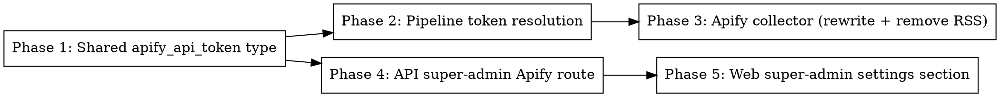

# Plan: Apify-Based Reddit Collector

> **Source:** .harness/features/reddit-collector-apify/design.md + spec.md
> **Created:** 2026-06-18
> **Status:** planning

## Goal

Replace the Reddit RSS collector (batch + single-post) with the Apify actor
`trudax/reddit-scraper-lite`, remove all RSS/jsdom code, and store the Apify token as a
super-admin-managed platform credential (DB-first, `APIFY_API_KEY` env fallback).

## Acceptance Criteria

- [ ] `collectReddit` and `fetchRedditPost` fetch via Apify; no `*.rss`/jsdom code remains (REQ-001, REQ-023)
- [ ] Items map to `RawItemInsert` with real engagement (upVotes/comments) (REQ-002, REQ-003)
- [ ] Token resolves DB-first with env fallback; decrypt-fail → unconfigured (REQ-012, REQ-013)
- [ ] Super-admin can set/clear/inspect the Apify token; tenant admins cannot (REQ-015..019)
- [ ] No-token → batch returns empty (no throw), single-post throws typed error (REQ-020, REQ-021)
- [ ] Baseline suite stays green; new tests cover every matrix row

## Codebase Context

**Packages touched:** shared (types), pipeline (collector + credential resolution), api
(super route + repo), web (settings section).

### Existing Patterns to Follow
- **App-level credential (non-tenant, super-admin):** `packages/shared/src/db/schema.ts`
  `app_credentials` + `AppCredentialKey` (`linkedin_client`/`twitter_collector`/`twitter_client`).
  `key` is a `text` column with a TS-only `$type` union → **adding `apify_api_token` needs NO
  migration.**
- **Credential cipher:** `@newsletter/shared/services/credential-cipher` — `getCredentialCipher()`,
  `encrypt/decrypt(EncryptedBlob)` (AES-256-GCM).
- **DB-first resolver:** `packages/pipeline/src/services/credential-resolver.ts`
  `resolveTwitterCollectorCookie({appRepo, env})` + `safeGetDbRow` (decrypt-fail → null, no env
  fallthrough). Copy this shape for `resolveApifyApiToken`.
- **Pipeline app-cred repo (read-only):** `packages/pipeline/src/repositories/app-credentials.ts`
  `createAppCredentialsRepo(db, cipher)` — add `getApifyApiToken()`.
- **API app-cred repo + super route:** `packages/api/src/repositories/app-credentials.ts` +
  `packages/api/src/routes/super-app-credentials.ts` (all behind `requireSuperAdmin`,
  `KEY_SLUG_TO_KEY` slug map, status projection never serializes secrets). Validation schemas in
  `packages/api/src/lib/validate-social-credentials.ts`.
- **Lazy default deps wiring (token into collector):** `packages/pipeline/src/services/add-post/dispatch.ts`
  `buildDefaultTwitterDeps` / `loadTwitterDefaults` — mirror for Reddit/Apify.
- **Collector contract:** `collectReddit(deps, config): Promise<CollectorResult>` called from
  `workers/collection.ts`, `workers/run-process.ts` (`collectFns.reddit`), `workers/processing.ts`.
  Keep the signature; add token resolution via injected dep so the collector never imports `db`
  (NF4 / `enforce-repository-access`).
- **Selected actor I/O + input contract:** see `library-probe.md` (authoritative field mapping +
  `startUrls` sort-path rule + `includeMediaLinks:true` for engagement).
- **Super-admin role in web:** `RequireSuperAdmin.tsx` reads `data?.user.role === "super_admin"`;
  `SettingsPage.tsx` lives at `/admin/settings`. The Apify section renders only when the session
  user is super_admin (same session source RequireSuperAdmin uses).

### Test Infrastructure
- Vitest 3. Pipeline unit: `pnpm --filter @newsletter/pipeline exec vitest run <file>`. Existing
  collector tests: `packages/pipeline/tests/unit/...` and `src/collectors/__tests__` patterns;
  reddit tests currently mock `fetch`. New collector tests inject a fake actor-runner + fake
  resolveToken (no network).
- API route tests: `packages/api/tests/unit/routes/*.test.ts` (see `super-app-credentials` / social
  credential route tests for the requireSuperAdmin harness).
- Web: Vitest + Testing Library (`packages/web/tests/unit/components/...`); e2e Playwright
  (`packages/web/tests/e2e/*.spec.ts`).
- VS-0 live probe: `bash .harness/runtime/reddit-collector-apify/probes/apify-client/probe.sh`.

## Phase Graph

Waves: **(1)** Phase 1 → **(2)** Phase 2 ∥ Phase 4 → **(3)** Phase 3 ∥ Phase 5.
Phases 2/3 (pipeline) and 4/5 (api+web) are independent chains after Phase 1.
