# Plan: Regenerate Digest Meta on Review Page

> **Source:** docs/spec/regenerate-digest-meta/design.md, docs/spec/regenerate-digest-meta/spec.md
> **Created:** 2026-05-27
> **Status:** planning

## Goal

Let an operator regenerate `{headline, summary, hook, twitterSummary}` from the current curated ranked items in
one click on `/admin/review/:runId`, edit them inline, and persist them with the review save — while leaving
auto-review's rank-time generation unchanged.

## Acceptance Criteria

- [ ] A `DigestMetaPanel` renders below `AddPostPanel` with four editable fields seeded from the archive (REQ-015).
- [ ] Clicking Regenerate calls `POST /api/admin/archives/:runId/regenerate-digest-meta` with the current ranked items and overwrites all four fields (REQ-016).
- [ ] Saving the review persists the four fields to `run_archives` and they survive reload (REQ-019, REQ-020).
- [ ] FTS `searchText` is recomputed from the new headline/summary on save (REQ-010 correctness).
- [ ] Auto-review still generates + persists the four fields at rank time, byte-identical prompt (REQ-021, EDGE-007).
- [ ] The regenerate endpoint is admin-gated, returns 200 without persisting, 404/409/502 on the error paths (REQ-005..009).
- [ ] `pnpm typecheck`, `pnpm lint`, `pnpm test:unit` all green; new e2e + Playwright proof for the UI.

## Codebase Context

### Existing Patterns to Follow
- **Digest generation:** `packages/pipeline/src/processors/rank.ts` — `digestSchema` (78-83), `generateObject` call with `structuredOutputMode: "outputFormat"`, temperature 0, `TWITTER_SUMMARY_MAX_CHARS` (180) over-budget single retry (256-270), `CostTracker.record` (293-298).
- **Digest prompt text:** inline in `DEFAULT_RANKING_PROMPT` (`packages/shared/src/constants/ranking-prompt.ts:82-101`). Extract to `DIGEST_META_INSTRUCTIONS` and re-compose.
- **Recap-only LLM helper precedent:** `packages/pipeline/src/processors/recap.ts::generateRecap` — a standalone single-purpose `generateObject` helper; mirror its structure for `generateDigestMeta`.
- **Admin archive route + service:** `packages/api/src/routes/archives.ts::createAdminArchivesRouter` (PATCH at 200-269, add-post at 294). New route added here. Business logic in `packages/api/src/services/review.ts`.
- **Request validation:** `packages/api/src/lib/validate.ts::archivePatchSchema` (383-402) — extend with 4 optional digest fields. New `regenerateDigestMetaSchema` for the POST body.
- **API repo writer:** `packages/api/src/repositories/run-archives.ts::updateRankedItems` (519+) — `.set()` already writes rankedItems/reviewed/searchText; add the 4 digest cols + recompute `searchText` from new values via `serializeArchiveSearchText`. Add `twitterSummary` to `findById` select + `RunArchiveRow` (currently missing).
- **Pipeline repo writer (auto-review):** `packages/pipeline/src/repositories/run-archives.ts::upsert` already writes all four — unchanged.
- **Web review page:** `packages/web/src/pages/ReviewPage.tsx` (AddPostPanel ~250). New `DigestMetaPanel` component below it.
- **Web API client:** `packages/web/src/api/archives.ts` — `PatchArchiveBody` (8-18) + `patchArchive` (64-76); add `regenerateDigestMeta()` + extend the patch body.
- **Web→shared imports:** ALWAYS subpath (`@newsletter/shared/constants`, `@newsletter/shared/types`) — never root barrel (leaks DB client into the browser bundle). See `.claude/rules/learnings/web-shared-subpath-imports.md`.

### Test Infrastructure
- **Runner:** Vitest 3, per-package `test:unit` (mocked) + `test:e2e` (live DB+Redis via `pnpm infra:up`). Run all: `pnpm test:unit`.
- **Pipeline processor tests:** mock `generateObject` (the established seam; see `rank.ts` tests).
- **API e2e:** spin a real DB; test handlers via the Hono app. `pnpm --filter @newsletter/api test:e2e`.
- **Web component tests:** Vitest + Testing Library under `packages/web/tests/unit`. Playwright MCP for the live UI proof.
- **Prompt-identity guard (EDGE-007):** snapshot/assert that `DEFAULT_RANKING_PROMPT` after extraction equals the pre-refactor string (capture the current string as a fixture before editing).

### Key correctness notes
- `updateRankedItems` feeds `serializeArchiveSearchText({digestHeadline, digestSummary, ...})`. When the PATCH carries new headline/summary, the writer MUST recompute `searchText` from the **new** values, not the stale archive values, or public FTS search drifts from displayed copy.
- Regenerate endpoint **does not persist** — returns the blob; Save persists (decision #2). Keeps regenerate idempotent.
- Regenerate runs `generateDigestMeta` **per request** (live ranking prompt/model, no cached deps) — honors the project's "takes effect without restart" convention.
- twitterSummary is NOT in the API repo `findById` select today → add it (REQ-013). Public detail route must NOT add it (REQ-014).

## Phase Graph

```dot
digraph phases {
  rankdir=LR
  node [shape=box]

  phase_1 [label="Phase 1: Shared constant + schema + pipeline generateDigestMeta"]
  phase_2 [label="Phase 2: API regenerate endpoint + body schema"]
  phase_3 [label="Phase 3: API persist digest meta on PATCH (+ searchText + twitterSummary expose)"]
  phase_4 [label="Phase 4: Web DigestMetaPanel + client + wire into save"]

  phase_1 -> phase_2 -> phase_3 -> phase_4
}
```

Linear dependency chain: each layer consumes the one below. Phases 2 and 3 both touch the API package and the
PATCH-related code, so they are sequenced (not parallel) to avoid edit conflicts in `archives.ts` / `review.ts`
/ `run-archives.ts` / `validate.ts`.
