# Plan: Review Page Enhancements

> **Source:** docs/spec/review-page-enhancements/design.md + spec.md
> **Created:** 2026-05-26
> **Status:** planning

## Goal

Add five operator improvements to `/admin/review/:runId` — shortlist filter, per-source
(derived-identifier) filter, collapsible inline preview on pool items, real source
identifier on every card — plus two supporting backend changes: persist the stage-1
shortlist set, and drop already-published links during the pipeline dedup stage.

## Acceptance Criteria

- [ ] `run_archives.shortlisted_item_ids` persisted on successful runs (migration 0033).
- [ ] Links published in prior newsletters (`reviewed AND !dry-run AND completed`) are
      removed at the dedup stage and never reach the pool/ranked list.
- [ ] Admin archive GET exposes `shortlistedItemIds`; public routes do not.
- [ ] Ranked items + pool items carry `sourceIdentifier`; pool items carry a bounded `preview`.
- [ ] New `GET /api/admin/archives/:runId/source-facets` returns `{sourceType,identifier,count}[]`.
- [ ] Pool query honors `selectedSources` (derived identifiers) + `shortlistedOnly`.
- [ ] Pool toolbar (rendered inside the Item Pool section): "Shortlisted only" toggle
      (disabled on legacy) + grouped Source dropdown w/ counts + active chips; both filters
      apply to the **pool only** (AND-composed). The ranked list is never filtered and
      drag-to-reorder stays enabled regardless of toggle state.
- [ ] Pool cards expand/collapse (collapsed by default) into a sanitized inline preview.
- [ ] Every card shows `sourceIdentifier` next to its type badge.
- [ ] `pnpm --filter @newsletter/web build` succeeds; no Node/DB leak; subpath imports only.
- [ ] `pnpm typecheck`, `pnpm lint`, `pnpm test:unit` green across the monorepo.

## UI Contract (Phase 4)

The approved HTML mockup is the binding visual reference for the web phase:
- **Mockup:** `docs/spec/review-page-enhancements/verification/mockup.html`
- **Screenshot:** `docs/spec/review-page-enhancements/verification/screenshots/mockup-full.png`

Phase 4 must match it (toolbar layout, grouped source dropdown + chips, pool-only
collapsible previews collapsed by default, source identifier next to each badge), reusing
the current page's theme tokens. See design.md "## Mockup (UI contract)".

## Codebase Context

### Existing Patterns to Follow
- **Derived source identifier (JS):** `packages/shared/src/services/source-identifier.ts::deriveRawItemIdentifier` — importable by web via `@newsletter/shared/services`.
- **Derived source identifier (SQL):** `packages/api/src/repositories/raw-items.ts:64-91` `deriveRawItemIdentifierSql` — reuse for facets + pool filter (NO new JS↔SQL pair). Honors learning `js-sql-cross-check-must-include-edge-cases`.
- **Dedup + canonicalization:** `packages/pipeline/src/processors/dedup.ts` (`dedupCandidates`, `canonicalizeUrl`); call site `packages/pipeline/src/workers/run-process.ts:745`.
- **Finalize upsert:** `run-process.ts:957`; repo `packages/pipeline/src/repositories/run-archives.ts` `upsert` + `RunArchiveUpsertInput`. Shortlist ids written in the same insert (NOT a partial UPDATE — honors learning `partial-update-db-writers-precondition`).
- **Hydration:** `packages/api/src/services/rank-hydration.ts::hydrateRankedItems` (add `sourceIdentifier`); pool mapping `run-archives.ts::toPoolItem` + `findPoolItems` (add `sourceIdentifier`, `preview`, filter params).
- **Pool route/service:** `archives.ts:349` `GET /:runId/pool` → `review.ts::getPool` → `findPoolItems`.
- **Web review composition:** `ReviewPage.tsx` renders `ReviewList` (ranked, client-side) + `PoolSection` (pool, `usePool`). Toolbar mounts above both; filter state lifted to `ReviewPage`.
- **Web→shared subpath imports only** (learning `web-shared-subpath-imports`).

### Test Infrastructure
- **API:** vitest; route tests build a `Hono` app with a mocked `RunArchivesRepo` (`packages/api/tests/unit/archives-search-route.test.ts`). Run: `pnpm --filter @newsletter/api test:unit`.
- **Pipeline:** vitest; unit `dedup.test.ts`; e2e `tests/e2e/seam/workers/run-process.e2e.test.ts` with `getTestDb()`/`getTestRedis()`/`truncateAll()`, seeds `raw_items`, asserts archive. Run: `pnpm --filter @newsletter/pipeline test:unit` (+ e2e project).
- **Web:** vitest + @testing-library/react; QueryClient + router wrappers (`tests/unit/...`). Playwright MCP for UI VS. Run: `pnpm --filter @newsletter/web test:unit`; build check `pnpm --filter @newsletter/web build`.
- **Migrations:** edit `schema.ts` → `pnpm --filter @newsletter/shared db:generate` (updates `migrations/` + `meta/_journal.json`); next number `0033`.

## Phase Graph

```dot
digraph phases {
  rankdir=LR
  node [shape=box]

  phase_1 [label="Phase 1: shared — schema + types + migration 0033"]
  phase_2 [label="Phase 2: pipeline — persist shortlist + dedup covered-link filter"]
  phase_3 [label="Phase 3: api — hydration (sourceId+preview), shortlist exposure, pool filter, facets"]
  phase_4 [label="Phase 4: web — deps + SafeMarkdown + toolbar + filters + pool expansion + source label"]

  phase_1 -> phase_2
  phase_1 -> phase_3
  phase_2 -> phase_3
  phase_3 -> phase_4
}
```

Phase 1 is the prerequisite for everything. Phases 2 and 3 both depend on Phase 1's
shared types; Phase 3 also depends on Phase 2 (it reads `shortlistedItemIds` the pipeline
writes, and pool e2e benefits from the dedup change). Phase 4 depends on Phase 3's API
contract. Built sequentially 1 → 2 → 3 → 4.
