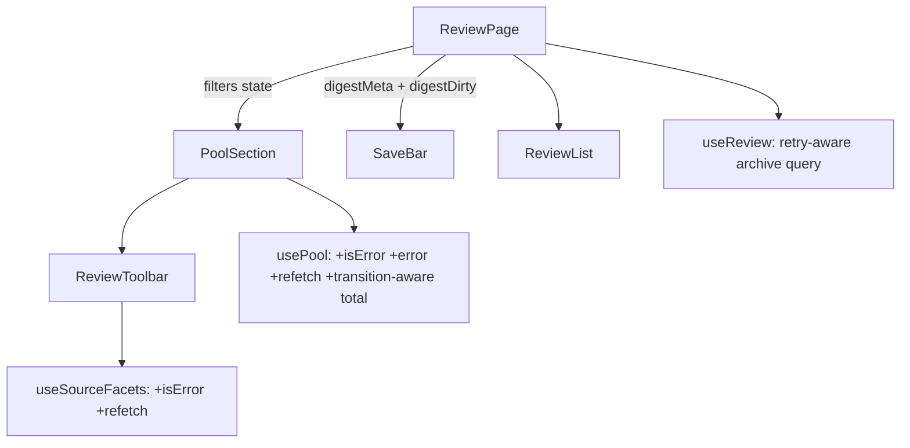

# Design: Review Page Robustness Fixes (review-page-issues-audit)

## Problem Statement

The admin review page (`/admin/review/:runId`) has a cluster of robustness defects
discovered from two operator reports plus a full code audit:

1. **Filter UI vanishes** — selecting a source/shortlist filter (or typing a search)
   that matches zero pool items unmounts the entire Item Pool section *including the
   filter toolbar*, leaving no way to clear the filter (`PoolSection.tsx:92`,
   the `EDGE-002` guard `total === 0 && !isLoading`).
2. **"Selected an option, kept loading, nothing happened"** — pool and facet queries
   have **no error surface**. With the default `QueryClient` (3 retries, exponential
   backoff) a failing request shows "Loading…" for ~7–15 s, then silently settles into
   a wrong state: the section vanishes (stale/zero `total`), or shows the misleading
   "All collected items are already ranked.", or the Source dropdown shows "No sources
   found". The same incident is also reproduced by the zero-match path of (1): select
   option → Loading… → everything disappears.

The audit found six more defects (dry-run save deadlock, untracked digest-meta edits,
error/404 conflation, stale counts, promote/remove desync, minor UX gaps) detailed in
Requirements.

## Context

- All defects live in `packages/web` (React + Vite, react-query, react-router). No API
  or schema changes are needed — server routes (`/pool`, `/source-facets`, PATCH,
  promote, regenerate) behave correctly; the web layer mishandles their error/empty
  responses.
- Key files: `pages/ReviewPage.tsx`, `components/review/PoolSection.tsx`,
  `components/review/ReviewToolbar.tsx`, `components/review/SaveBar.tsx`,
  `hooks/usePool.ts`, `hooks/useReview.ts`, `hooks/useSourceFacets.ts`,
  `hooks/useReviewFilters.ts`.
- Relevant decisions honored: D-027 (dry-runs are editable after review), web standards
  S-web (typed API client, react-query for data, no fetch in components), repository
  rule untouched (no API changes).
- Server facts verified: `getPool` silently drops `shortlistedOnly` when
  `shortlistedItemIds` is null/empty; `regenerate-digest-meta` always 409s for dry-run
  archives; `getAdminArchive` returns `null` only on 404 and throws otherwise while
  `useReview` uses `retry: false`.

## Product Requirements (PRD)

No PRD — internal-facing change.

## Requirements

### Functional

- **F1** — WHEN any filter or pool search is active and the filtered pool total is 0,
  the Item Pool section SHALL remain rendered (header, filter toolbar, active chips,
  search input, sort controls) and display "No items match the current filters." in
  place of the item list.
- **F2** — The Item Pool section SHALL unmount entirely only when the run's
  *unconstrained* pool is empty (no filters, no search, not loading, no error).
  Legacy-run "Pool unavailable for this run" behavior is unchanged.
- **F3** — IF the pool query errors (after retries), the section SHALL stay rendered
  with an inline error message and a Retry control that refetches; the toolbar stays
  usable so filters can still be changed/cleared.
- **F4** — IF the source-facets query errors, the Source dropdown SHALL show an inline
  error with a Retry control instead of the misleading "No sources found".
- **F5** — The "(N items)" header count and `hasMore` SHALL never reflect a stale
  total from a previous filter key; during a filter transition the count area shows a
  loading indicator instead of the old number.
- **F6** — The empty-item-list message SHALL be context-aware: unconstrained →
  "All collected items are already ranked."; constrained → the F1 message.
- **F7** — Edits to any digest-meta field (headline, summary, hook, LinkedIn post,
  Twitter summary) SHALL count as unsaved changes: reflected in the SaveBar count,
  the in-app navigation blocker, the `beforeunload` guard, and reverted by Discard
  (back to the last hydrated/saved values).
- **F8** — Dry-run archives SHALL bypass the regenerate-before-save gate (regeneration
  is impossible for them — server 409s); the Regenerate button is disabled with an
  explanatory reason on dry-runs. Reordering/removing/adding items on a dry-run review
  must remain saveable.
- **F9** — WHEN a Regenerate attempt fails, Save SHALL unlock with the existing digest
  copy and the SaveBar SHALL show a non-blocking warning that the digest copy may not
  match the new story order. (Operator decision 2026-06-05: availability over forced
  consistency. **Revised 2026-06-06:** the disabled-button gate was removed entirely —
  ANY save with a stale digest signature now goes through a "Save without
  regenerating?" confirm dialog ("Save anyway" / Cancel) instead of disabling Save;
  the amber warning shows whenever the digest is stale, dry-run or not.)
- **F10** — The archive-load failure state SHALL distinguish 404 ("This run was not
  found.") from transient errors, which show "Failed to load this run." plus a Retry
  control.
- **F11** — WHEN a ranked item that was promoted during this session is removed from
  the ranked list, it SHALL reappear in the pool (promotion-tracking IDs cleared on
  removal) without a page reload.
- **F12** — The Source dropdown SHALL close on outside click and on Escape.
- **F13** — A run whose `shortlistedItemIds` is an empty array SHALL be treated like a
  null shortlist: toggle disabled with the "No shortlist data for this run" tooltip
  (the server silently drops the filter for empty ids, so an enabled toggle would lie).
- **F14** — The "run still in progress" view SHALL poll the archive (~5 s interval)
  while status is non-terminal so the page transitions into review without a manual
  reload.
- **F15** — "Clear filters" SHALL also clear the pool search input/query (search is a
  constraint like any filter; clearing must restore the full pool).

### Non-functional

- **NF1** — Web-package-only change; no API, shared, or pipeline edits; no migrations.
- **NF2** — No regressions: existing review unit/e2e suites pass (tests asserting the
  old EDGE-002 unmount are updated deliberately, not deleted).
- **NF3** — Strict TS; no `any`; react-query error/refetch surfaced through the
  existing hook return shapes (extend `UsePoolReturn` / `UseSourceFacetsResult`).

### Edge cases

- **EC1** — Pool error AND zero total simultaneously → error display wins over empty
  state.
- **EC2** — Changing/clearing a filter while the error is displayed → key change
  triggers a fresh fetch; error clears automatically.
- **EC3** — Legacy run (`startedAt`/`sourceTypes` null) → unchanged "Pool unavailable"
  branch; none of F1–F6 apply.
- **EC4** — Dry-run + digest-field edits → Save permitted (PATCH allows dry-runs);
  verified during planning.
- **EC5** — Rapid filter toggling → last query key wins; no stale flash (react-query
  keyed caching; transition-aware total from F5).
- **EC6** — Regenerate fails, then user reorders again, then Regenerate succeeds →
  warning clears, gate re-engages normally.
- **EC7** — Promote fails (item hidden + failure card), then user clicks Retry →
  existing behavior unchanged; F11 only applies to items present in the ranked list.

## Architectural Challenges

- **Two sources of truth for filters** — `useReviewFilters` (ReviewPage) is synced
  into `usePool` (PoolSection) via effects. Fixes deliberately work *with* this seam
  rather than consolidating it (see Approaches).
- **Render-time sync pattern** — `usePool` syncs server data into accumulated state
  during render (project pattern, mirrors `useReview`). The stale-total fix must stay
  inside this pattern: track the filter key the displayed total belongs to.
- **Dirty-state composition** — digest meta lives in ReviewPage local state while item
  dirtiness lives in `useReview`. F7 composes them at the page level (`isDirty ||
  digestDirty`) rather than moving digest state into the hook.

## Approaches Considered

**Chosen: targeted fixes within the existing hook/component seams.** Each defect gets
a minimal, locally-testable fix; the filter/pool/review state architecture is unchanged.

**Why not a state consolidation refactor** (single reducer/context owning filters +
pool + review + digest): it would remove the sync-effect seam that enabled bug #1, but
it rewrites the page's data layer wholesale — far more regression surface than eleven
scoped fixes, and nothing now requires the consolidation (YAGNI).

## High-Level Design

Component-level changes:

1. **`usePool`** — expose `isError`/`refetch`; replace stored `total` with
  `{ total, key }` so consumers can tell whether the total belongs to the current
  filter key (F5); everything else unchanged.
2. **`PoolSection`** — empty-state taxonomy:
   `unavailable → error → zero-unconstrained (unmount) → zero-constrained (message) →
   list`. The toolbar renders in every branch except `unavailable`/`unmount` (F1–F3,
   F6). Search participates in "constrained" (F15: `clearAll` also resets local search
   + `pool.setQ("")`).
3. **`ReviewToolbar`** — facets error + retry inside the dropdown (F4); outside-click
   and Escape close (F12); `hasShortlist = ids !== null && ids.length > 0` (F13).
4. **`ReviewPage`** — `digestDirty` derived by comparing `digestMeta` against the
   hydrated snapshot; feeds unsaved count, blocker, beforeunload, Discard (F7).
   Regen gate: `needsRegen && !isDryRun && !regenFailedSinceLastChange` (F8, F9) with
   SaveBar warning text when saving with stale copy. Archive query: distinguish
   `query.isError` (retry UI) from `data === null` (404) (F10). Clear promotion
   tracking on `remove` (F11). `refetchInterval` while status non-terminal (F14).
5. **`SaveBar`** — accepts an optional non-blocking `warning` string (F9); no other
   change.

## External Dependencies & Fallback Chain

None — pure-internal feature.

## Open Questions

None — the one product decision (regen-failure escape hatch) was resolved: allow Save
with existing copy after a failed regenerate.

## Risks and Mitigations

- **Tests pinned to EDGE-002 unmount behavior** — locate and update them intentionally
  (plan phase greps for `EDGE-002` / `total === 0` assertions); changed expectations
  documented in the spec's verification matrix.
- **Render-time sync regressions in `usePool`** — keep the change additive
  (`{total, key}`), cover with unit tests for filter-transition and error sequences.
- **Regen-warning path weakens copy/order consistency** — warning text plus the
  unchanged happy-path gate keep the default behavior identical when the LLM is up.

## Assumptions

- PATCH `/api/admin/archives/:runId` accepts dry-run archives (verified in planning;
  if not, F8 expands to a one-line route fix — the only potential API touch).
