# Plan: Review Page Robustness Fixes

> **Source:** .harness/features/review-page-issues-audit/design.md + spec.md
> **Created:** 2026-06-05
> **Status:** planning

## Goal

Fix the two reported review-page incidents (filter UI vanishing on zero-match,
"kept loading, nothing happened") and the nine additional audit defects with
web-package-only changes covering spec REQ-001…REQ-017 and EDGE-001…EDGE-007.

## Acceptance Criteria

- [ ] Zero-match filters keep the Item Pool section + toolbar rendered with a "No items match the current filters." message (REQ-001/006)
- [ ] Pool and facets query failures surface inline errors with Retry — never a silent wrong state (REQ-003/004)
- [ ] Dry-run reviews are saveable after reorder (regen gate bypass) and a failed Regenerate unlocks Save with a warning (REQ-009/010/011)
- [ ] Digest-meta edits are dirty-tracked (count, blocker, beforeunload, discard) (REQ-007/008)
- [ ] Archive-load errors are distinct from 404, removed promoted items return to the pool, non-terminal runs poll (REQ-012/013/016)
- [ ] All 24 verification-matrix rows have their one test; existing suites stay green

## Codebase Context

### Context Map (Step 2.0)
- **Context map read:** 3 PACKAGE.md (web/pages, web/components/review, web/hooks), 2 standards files (global, web)
- **Decisions honored:**
  - `D-004` (render-time hydration, not effects) — digest dirty-snapshot and the `{total,key}` pool sync stay in the render-time "store previous value in state" pattern.
  - `D-009` (usePool client-side accumulation) — accumulation/loadMore mechanics untouched; only error surfacing and total-key tracking are added.
  - `D-013` (pool filters are server-side) — filters still flow through `pool.set*` re-fetches; the fix changes only what renders around them.
  - `D-014` (Regenerate always-overwrites) — unchanged; the new failure path only unlocks Save, it never merges fields.
  - `D-012` (touch sensor constraints) — ReviewList untouched.
- **Standards honored:**
  - `S-web-01` — any new shared imports use subpaths (none expected).
  - `S-web-02` — no new `fetch` calls; error/retry comes from react-query `isError`/`refetch` on existing client functions.
  - `S-web-03` — pages stay thin: digest dirty-compare is a small pure helper exported from ReviewPage (mirrors `computeUnsavedCount`), pool taxonomy lives in PoolSection.
  - `S-global-01` — strict TS, no `any`/unsafe casts.
  - `S-global-03` — no new abstractions; extend existing hook return shapes in place.
- **Gotchas carried forward:**
  - hooks PACKAGE.md "render-time hydration avoids Strict-Mode double-render issues" → Phase 1's total-key sync and Phase 3's digest snapshot both use render-time state, no new effects.
  - hooks PACKAGE.md `useCollectorHealth` stop-at-terminal pattern → Phase 4's archive polling mirrors it (`refetchInterval` as a function returning `false` on terminal status).
  - review PACKAGE.md "Pool filters are server-side" → zero-match handling must be a render-branch fix, not a client-side filter fallback.

### Existing Patterns to Follow
- **Render-time sync**: `packages/web/src/hooks/usePool.ts:84-104`, `useReview.ts:84-91` — extend, don't replace.
- **Inline error + role="alert"**: `packages/web/src/components/review/DigestMetaPanel.tsx:124-128`.
- **Poll-while-active refetchInterval**: `packages/web/src/hooks/useRunList.ts` / `useCollectorHealth.ts`.
- **jsdom component tests with hook mocks**: `packages/web/tests/unit/components/review/PoolSection.test.tsx` (mock `usePool` via `vi.mock`, override per test).
- **E2E PG seeding**: `packages/web/tests/e2e/edit-after-review.spec.ts` (seeds dry-run archives already).

### Test Infrastructure
- Unit: `pnpm --filter @newsletter/web exec vitest run --project unit <file>` (jsdom; suite-wide: `pnpm --filter @newsletter/web test:unit`)
- E2E: Playwright, `packages/web/tests/e2e/`, needs `pnpm infra:up` + api dev (:3000) + web dev (:5173); run one spec: `pnpm --filter @newsletter/web exec playwright test tests/e2e/<spec>`
- Lesson: getByRole("heading", { level }) must match the component's actual heading element.

## Phase Graph

```dot
digraph phases {
  rankdir=LR
  node [shape=box]

  phase_1 [label="Phase 1: Pool taxonomy + error surfacing (usePool, PoolSection)"]
  phase_2 [label="Phase 2: Toolbar robustness (facets error, dropdown close, shortlist-empty)"]
  phase_3 [label="Phase 3: Save & digest robustness (dirty tracking, regen gate, dry-run)"]
  phase_4 [label="Phase 4: Load & lifecycle (error vs 404, promote/remove, polling)"]

  phase_1 -> phase_2 -> phase_3 -> phase_4
}
```

Phases are serialized deliberately — all four touch `ReviewPage.tsx`/`PoolSection.tsx`
prop seams; parallel dispatch would conflict.

## Phase Summary

| Phase | Traces to | Files |
|---|---|---|
| 1 | REQ-001/002/003/005/006/017, EDGE-001/002/003/005 | usePool.ts, PoolSection.tsx (+tests) |
| 2 | REQ-004/014/015 | ReviewToolbar.tsx, useSourceFacets.ts, PoolSection.tsx, ReviewPage.tsx (+tests) |
| 3 | REQ-007/008/009/010/011, EDGE-004/006 | ReviewPage.tsx, SaveBar.tsx, DigestMetaPanel.tsx (+tests, e2e) |
| 4 | REQ-012/013/016, EDGE-007 | ReviewPage.tsx, useReview.ts (+tests) |
