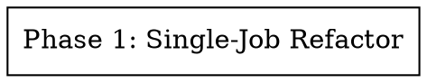

# Run as Single Parallel Job — Implementation Plan

> **For agentic workers:** REQUIRED SUB-SKILL: Use `superpowers:subagent-driven-development` (recommended) or `superpowers:executing-plans` to implement this plan task-by-task. Steps use checkbox (`- [ ]`) syntax for tracking.

**Goal:** Collapse a newsletter run from a BullMQ FlowProducer tree (parent + N collector children on separate queues) into a single BullMQ `run-process` job that runs all requested collectors concurrently in-process, serializes per-source state writes to prevent clobber, and preserves partial-success semantics.

**Architecture:** Single-owner job — the `run-process` worker is the only writer to `run:{runId}` Redis state for the duration of the run. Collectors run via `Promise.all` with per-task `try/catch`. State updates from each collector's `.then` callback go through an in-process promise chain (`writeSerial`) that replicates the implicit `concurrency: 1` invariant of the old `collection` worker. BullMQ job `jobId` is set to `runId` to idempotently deduplicate double-submits and stall redelivery.

**Tech Stack:** BullMQ 5.x (`Queue.add`, drop `FlowProducer` from this path), ioredis, Vitest 3, TypeScript strict, pnpm + Turborepo.

**Spec:** `docs/spec/run-as-single-parallel-job/spec.md` (18 requirements, 13 edge cases, verification matrix)

**Design:** `docs/plans/2026-04-08-run-as-single-parallel-job-design.md`

---

## Scope Boundaries

Files the implementer **MUST touch**:
- `packages/pipeline/src/workers/run-process.ts` — new collecting stage, `collectFns` injection, new job data shape
- `packages/api/src/services/runs.ts` — drop `FlowProducer`, use `Queue.add` with `jobId: runId`, carry `collectors` payload

Files the implementer **MUST NOT touch** (REQ-014):
- `packages/pipeline/src/services/run-state.ts`
- `packages/pipeline/src/collectors/*.ts` (hn, reddit, web)
- `packages/pipeline/src/processors/dedup.ts`, `rank.ts`
- `packages/pipeline/src/services/candidate-loader.ts`
- `packages/pipeline/src/workers/collection.ts` (left in place for rollback; follow-up PR deletes it)
- `packages/api/src/lib/flow.ts` (left in place for rollback)

Files the implementer **MAY touch** (test harness updates, required):
- `packages/api/tests/unit/runs-service.test.ts`
- `packages/api/tests/unit/runs-route.test.ts`
- `packages/api/tests/e2e/runs.e2e.test.ts`
- `packages/pipeline/tests/unit/workers/run-process.test.ts`
- `packages/pipeline/tests/e2e/run-flow.e2e.test.ts`
- `packages/pipeline/tests/e2e/workers/run-process.e2e.test.ts`

No new `src/` files will be created (REQ-013).

---

## Phase Graph

Single phase — the `runs.ts` enqueue shape depends on the new `RunProcessJobData` consumed by `run-process.ts`, so both files must change in one logical unit. See `phase-1.md` for task breakdown.

---

## Self-Review Checklist

Before handing off:

1. **Spec coverage** — every REQ-001 through REQ-018 and EDGE-001 through EDGE-013 is mapped to at least one task in `phase-1.md`. See the Verification Matrix in `spec.md`.
2. **No new source files** — `git diff --name-status` shows zero `A` entries under `packages/*/src/`.
3. **Forbidden files untouched** — `git diff` shows zero changes in the REQ-014 file list.
4. **Type consistency** — `RunProcessJobData.collectors` shape matches what `createRun` sends; `collectFns` keys match what the handler calls.
5. **Exact SPEC-mandated strings** — the `"no items collected"` warning text is preserved verbatim (REQ-011, EDGE-005).

---

## Execution Handoff

This plan has one phase. Dispatch a single coder sub-agent via `superpowers:subagent-driven-development` with the TDD skill, referencing `phase-1.md` for the full step-by-step task list.
