# Plan: Run Observability Page

> **Source:** docs/spec/run-observability-page/design.md, docs/spec/run-observability-page/spec.md
> **Approved mock:** docs/spec/run-observability-page/mocks/run-observability.html
> **Created:** 2026-05-25
> **Status:** planning

## Goal

A centralized per-run observability page at `/admin/runs/:runId` that shows
detailed debug logs, a stage funnel (collected→deduped→shortlisted→ranked),
per-source telemetry, link-enrichment stats, per-stage timing & cost, and
full-context failure logs — viewable live (~2s poll) and persisted forever via a
new `run_logs` table and a `run_archives.run_funnel` column.

## Acceptance Criteria

- [ ] `run_logs` table + `run_funnel` column migrated and typed in `@newsletter/shared`.
- [ ] Pipeline emits milestone `run_logs` entries (stage.start/end, source.completed/failed, stage.result funnel counts, enrichment.summary, run.failed with stack) best-effort, never failing the run.
- [ ] `run_funnel` persisted at finalize.
- [ ] `GET /api/admin/runs/:runId/observability` returns one `RunObservability` payload for both live (`live=true`, from Redis+logs) and historical (`live=false`, from archive+logs) runs; 404 for unknown; admin-gated.
- [ ] `RunObservabilityPage` at `/admin/runs/:runId` renders all six approved sections, polls every 2s while live and stops on terminal, with error-row stack expansion, level filter, and legacy/empty states. Dashboard rows link to it.
- [ ] E2E covers live, historical, failure, and legacy runs; unit + integration cover the rest of the verification matrix. Baseline metrics not regressed.

## Codebase Context

### Existing Patterns to Follow

- **Drizzle schema + migration:** `packages/shared/src/db/schema.ts` (tables defined with `pgTable`, JSONB cols typed via `.$type<T>()`, indexes via the array form). Migrations generated with `pnpm --filter @newsletter/shared db:generate` into `src/db/migrations/` (do NOT hand-write raw SQL — generator handles it). Latest is `0030`.
- **Repository pattern (write, pipeline):** `packages/pipeline/src/repositories/run-archives.ts` — `createXRepo(db)` returns an interface object; uses `drizzle-orm` query builder. Enforced by `newsletter/enforce-repository-access`.
- **Repository pattern (read, api):** `packages/api/src/repositories/run-archives.ts` — `findById`, `list`, etc.
- **Run-state service (Redis live):** `packages/pipeline/src/services/run-state.ts`; `RunState` shape in `packages/shared/src/types/run.ts` (`status`, `stage`, per-source counters, warnings, error). API reads run-state via Redis in `run-list`/raw-items repo.
- **Worker stages + existing log events:** `packages/pipeline/src/workers/run-process.ts` — `setStage(...)` markers and Pino events `run.source.completed` (L406), `run.source.failed` (L438), `run.dedup` (L636, has inputCount/outputCount), shortlist result (L658), rank (L697), `run.completed`, `run.failed` (L553/L806), `run.cancelled` (L883). `RunProcessDeps` injects `runState`, `archiveRepo`, `logger`, `tracker`. `buildSourceTelemetry` (L771) + `toEnrichmentTelemetry` build the persisted telemetry.
- **CostTracker:** `packages/pipeline/src/services/cost-tracker.ts` — `createCostTracker(runId)`, `.snapshot()`, `.hasAnyCalls()`. Snapshot persisted via `archiveRepo.setCostBreakdown`.
- **Admin API route + auto-gating:** `packages/api/src/routes/admin-runs.ts` (`createAdminRunsRouter` with `GET /:runId/sources`). Mounted at `/api/admin/runs` in `packages/api/src/app.ts` (L93) under the `conditionalGate` → **any new route here is admin-gated automatically** (satisfies REQ-025).
- **Web router + admin gate:** `packages/web/src/App.tsx` — admin pages under `{ path: "/admin", element: <RequireAdmin/> }` → `<AdminLayout/>` children. Add `{ path: "runs/:runId", element: <RunObservabilityPage/> }` there.
- **Polling hook to mirror:** `packages/web/src/hooks/useRunPolling.ts` — react-query, 2s interval, `refetchInterval` returns false on terminal status. **Reuse this exact shape** for `useRunObservability` (do NOT modify `useRunPolling`).
- **API client:** `packages/web/src/api/runs.ts` — `apiFetchAdmin(path)` for admin calls; 404 → null. Add `getRunObservability(runId)` here.
- **Dashboard run-row links:** `packages/web/src/components/dashboard/RunsTable.tsx` (L115/381) and `RunsCardList.tsx` — `<Link to={`/admin/review/${run.runId}`}>` etc. Add a "Details"/"Observability" link next to these.
- **Web→shared imports:** ALWAYS use subpath (`@newsletter/shared/types`, `/constants`) — never the root barrel (learning: `web-shared-subpath-imports`).

### Test Infrastructure

- **Runner:** Vitest 3 (per-package `unit` + `e2e` projects). `pnpm test:unit`, `pnpm test:e2e`.
- **API/pipeline e2e:** require real Postgres + Redis from `pnpm infra:up`. Pattern: `config({ path: REPO_ROOT/.env })`, `getDb()`, `createRedisConnection()`, seed via repos, `randomUUID()` run ids, cleanup in `afterEach`/`afterAll`. See `packages/api/tests/e2e/archives.e2e.test.ts`.
- **Web e2e:** Playwright specs in `packages/web/tests/e2e/*.spec.ts` (e.g. `cost-dialog.spec.ts`, `dashboard-run-now.spec.ts`). Admin auth flow established in existing specs.
- **Lint requires build first** (eslint-plugin must be compiled): run `pnpm build` before `pnpm lint`.

### Key Constraints (from learnings)

- **Partial-update writers must verify the row exists** — `run_funnel` is written inside the existing finalize upsert where the archive row is guaranteed; `run_logs` inserts are pure INSERTs (no precondition). Do NOT add a standalone `setRunFunnel` UPDATE on a path where the row may not exist.
- **Best-effort logging** — every `run_logs` insert is wrapped; a DB error is caught, stdout-logged, swallowed. A run never fails because logging failed (REQ-016).
- **Cross-package boundaries** — schema/types in shared only; repos per package; web via typed client + shared subpath imports.

## Phase Graph

```dot
digraph phases {
  rankdir=LR
  node [shape=box]

  phase_1 [label="Phase 1: Schema + types foundation\n(run_logs table, run_funnel col, RunLogEntry/RunObservability types)"]
  phase_2 [label="Phase 2: Pipeline log emission\n(runLogger, write repo, thread events, persist run_funnel)"]
  phase_3 [label="Phase 3: API composition endpoint\n(read repo, GET .../observability, live+historical compose)"]
  phase_4 [label="Phase 4: Frontend page\n(useRunObservability, RunObservabilityPage, route, dashboard link)"]
  phase_5 [label="Phase 5: E2E + verification\n(live/historical/failure/legacy)"]

  phase_1 -> phase_2
  phase_1 -> phase_3
  phase_2 -> phase_5
  phase_3 -> phase_4
  phase_1 -> phase_4
  phase_4 -> phase_5
}
```

**Dispatch waves:**
- Wave 1: Phase 1 (foundation, everything depends on it).
- Wave 2: Phase 2 and Phase 3 in parallel (both depend only on Phase 1; P2 writes logs, P3 reads — independent).
- Wave 3: Phase 4 (needs P1 types + P3 endpoint).
- Wave 4: Phase 5 (e2e needs the full vertical slice P2+P3+P4).

## Phase Summaries

- **Phase 1 — Schema + types foundation.** Add `run_logs` table and `run_archives.run_funnel` column to the shared schema, generate + apply the migration, and export `RunLogLevel`, `RunLogEvent`, `RunLogEntry`, `RunLogInsert`, `RunFunnel`, and the `RunObservability` payload type. Traces: REQ-001, REQ-002, REQ-003.
- **Phase 2 — Pipeline log emission.** Add a `RunLogRepository` (write) in pipeline + shared insert helper, a `runLogger(runId)` that writes a row and emits the existing Pino line (best-effort), thread milestone events into the run-process stages, and persist `run_funnel` at finalize. Traces: REQ-010..REQ-017, EDGE-002/006/008/009/010.
- **Phase 3 — API composition endpoint.** Add a read `RunLogRepository` in api and the `GET /api/admin/runs/:runId/observability` route that composes Redis run-state (live) or `run_archives` (historical) with `run_logs` into one `RunObservability` payload. Traces: REQ-020..REQ-026, EDGE-001/003/005.
- **Phase 4 — Frontend page.** Add `getRunObservability` client, `useRunObservability` hook (2s poll mirroring `useRunPolling`), the `RunObservabilityPage` implementing the approved mock's six sections, the `/admin/runs/:runId` route, and dashboard run-row links. Traces: REQ-030..REQ-038, EDGE-004/005/007.
- **Phase 5 — E2E + verification.** End-to-end specs proving live (funnel populating, timeline appending, poll stops at terminal), historical (archive-sourced), failure (error row + stack), and legacy (empty states) flows, plus the API endpoint e2e. Traces: VS-1..VS-4, REQ-020/021/022/030/033.
