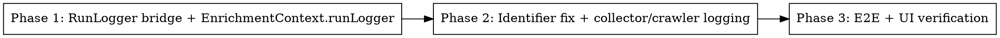

# Plan — Run Telemetry: Live Logs, Verbose Failures, Source-Items Dropdown Fix

**Spec:** `docs/spec/run-telemetry-live-logs/spec.md`
**Branch:** `feat/run-telemetry-live-logs`

## Phase Graph (DOT)

Three serial phases. No parallelism — Phase 2 depends on the `withPinoBridge` helper added in Phase 1, and Phase 3 depends on the full pipeline being instrumented.

---

## Phase 1 — Foundation: RunLogger bridge + enrichment logging

**Goal:** Add the `withPinoBridge` helper, thread `runLogger` into `EnrichmentContext`, and emit `link_enrichment.failed` rows. Unit-tested in isolation.

### Files

- **MODIFY** `packages/pipeline/src/services/run-logger.ts` — add `withPinoBridge(runLogger, baseLogger): RunLogger`. New export. Keep the existing `createRunLogger` untouched.
- **MODIFY** `packages/pipeline/src/services/link-enrichment/types.ts` — add `runLogger?: RunLogger` to `EnrichmentContext`. Optional so existing callers (tests) keep compiling.
- **MODIFY** `packages/pipeline/src/services/link-enrichment/index.ts` — on each failure branch (cancelled, non-ok, catch), call `ctx.runLogger?.error(...)` with the verbose context (REQ-003 + REQ-004). Compute `hostname` once for the message; truncate `failureReason` to 200 chars.
- **CREATE** `packages/pipeline/src/services/__tests__/run-logger.test.ts` — unit tests for `withPinoBridge` (VS-2): double-emit, all 4 levels, repo failure swallowed.
- **CREATE / MODIFY** `packages/pipeline/src/services/link-enrichment/__tests__/index.test.ts` (or extend existing) — unit tests for VS-3 (failure path emits error row) and VS-4 (success path emits zero rows). Cover the three failure branches.

### Steps (no parallelism — sequential within phase)

1. **Step 1.1** — Add `withPinoBridge` to `run-logger.ts`. Write the test first (it's a pure unit, no DB).
2. **Step 1.2** — Add `runLogger?: RunLogger` to `EnrichmentContext`.
3. **Step 1.3** — Wire emission in `enrichRawItems` on three failure branches; add tests.

### Acceptance for Phase 1

- `pnpm --filter @newsletter/pipeline test:unit -- run-logger` passes.
- `pnpm --filter @newsletter/pipeline test:unit -- link-enrichment` passes.
- `pnpm typecheck` clean.
- `pnpm lint` clean.

---

## Phase 2 — Wire collectors + crawler to RunLogger; fix identifier

**Goal:** Web collector + web crawler emit through `runLogger`. Source-row identifier matches item identifier. Existing Pino emissions stay (via the bridge).

### Files

- **MODIFY** `packages/pipeline/src/collectors/web.ts`:
  - Add `runLogger?: RunLogger` to `WebCollectorDeps`.
  - At each milestone `logger.info/.warn/.error` call site for the events in REQ-001, ALSO call `deps.runLogger?.<level>` with the **same fields plus** `stage: "collect"`, `source: "blog"`. Mapping per REQ-009.
  - **Change `unitResults[i].identifier`** from `ps.source.listingUrl` to `deriveRawItemIdentifier({ sourceType: "blog", url: ps.source.listingUrl, sourceUrl: ps.source.listingUrl, metadata: null })` (which collapses to the hostname). Import `deriveRawItemIdentifier` from `@newsletter/shared/services` (subpath, not root barrel, per the web→shared subpath learning — but pipeline isn't web; still prefer the explicit subpath).
- **MODIFY** `packages/pipeline/src/services/web-crawler.ts`:
  - Accept `runLogger?: RunLogger` in `runWebCrawl` opts (or a sibling closure if simpler — choose at implementation time).
  - On `crawler.stats` emission: call `runLogger?.<info|warn>(...)` based on whether `requestsFailed > 0` (REQ-002).
- **MODIFY** `packages/pipeline/src/workers/run-process.ts`:
  - At the `collectWeb` call site, pass `runLogger`.
  - At the `runWebCrawl` opts, pass `runLogger` (or thread through `web-crawler` options).
  - At the `EnrichmentContext` construction site, set `ctx.runLogger = runLogger`.
- **CREATE / MODIFY** `packages/pipeline/src/collectors/__tests__/web.test.ts` (extend existing) — tests for:
  - VS-1 (identifier parity matrix — at least 5 listing URLs).
  - VS-5 level mapping for web events.

### Steps

1. **Step 2.1** — Identifier fix + parity tests (VS-1). This is independent of logging changes; tests must include the cross-URL matrix from the learning file `js-sql-cross-check-must-include-edge-cases.md` (canonical, uppercase, subdomain, trailing-slash, `.co.uk`).
2. **Step 2.2** — Add `runLogger` to `WebCollectorDeps` and wire at the 10 emission sites in `web.ts` per REQ-001 + REQ-009.
3. **Step 2.3** — Add `runLogger` to web-crawler emit path per REQ-002.
4. **Step 2.4** — Wire from `run-process.ts` (pass the existing `runLogger` instance down).
5. **Step 2.5** — Unit tests for level mapping (VS-5) and confirm Pino emissions still happen.

### Acceptance for Phase 2

- `pnpm --filter @newsletter/pipeline test:unit` passes (all suites).
- `pnpm typecheck` clean.
- `pnpm lint` clean.
- Manual confirmation: search `web.ts` — every event in REQ-001 has both a `logger.<level>(...)` call AND a `deps.runLogger?.<level>(...)` call.

---

## Phase 3 — API + UI E2E verification

**Goal:** End-to-end test the full pipeline → DB → API → UI surface. Includes the two UI-claim verifications.

### Files

- **CREATE** `packages/api/tests/e2e/observability-extended.spec.ts` — e2e tests:
  - **VS-6** — seed `run_logs` with all new event types and confirm `GET /api/admin/runs/:runId/observability` returns them in `logs[]` and the `level=error` subset in `failures[]`.
  - **VS-7** — seed `run_archives.sourceTelemetry` with hostname identifier + matching `raw_items`; confirm `GET /api/admin/runs/:runId/sources/blog:cursor.com/items` returns the items.
  - **VS-8** — legacy archive with listing-URL identifier returns 200 + empty items (no crash).
- **MODIFY (if needed)** `packages/web/src/components/observability/DebugTimeline.tsx` and `FailuresList.tsx` — verify they handle the new `link_enrichment.failed` event without runtime errors. **Read-only inspection first** — they already render generic `event` strings, so likely no change is needed. If a stage/source badge needs the new value, add it; otherwise leave them alone (per "no scope creep" rule).
- **Playwright MCP UI verification** (executed by the verify stage, NOT by a test file):
  - **VS-9** — Open `/admin/runs/<runId>` for a run with seeded rows. Filter timeline to ALL. Screenshot. Expand a `link_enrichment.failed` Failure Card. Screenshot.
  - **VS-10** — Click "Expand items" on a `blog · cursor.com` source row. Screenshot the populated dropdown.

### Steps

1. **Step 3.1** — Write the three e2e tests (VS-6, VS-7, VS-8). Run them — they fail (RED).
2. **Step 3.2** — Confirm no production code changes needed for them to pass (the API + service layer already does the right thing once the source-row identifier is fixed; the e2e is verifying the wiring end-to-end).
3. **Step 3.3** — Run the e2e suite. GREEN.
4. **Step 3.4** — Hand off to verify stage for Playwright MCP UI proofs (VS-9, VS-10).

### Acceptance for Phase 3

- All three e2e tests pass against live DB + Redis.
- `pnpm test:e2e` clean for both `api` and `pipeline` packages.
- Verify stage produces `proof-report.md` with screenshots for VS-9 and VS-10.

---

## Phase Claims Schema

Each phase writes `.harness/run-telemetry-live-logs/phase-<N>-claims.json` per `skills/tdd/references/phase-claims-format.md`. UI claims (VS-9, VS-10) live in Phase 3.

## Risks during execution

- **R1 — log volume in tests:** Mock `runLogRepo.append` in unit tests so we don't pollute the test DB. Use the existing in-memory pattern (see `createRunLogger` tests if present).
- **R2 — Pino bridge double-emit confuses existing log assertions:** Existing tests using `logger.info(...)` expectations stay valid because the bridge calls Pino unchanged. If any existing test asserts on the Pino call count, double-check that path.
- **R3 — `WebCollectorDeps` is consumed in many test files:** All additions are optional (`runLogger?:`) so callers don't break.
