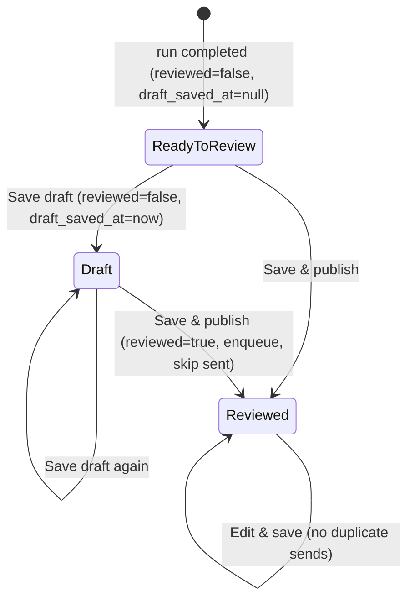

# Design — Save newsletter review as draft

## Problem Statement

The newsletter review page forces an all-or-nothing commit: the only save action
("Save & view archive") persists the admin's edits, flips `run_archives.reviewed`
to `true`, and enqueues the email/LinkedIn/X publish jobs in one shot. An admin who
wants to curate over multiple sittings has no way to persist partial progress — if
they leave mid-review, their reordering, deletions, added posts, and digest-copy edits
are lost. We need a **Save draft** action that persists the current review state
without publishing or surfacing it publicly, alongside a **Save & publish** action
that preserves today's full behavior.

## Context

The system already has latent draft semantics around the `reviewed` flag:

- **Public archive is gated on `reviewed`** — `run-archives.ts` `listReviewed` /
  `searchReviewed` filter `where reviewed = true and isDryRun = false`, and the public
  archive-detail GET returns 404 when `!archive.reviewed`. An unreviewed run is already
  invisible publicly.
- **Every publish worker gates on `reviewed`** — `pipeline/workers/publish-target.ts`
  returns `null` (skips the send) for `!archive.reviewed`, both in the targeted-runId
  branch (`reason: "not_reviewed"`) and the latest-terminal branch
  (`reason: "latest_unreviewed"`). So even a publish job that somehow reaches a worker
  cannot send an unreviewed run.
- **The dashboard already lists unreviewed completed runs** — `run-status.tsx`
  `deriveStatus` maps a completed `reviewed=false` run to `"ready-to-review"` with a
  **Review** CTA linking to `/admin/review/:runId`.

What's missing is purely the *write path*: `patchArchive` →
`updateRankedItems` / `updateRankedItemsInTx` hardcode `reviewed: true`, and the PATCH
route unconditionally enqueues immediate publish channels. A draft save just needs to
persist `rankedItems` + digest meta while leaving `reviewed = false` and skipping the
enqueue. A completed-but-unreviewed run **is** a draft; today's UI simply can't produce
one with edits saved.

Relevant decisions honored: `S-global-03` (no premature abstractions), the "new nullable
column degrades gracefully for legacy archives" pattern (digest fields, `published_at`,
`shortlisted_item_ids`), and the repository-access boundary (`enforce-repository-access`).

## Product Requirements (PRD)

**Persona** — *Newsletter admin (Ritesh/Aman)* reviewing a completed run. They want to
curate across multiple sittings without losing progress and without accidentally
publishing.

**Goals**
- G1 — Persist in-progress review edits without publishing or going public.
- G2 — Resume a saved draft later with all edits intact.
- G3 — Preserve today's one-click publish exactly, including its no-duplicate-send guard.

**Non-Goals (what this does NOT do)**
- No auto-save / draft versioning / draft history — a single mutable draft state per run.
- No new "draft" lifecycle for runs that were never completed (drafts apply only to
  completed runs, the same set that is reviewable today).
- No un-publishing: an already-published archive (`reviewed=true`) cannot be reverted to a
  draft.
- No scheduling/queuing changes in the pipeline — publish workers are untouched.

**Story → requirement map**

| Story | Requirements |
|-------|--------------|
| As an admin, I save my partial review and come back later | F1, F2, F6, NF1 |
| As an admin, I publish when ready, exactly as before | F3, F4, EC4 |
| As an admin, I can tell which runs have saved progress | F5 |
| As an admin, I never accidentally un-publish or double-send a live issue | F7, EC1, EC4 |

**User flows**
1. *Save draft* — On a not-yet-published run, admin clicks **Save draft**. Edits persist;
   the run stays out of the public archive and unqueued. A "Draft saved" toast appears, the
   unsaved-changes counter resets, and the admin remains on the review page.
2. *Resume* — From the dashboard the run shows a **Draft** badge with a **Review** CTA.
   Opening it rehydrates the saved edits.
3. *Publish* — Admin clicks **Save & publish**. Edits persist, the run becomes `reviewed`,
   publish channels enqueue (skipping any already-sent), and the admin is taken to the
   archive — today's behavior unchanged.
4. *Edit published* — Opening an already-published archive shows only the single existing
   Save action (no draft option); re-saving never re-sends an already-sent channel.

## Requirements

### Functional
- **F1** — When the admin saves a draft, the system SHALL persist `rankedItems` and all
  provided digest-meta fields and SHALL leave `run_archives.reviewed = false`.
- **F2** — When the admin saves a draft, the system SHALL NOT enqueue any publish channel
  (email-send, linkedin-post, twitter-post).
- **F3** — When the admin saves & publishes a not-yet-reviewed run, the system SHALL set
  `reviewed = true` and enqueue the immediate publish channels — identical to current
  "Save & view archive" behavior.
- **F4** — When the admin saves an already-reviewed archive (edit), the system SHALL keep
  `reviewed = true` and enqueue only channels not already sent.
- **F5** — The admin dashboard SHALL render a distinct **Draft** status for a completed run
  that has saved draft progress and is not yet reviewed, distinguishing it from a fresh
  "Ready to review" run; both keep a CTA to open the review page.
- **F6** — On a not-yet-reviewed run the review page SHALL present two actions, **Save draft**
  and **Save & publish**; on an already-reviewed run it SHALL present only the single
  existing Save action.
- **F7** — The API SHALL reject a draft save (`publish=false`) for an archive that is
  already `reviewed=true`.

### Non-Functional
- **NF1** — Resume fidelity: a resumed draft SHALL rehydrate to exactly the saved
  `rankedItems` order/content and digest copy (reuses existing `rankedItems` hydration).
- **NF2** — Backward compatibility: the PATCH `publish` field is optional and defaults to
  `true`; existing API callers and tests that omit it keep publishing. Legacy rows with
  `draft_saved_at = null` derive correctly.
- **NF3** — No regression to the existing no-duplicate-send guarantee
  (per-channel `sentAt != null` skip + worker idempotency markers).

### Edge Cases
- **EC1** — Draft save against an already-`reviewed` run → API 400/409, no state change
  (defense in depth behind the UI rule of F6).
- **EC2** — Publishing a run that was previously drafted → `reviewed=true`; dashboard shows
  "Reviewed"; `draft_saved_at` may remain set but is ignored (derived status checks
  `reviewed` first).
- **EC3** — Legacy/unopened completed run (`draft_saved_at=null`, `reviewed=false`) → stays
  "Ready to review".
- **EC4** — Save & publish re-edit where some channels already sent → already-sent channels
  are skipped (`if (sentAt[channel] != null) continue`), preventing duplicate posts.
- **EC5** — Dry-run draft → allowed; stays `reviewed=false`; publish is already a no-op for
  dry runs.
- **EC6** — Draft save failure (DB error) → existing error toast; dirty state preserved.

## Architectural Challenges

- **Distinguishing draft from never-opened** — both are `reviewed=false`. Resolved with a
  nullable `run_archives.draft_saved_at` timestamp, set on draft save, surfaced in
  `RunSummary` and consumed by `deriveStatus`. Follows the established nullable-column
  graceful-degradation pattern.
- **One write path, two intents** — `patchArchive` must conditionally set `reviewed`. Thread
  an explicit `reviewed: boolean` (+ `draftSavedAt`) through `updateRankedItems` /
  `updateRankedItemsInTx` rather than forking the method.
- **Enqueue gating lives in the route** — the immediate-publish enqueue block in the PATCH
  handler runs only when `publish === true`. Workers need no change (already `reviewed`-gated).

## Approaches Considered

**Chosen — `publish` flag on the existing PATCH endpoint.** Add optional `publish?: boolean`
(default `true`) to `archivePatchSchema` / `PatchArchivePayload`. The route derives
`reviewed = publish` and only enqueues when `publish`. Minimal surface, fully backward
compatible, reuses all existing validation/diff/hydration.

Why not a separate `/draft` endpoint: would duplicate the entire ranked-items validation,
review-edits diff, and digest-meta logic for no benefit (`S-global-03`).

Why not a client-only "don't navigate" hack (skip server changes): impossible — the server
unconditionally sets `reviewed=true` and enqueues today, so a draft must change the server.

## High-Level Design

```mermaid
graph TB
  RP[ReviewPage] -->|publish=false| API[PATCH /api/admin/archives/:runId]
  RP -->|publish=true| API
  API --> SVC[review.patchArchive]
  SVC --> REPO[(run_archives.updateRankedItems\nreviewed = publish\ndraft_saved_at = publish ? keep : now)]
  API -->|publish=true only| Q[[processingQueue.add email/linkedin/twitter\nskip already-sent]]
  DB[(run_archives)] --> RUNS[GET runs -> RunSummary.draftSavedAt]
  RUNS --> DS[deriveStatus -> Draft | Ready to review | Reviewed]
```



**Layers touched**
- **shared** — `PatchArchivePayload` gains `publish?: boolean`; `RunSummary` gains
  `draftSavedAt?: string | null`; Drizzle schema + migration add nullable
  `run_archives.draft_saved_at`.
- **api** — `archivePatchSchema` adds `publish`; `patchArchive` service threads
  `reviewed`/`draftSavedAt` into the repo; PATCH route gates the enqueue on `publish` and
  rejects `publish=false` on already-reviewed runs (F7); repo `updateRankedItems` /
  `updateRankedItemsInTx` accept the `reviewed` flag and stamp `draft_saved_at`; runs-list
  query selects `draft_saved_at`.
- **web** — `patchArchive` client passes `publish`; `ReviewPage` adds `handleSaveDraft`
  (publish=false, toast + reset, stay) and renders the two-vs-one button set by `reviewed`;
  `SaveBar` gains an optional draft action; `run-status.tsx` adds a `"draft"` derived status
  + badge; `RunsTable` / `RunsCardList` treat draft like ready-to-review for the CTA.

Interface shapes (bodies belong to planning/coding):

```ts
interface PatchArchivePayload { /* …existing… */ publish?: boolean } // default true

interface RunSummary { /* …existing… */ draftSavedAt?: string | null }

type DerivedStatus = "running" | "cancelling" | "cancelled"
  | "ready-to-review" | "draft" | "reviewed" | "failed";
```

## External Dependencies & Fallback Chain

None — pure-internal feature.

## Open Questions

None — all product decisions resolved (button rule on published archives = single Save with
no-duplicate-send; post-draft = stay + toast; distinct Draft badge via `draft_saved_at`).

## Risks and Mitigations

- **Risk: a draft accidentally publishes via the scheduled/cron path.** Mitigation: publish
  workers already short-circuit on `!reviewed` (`publish-target.ts`); no enqueue on draft
  save. Verified, not assumed.
- **Risk: re-publish duplicates a send.** Mitigation: existing per-channel `sentAt != null`
  skip + archive idempotency markers; covered by F4/EC4 and asserted in verification.
- **Risk: un-publishing a live issue via a draft save.** Mitigation: F7 server guard + F6 UI
  rule (no draft button on reviewed runs).

## Assumptions

- `run_archives.draft_saved_at` is acceptable as a new nullable column (consistent with the
  project's additive-column convention).
