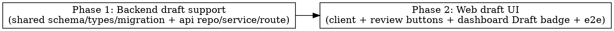

# Plan: Save newsletter review as draft

> **Source:** .harness/features/save-newsletter-draft/design.md + spec.md
> **Created:** 2026-06-08
> **Status:** planning

## Goal

Let the admin persist in-progress review edits without publishing (Save draft), keeping the
run out of the public archive and unqueued, while preserving today's one-click Save & publish.

## Acceptance Criteria

- [ ] Draft save persists `rankedItems` + digest meta, leaves `reviewed=false`, sets `draft_saved_at`, enqueues nothing (REQ-001..004).
- [ ] Publish save (or omitted `publish`) sets `reviewed=true` and enqueues immediate channels, skipping already-sent ones (REQ-005..007, EDGE-004).
- [ ] Draft save against an already-reviewed run is rejected with no state change (REQ-008/EDGE-001).
- [ ] Dashboard derives a distinct `"draft"` status with a Review CTA; reviewed overrides draft; legacy null degrades to ready-to-review (REQ-009..012, EDGE-002/003).
- [ ] Review page shows two buttons when unreviewed, one when reviewed; draft save stays on page + toast + resets dirty state (REQ-013..015, EDGE-006).
- [ ] `RunSummary` serializes `draftSavedAt` (REQ-016).
- [ ] Existing tests still pass; typecheck + lint clean (baseline pre-existing lint error excepted).

## Codebase Context

### Context Map (Step 2.0)
- **Context map read:** ARCHITECTURE.md + DECISIONS.md (index + relevant bodies) + the auto-injected per-package map for shared/api/web; 3 standards files (global, api, web). Grounded against code (authoritative).
- **Decisions honored:**
  - `D-003` (updateRankedItems is a partial UPDATE) — threading the `reviewed` flag + `draftSavedAt` stamp preserves partial-update semantics: only provided keys, plus `reviewed`/`draft_saved_at`/`searchText`/`updatedAt`, are set; unprovided fields are untouched.
  - `D-013` (digest-meta presence via `"k" in input`) — unchanged; draft save reuses the same presence detection in `patchArchive`.
  - `D-017` (dual publish/start date columns) — dashboard date display untouched; the Draft change only affects status derivation.
  - `D-027` (edit-newsletter gate includes dry-run; social gate excludes it) — dry-run drafts are allowed (EDGE-005), and the draft CTA mirrors the ready-to-review (edit) gate, consistent with this decision.
  - `D-050` (email_sent_at is the broadcast idempotency marker only) — the no-duplicate-send guarantee (REQ-007/EDGE-004) rests on the existing per-channel `sentAt != null` skip + this marker; left unchanged.
- **Standards honored:**
  - `S-global-01` strict TS (no `any`); `S-global-02` no new deps; `S-global-03` no premature abstractions (a `publish` flag on the existing PATCH, not a new endpoint); `S-global-04` log at boundaries (reuse existing route logging).
  - `S-api` — validate `publish` with zod at the boundary (`archivePatchSchema`); all `draft_saved_at` reads/writes stay inside `repositories/**` (enforce-repository-access).
  - `S-web` — `publish` flows through the typed `patchArchive` client (no `fetch` in components); save/draft logic stays out of JSX.
- **Gotchas carried forward:**
  - L1 (discard/reset must clear ALL derived state) → Phase 2 `handleSaveDraft` resets the ranked baseline (`reset`), `digestBaseline`, AND `regenSignature` so the unsaved count returns to 0.
  - L2 (Playwright heading level matches rendered element) → Phase 2 e2e asserts the actual `h2` heading.
  - L3 (useCallback deps) → Phase 2 memoized handlers depend on specific fields, not the whole `query`.

### Existing Patterns to Follow
- **Partial archive UPDATE:** `packages/api/src/repositories/run-archives.ts:565` `updateRankedItems` / `:632` `updateRankedItemsInTx` (D-003).
- **Enqueue with already-sent skip:** `packages/api/src/routes/archives.ts:260-292` (`if (sentAt[channel] != null) continue`).
- **Nullable-column graceful degradation:** existing `publishedAt`, `shortlistedItemIds`, digest fields in `schema.ts`.
- **Derived dashboard status:** `packages/web/src/components/dashboard/run-status.tsx` `deriveStatus` + `STATUS_MAP`.
- **RunSummary build:** `packages/api/src/services/run-list.ts:77-93` from `RunArchiveRow`.

### Test Infrastructure
- Runner: Vitest 3. Unit: `pnpm --filter <pkg> exec vitest run --project unit {FILE}`. API e2e: `pnpm --filter @newsletter/api test:e2e` (needs `pnpm infra:up`). Web e2e: `pnpm --filter @newsletter/web test:e2e` (Playwright via `tests/e2e/run-e2e.mjs`).
- API route tests build the route with stub repos + a stub `processingQueue` (`Pick<Queue,"add">`) — assert `.add` calls. Follow existing `archives` route tests.
- Web unit: vitest + jsdom + Testing Library. Web e2e: Playwright MCP / spec under `packages/web/tests/e2e/`.

## Phase Graph

Phase 2 depends on Phase 1 (shared types + API contract). Within Phase 2, the dashboard and
review-page steps are independent (see phase-2.md step graph).
