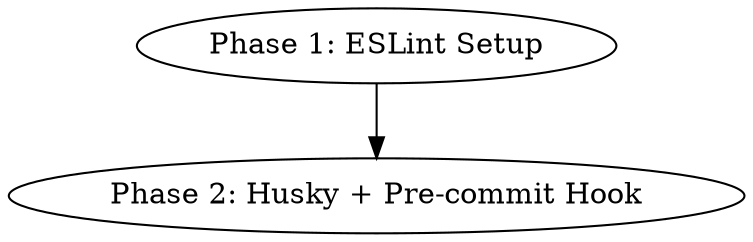

# Plan: VER-40 — Set up pre-commit hooks with lint and typecheck

## Summary

Install ESLint with TypeScript support, configure it for each package, and set up a git pre-commit hook (via husky + lint-staged) to run lint and typecheck on staged files before each commit.

## Current State

- **Linting:** No ESLint or any linter configured. Root `package.json` has `"lint": "turbo lint"` but no package has a `lint` script.
- **Typecheck:** Already works via `pnpm typecheck` (Turborepo runs `tsc --noEmit` in each package).
- **Git hooks:** Only sample hooks in `.git/hooks/`. No husky/lefthook/etc. Claude Code hooks exist (`.claude/hooks/`) but those are IDE-specific, not git hooks.
- **turbo.json:** Already has `"lint": {}` task defined.

## Phase Graph

## Phase 1: ESLint Setup

**Goal:** Install ESLint with TypeScript support and configure each package.

### Steps
1. Install root-level dev dependencies: `eslint`, `@eslint/js`, `typescript-eslint`, `eslint-plugin-react-hooks`, `eslint-plugin-react-refresh`, `globals`
2. Create root `eslint.config.js` (flat config) with:
   - TypeScript strict rules via `typescript-eslint`
   - `no-unused-vars` with `_` prefix exception
   - Ignore `dist/`, `node_modules/`, `*.config.*` patterns
3. Create package-specific `eslint.config.js` files:
   - `packages/web/` — extends root + adds React hooks/refresh plugins
   - `packages/api/`, `packages/pipeline/`, `packages/shared/` — extends root (Node.js)
4. Add `"lint": "eslint ."` script to each package's `package.json`
5. Fix any lint errors that surface (expect some from existing code)
6. Verify `pnpm lint` runs clean across all packages

### Files Changed
- `package.json` (root) — new devDependencies
- `eslint.config.js` (root) — new file
- `packages/web/eslint.config.js` — new file
- `packages/*/package.json` — add lint script
- Various `.ts`/`.tsx` files — lint fixes

## Phase 2: Husky + Pre-commit Hook

**Goal:** Set up husky for git hooks with a pre-commit hook that runs lint-staged (lint + typecheck on staged files).

### Steps
1. Install root dev dependencies: `husky`, `lint-staged`
2. Run `pnpm exec husky init` to set up `.husky/` directory
3. Configure `lint-staged` in root `package.json`:
   - `*.{ts,tsx}` → `eslint --fix` + `tsc --noEmit` (via turbo)
4. Set `.husky/pre-commit` to run `pnpm exec lint-staged`
5. Add `.husky/` to the repo (it's meant to be committed)
6. Verify hook works by staging a file and committing

### Files Changed
- `package.json` (root) — new devDependencies + lint-staged config
- `.husky/pre-commit` — new file
- `pnpm-lock.yaml` — updated

## Acceptance Criteria

- [ ] `pnpm lint` runs ESLint across all packages with zero errors
- [ ] `pnpm typecheck` still passes with zero errors
- [ ] `pnpm build` still passes
- [ ] Git pre-commit hook runs lint-staged on `git commit`
- [ ] lint-staged runs ESLint on staged `.ts`/`.tsx` files
